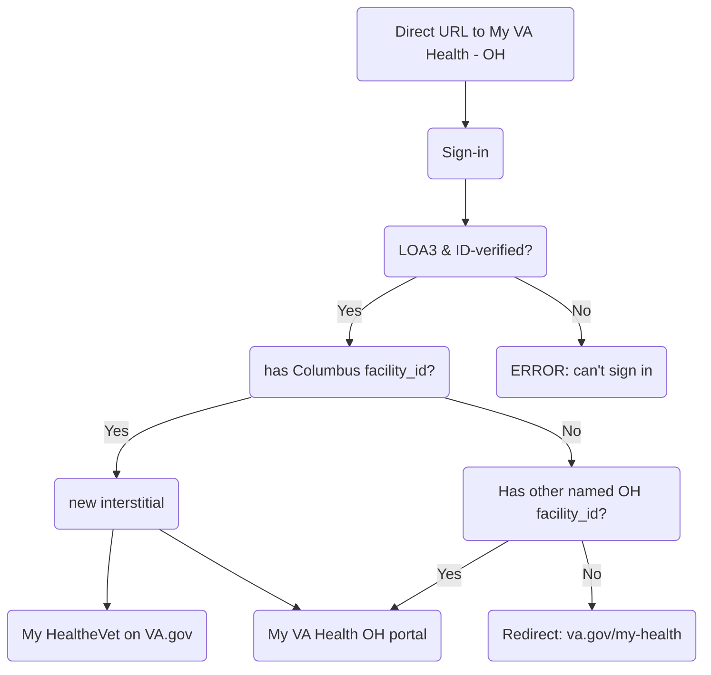

# Feature Brief: My VA Health (Oracle Health) USIP Interstitial & Access Control

## Overview

As part of the My VA Health (Oracle Health) transition to VA.gov, the frontend now enforces **attribute-based routing logic** for users authenticating through the **My VA Health Unified Sign-in Page (USIP)** at:

`https://www.va.gov/sign-in/?application=myvahealth&oauth=false`

This work introduces a **post-authentication interstitial** and **explicit access rules** that determine whether a user:

1. Sees the My VA Health interstitial  
2. Is redirected to My HealtheVet on VA.gov (`/my-health`)  
3. Proceeds through standard post-auth redirect flow  

The goal is to ensure that **only eligible Oracle Health users** can access the My VA Health portal experience, while safely routing all other users to VA.gov.

---

## High-Level User Routing Rules

After successful authentication via the **My VA Health USIP**, the frontend evaluates:

- Is the **My VA Health interstitial feature enabled**?
- Has the user been successfully **provisioned** (terms accepted + account ready)?
- Is the user a **VA patient**?
- Does the user meet **Oracle Health eligibility criteria** returned from the API?
  - `userAtPretransitionedOhFacility` & `isCernerPatient`

---

## Oracle Health Attribute Definitions & Eligibility Logic

### Required Conditions for Any Routing Logic

All of the following must be true:

- `isPortalNoticeInterstitialEnabled` (feature toggle is ON)
- `provisioned === true`
- `vaPatient === true`

If any of the above are false:
- User follows the **default redirect flow**
- No My VA Health interstitial logic is applied
  
### Attribute Definitions
From `userAttributes.vaProfile`:

- `isCernerPatient`
  - Indicates if the user is an Oracle Health (Cerner) patient

From `userAttributes.vaProfile.ohMigrationInfo`:

- `userAtPretransitionedOhFacility`
  - Indicates if the user is associated with a **pre-transition Oracle Health facility**

---

## User Journey

### 1. Users Eligible for My VA Health Interstitial

Users who meet **all** of the following:

- Feature toggle enabled  
- User is provisioned  
- User is a VA patient  
- `isCernerPatient === true`  
- `userAtPretransitionedOhFacility === true`  

**Experience:**

- Authenticate via My VA Health USIP  
- See the My VA Health interstitial (`/sign-in-health-portal/`)  
- Can choose to:
  - Continue to the My VA Health portal  
  - Go to My HealtheVet on VA.gov  

---

### 2. Oracle Health Users NOT Eligible for Portal Access

Users who meet base requirements but:

- `isCernerPatient === false`  
  **OR**
- `userAtPretransitionedOhFacility === false`  

**Experience:**

- Authenticate via My VA Health USIP  
- Do NOT see the interstitial  
- Are redirected to:
  - `https://va.gov/my-health`  

These users **cannot access the My VA Health portal**

---

### 3. Users Who Do Not Meet Base Requirements

If any of the following are false:

- Feature toggle disabled  
- Not provisioned  
- Not a VA patient  

**Experience:**

- No interstitial logic applied  
- User follows standard post-auth redirect flow  

---
## User Routing Decision Table

| Scenario | Feature Enabled | Provisioned | VA Patient | isCernerPatient | userAtPretransitionedOhFacility | Outcome | Redirect URL |
|----------|----------------|-------------|------------|-----------------|----------------------------------|---------|--------------|
| Eligible for interstitial | ✅ | ✅ | ✅ | ✅ | ✅ | Show My VA Health interstitial | `/sign-in-health-portal/` |
| Not Cerner patient | ✅ | ✅ | ✅ | ❌ | — | Redirect to My HealtheVet | `/my-health` |
| Not pre-transition facility | ✅ | ✅ | ✅ | ✅ | ❌ | Redirect to My HealtheVet | `/my-health` |
| Not provisioned | ✅ | ❌ | ✅ | — | — | Default flow (no interstitial logic) | Standard redirect |
| Not VA patient | ✅ | — | ❌ | — | — | Default flow (no interstitial logic) | Standard redirect |
| Feature disabled | ❌ | — | — | — | — | Default flow (no interstitial logic) | Standard redirect |

### Notes

- `—` means the value does not matter for that scenario
- “Default flow” = standard post-auth redirect logic (no interstitials applied)
- Only one interstitial can ever be shown per sign-in
---

## Important Constraints & Design Decisions

- This logic applies only to the **My VA Health USIP sign-in experience**
- Eligibility is determined using **API-provided user attributes**, not frontend-derived logic
- Feature toggles:
  - Control whether interstitial logic runs
  - Do NOT determine user eligibility
- Provisioning (terms of use acceptance) is required before any routing decisions
- Frontend does not evaluate facility IDs directly

---
## Auth Flow

## Version History

| Version | Approach | Key Logic | Routing Behavior | Limitations / Notes | Date |
|--------|---------|----------|------------------|--------------------|----|
| **Current** | Attribute-based | Uses API attributes: `isCernerPatient` `userAtPretransitionedOhFacility` + `provisioned` + `vaPatient` | - Eligible users → Interstitial - All others → `/my-health` - Default flow if base conditions fail | - Removes hardcoded logic - Scalable for future rollout - Backend is source of truth | March 2026 |
| **Previous** | Facility-based | Hardcoded `facility_id` checks in frontend | - Specific facility → Interstitial - Approved facilities → Direct portal - Others → `/my-health` | - Not scalable - Required manual updates - Risk of mismatched logic - Duplicated eligibility logic in FE | November 2025 |
 
## Resources
- [Original MHV team ticket](https://github.com/department-of-veterans-affairs/va.gov-team/issues/119600)
- [Identity team ticket](https://github.com/department-of-veterans-affairs/identity-documentation/issues/878)
- [Implementation PR for redirect](https://github.com/department-of-veterans-affairs/vets-website/pull/40232)
- [Implementation PR for landing page](https://github.com/department-of-veterans-affairs/vets-website/pull/40294)
- [Implementation PR for API routing logic](https://github.com/department-of-veterans-affairs/vets-website/pull/43182/)
- [#identity-suppport slack thread](https://dsva.slack.com/archives/CSFV4QTKN/p1769551119709939)

