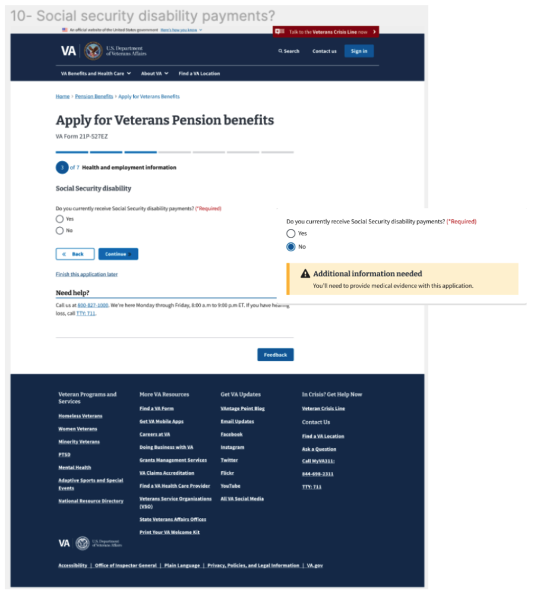
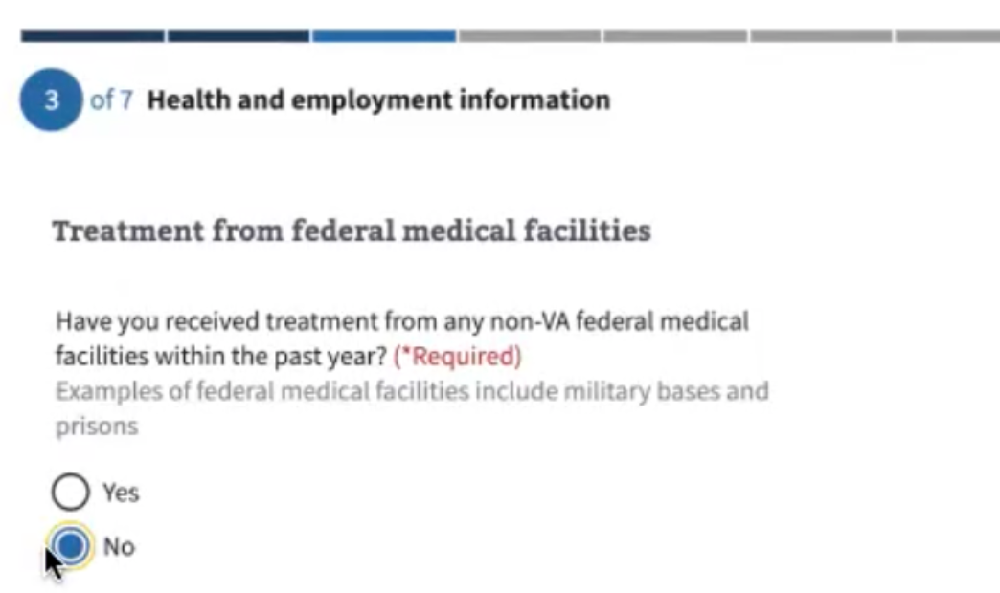
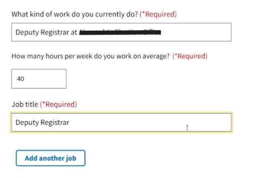
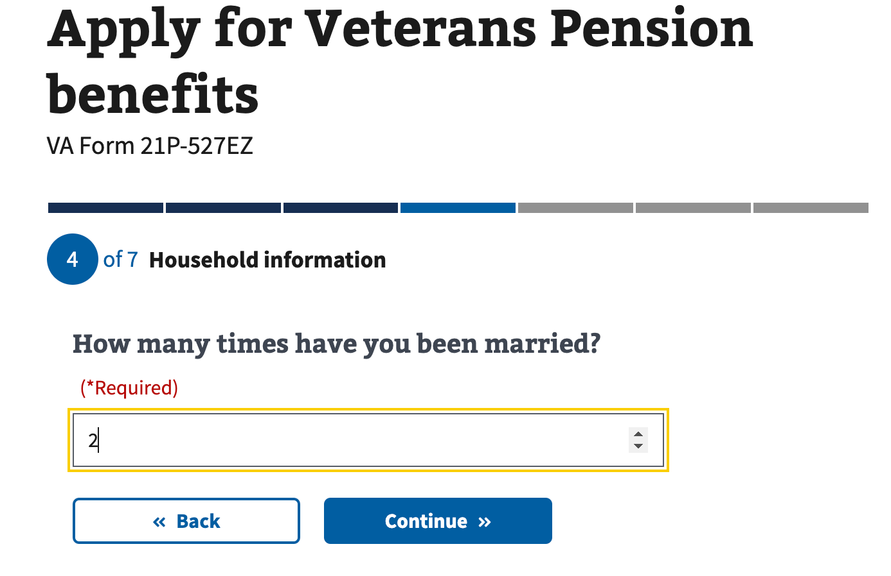
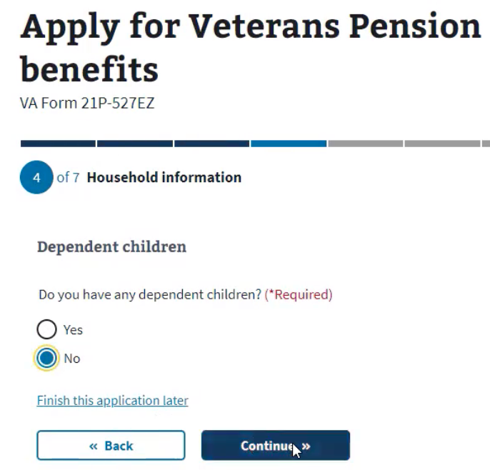
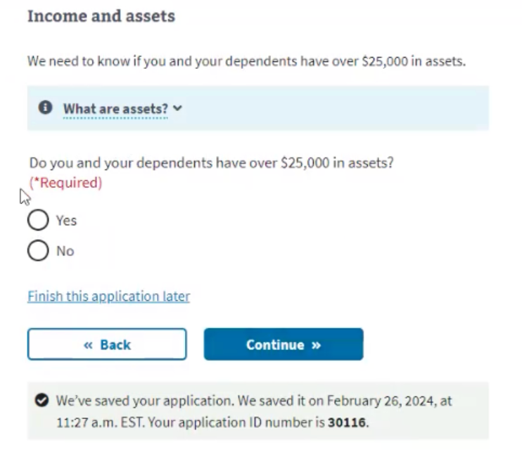
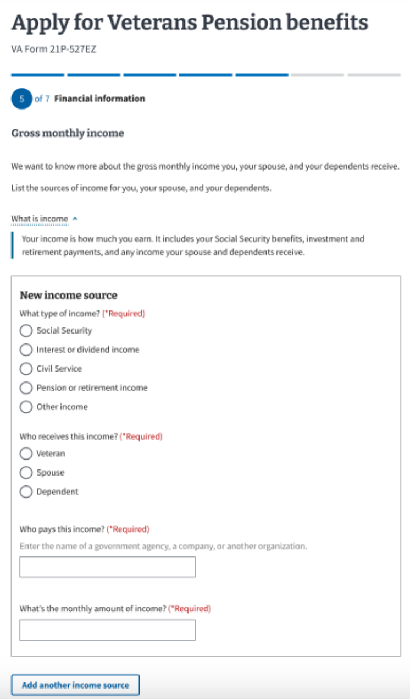
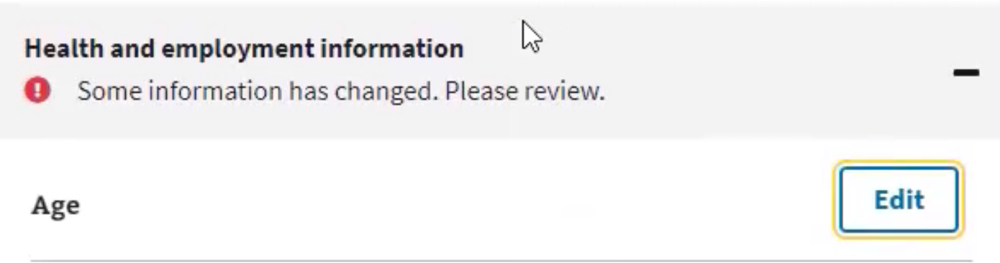
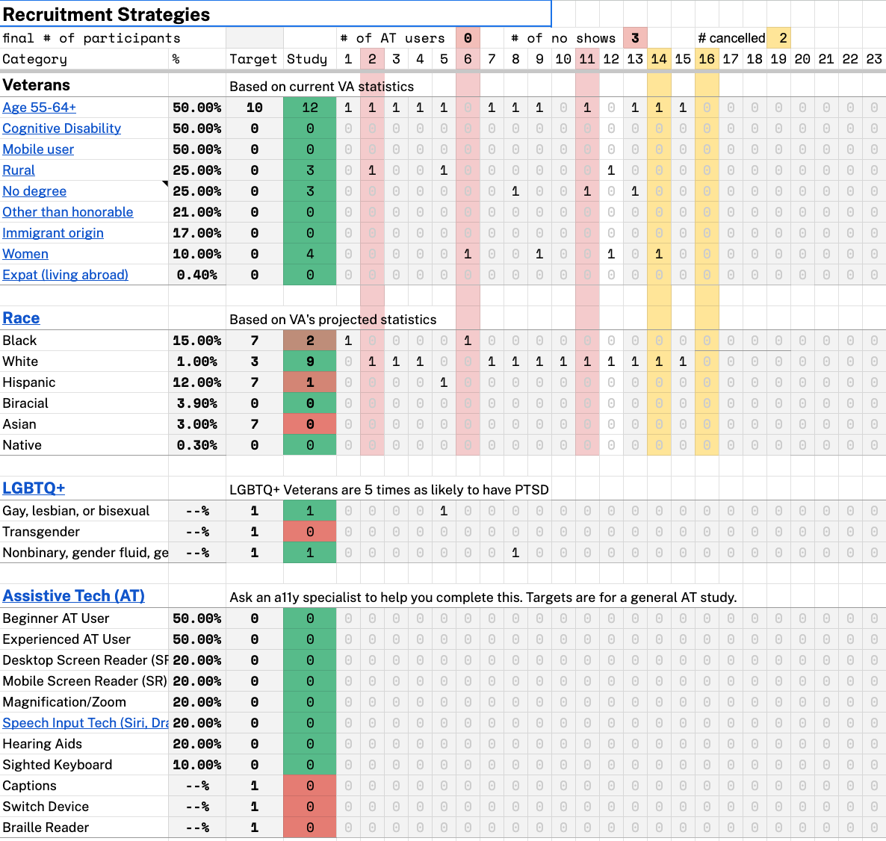

# Usability Test of VA pension benefits (527EZ) with Veterans: Research Findings and Recommendations

# Office of the CTO - Digital Experience (OCTO-DE), Pension benefits form 527EZ, Pension Benefits Team

Date: 03/24/2024

Allexe Law-Flood, Researcher, [Allexe.law-Flood@Adhocteam.us](mailto:Allexe.law-Flood@Adhocteam.us)

## Veteran Journey

This research and product (VA Form 21P-527EZ Veterans Pension benefits) fits into the taking care of myself and retiring stage of the [Veteran journey](https://github.com/department-of-veterans-affairs/va.gov-team/blob/master/platform/design/va-product-journey-maps/Veteran%20Journey%20Map.pdf) where Veterans’ are engaging VA to access pension benefits.

## Research Goals

The goals of the research are to learn from Veterans about their experience with completing the digital version of the 527EZ pension benefits form to determine:  

1. How Veterans respond to the instructions for completing the 527EZ form
2. The Veteran’s experience with applying for pension benefits
3. The pain points as well as pleasure points experienced with using the 527EZ digital form

## Research Questions

### Goal 1: To determine how Veterans respond to the instructions for completing the 527EZ form. 

1. Is there anything on the Apply for Veterans Pension benefits page that they question or do not understand? 
2. How difficult, if at all, do they expect it to be to get the information to complete the pension form? Why?
3. What other parties would they involve in the information gathering process?
4. Do they choose to complete the application with or without signing in? Why?

### Goal 2: To understand the Veteran’s experience with applying for pension benefits
1. What do Veterans do when they have a question or need assistance?
2. Were any questions on the online form misinterpreted? 
3. Where in the form is additional clarification or information needed?
4. Did their mental model or expectations about their experience completing the form change after they completed it? 
5. What, if anything, surprised them about their experience? 

### Goal 3: To determine the pain points experienced with using the 527EZ digital form

1. Are there certain sections that were more difficult to complete than others?   Where and why? 
2. Are there certain questions or sections that create confusion?
3. What information requires them to pause/stop and why?  
    1. What do they think/see as their next steps? 
1. Do Veterans want to know or question why certain information is needed?
4. Did they experience any challenge or concerns with uploading data? 
5. What information, if any, do they note that they have previously provided to VA?
6. What, if any, concerns did they have around completing the application?
7. What, if any, concerns did they have around submitting the application?

## Methodology

We facilitated 10 semi-structured interviews via Zoom and observed Veterans filling out the 527ez form. During the sessions, Veterans shared their screens and thought aloud as they filled out the form with the intention of filing.  Some of the information on the form was pre-populated with information for a fictional character.  Participants were asked to try completing the application with information that was as close to the truth as possible.

### Limitations

Although we conducted the study with 10 Veterans who were planning to apply for pension benefits, recruiting Veterans who had limited or no income, or a non-service related permanent and total disability, proved to be difficult. 

* All but one participant indicated that they planned to apply for pension benefits
* Of the 10 interviewed, six participants thought they were applying for their military retirement pension.
* Two interviews were cut short by 15-30 minutes due to technical difficulties or an unexpected need of the participant to leave part way through the session.
* The number and types of questions that Veterans responded to on the form varied depending on the Veterans’ personal situation (e.g. whether they were married or not, if they or their spouses were married before, if they had dependents, or if they and their spouses had multiple revenue sources)

### Learnings

* While observing Veterans complete the application provides meaningful “real life” data, we were unable to test every scenario a Veteran may have when completing the form. 

## Hypotheses and Conclusions

### Assumptions

* Certain information may be difficult for Veterans to obtain and in some cases participants may not know how to obtain the information. 
    * True:  Participants noted that they would have difficulty finding information on names and or dates for past marriages and spouses past marriages. 
* Participants may experience fatigue completing the application and will want to know how many questions are remaining or may abandon the application.
    * Mostly True: Some participants noted that they would want to complete the form while they were at the computer and in one sitting, but after viewing the Income and Asset Statement [VA Form 21P-0969] for the application, some participants noted they would come back to the form at a later date to complete. 
* Veterans will not understand why they have to populate all of their personal information when they believe VA already has it (e.g. provided the information when signed in, profile page shows their branch of service).
    * Because this usability test did pre-populate information on the Veteran’s fictional character, the participants did not experience the burden of populating their own personal information.
    * Because participants were not instructed to complete the supplemental forms that are part of this application, we were not able to determine the accuracy of this statement. 

## Thematic Findings

1. Finding one: **Veterans may mistakenly think that the 527-EZ Pension Form is for military retirement pension.**   
Based on the behavior and questions of the Veterans completing the 527EZ form who were eligible for military retirement pension we can infer that they thought they were filling out a form for their military retirement pension and that they **did not realize the 527EZ pension application was not relevant to them.**   
For additional information, go to <a href="apply-for-veterans-pension-page">‘Apply for Veterans Pension benefits page’ in detailed findings</a>

2. Finding two: **Many participants ignored or missed alerts or calls to action (CTAs) about the need for additional evidence or an action required by the Veteran** (e.g. medical evidence related to not receiving social security benefits; some information has changed, please review)   
Some participants, after reading an alert, thought the alert was not relevant or accurate.  
For additional information, go to <a href="findings-organized-by-form-flow">Findings (organized by 527ez form flow)</a>

3. Finding three: **There were multiple areas throughout the form where participants provided inaccurate or incomplete information.**   
Participants provided inaccurate or incomplete information when 1) faced with vague or unclear instructions (e.g.facility information), 2) required to provide information for which they did not see relevance or it seemed excessive (e.g. marital history/dates) or 3) when the form’s flow did not align with how they would enter/provide information (e.g. reimbursable medical co-payments)  
For additional information and examples, go to <a href="findings-organized-by-form-flow">Findings (organized by 527ez form flow), sections 1-7</a>

4. Finding four: **Some participants were surprised by the level of detail required in the form and questioned where they would find the information (e.g. marital history), despite reviewing what was needed to complete the application on the introduction page**.   
Several participants noted they would need to take additional steps to find the information, including stepping away from the form to look for information in a safe, a folder, call the 800# provided to get clarification on the meaning of a word (e.g. dependent) or determine what additional form they needed to complete.   
For additional information and examples, go to <a href="findings-organized-by-form-flow">Findings (organized by 527ez form flow), section 4 Household Information</a>

## Findings (organized by 527ez form flow)

### Apply for Veterans Pension benefits page 
([https://staging.va.gov/pension/application/527EZ/introduction](https://staging.va.gov/pension/application/527EZ/introduction))

1. Participants (6/10) who indicated that they were eligible for military retirement pensions **were not aware that the 527-EZ Veteran Pension Benefits form was only for Veterans who were below a certain income level**.  Participants were provided a link to an introduction on the Veterans Pension Benefit application and neither the introduction nor the first page of the application included eligibility criteria for pension benefit. 

VBA subject matter experts confirmed that too frequently Veterans confuse VA pension with military retirement pension.

2. All participants chose to sign in rather than start the application without signing in. Some participants noted that they did not want to lose the information they entered and others mentioned that they thought some information would be auto-populated if they signed in. 

**[Recommendation](https://app.zenhub.com/workspaces/benefits-pension-64e775aaa6b1ca1ed49b2ede/issues/gh/department-of-veterans-affairs/va.gov-team/77724#:~:text=gov%2Dteam%2377724-,Improve%20form%20introduction%20content,-buddhima%2Dcoforma)**:

* UX content and design will evaluate copy on the Veterans Pension benefits “How to apply page” and the first page of the VA pension benefit application and make recommendation for copy that clarifies the purpose of the VA pension benefit and eligibility criteria. 
* Product will explore with subject matter experts (SMEs) the introduction of criteria that validates eligibility at the beginning of form flow and work with design on messaging.  

### Section 1 -  Application

1. Several participants were **uncertain about how to respond** to the question _'Have you ever filed a claim with VA',_ wondering whether it referred to a pension claim or something else (6/10). 
* P1: _"Does that include VA mortgage or mortgage insurance?"_
* P10: _"I have no idea what it is"_
* P13: _"Does that mean a pension claim?"_
2. Additionally, several participants were **not clear as to what should be provided for a VA file number**.  
* P1 noted he wouldn't know VA file number and would put in SSN
* P10:  _"I would not...cause I don't know what that is" _[when asked about inputting the VA file number]_; I would just skip it_”
* P13 noted he would put in his SSN for VA file number as he was not entirely sure what a VA file number is.

**[Recommendation](https://app.zenhub.com/workspaces/benefits-pension-64e775aaa6b1ca1ed49b2ede/issues/gh/department-of-veterans-affairs/va.gov-team/79663)**:

* UX content and design will evaluate including copy that clarifies what is meant by VA claim and VA file number.

### Section 2 -  Military History

1. Participants who were in the reserves **had difficulty determining what dates that they should use for 'final release date of active duty**', wondering if they should use their date leaving or retiring from the Reserves.  These participants chose the date they retired. A couple of participants didn't know the dates off of the top of their head and estimated.
* P5: _"I'm a retired Reservist...so that final release date from active duty.  Is that the date you want or the date I retired?"_  
* P15: Initially interpreted release date as retirement date vs. release date from active duty. _"In my head I was going to put in the retirement date from Reserve and I think I would stick with that"_

**[Recommendation](https://app.zenhub.com/workspaces/benefits-pension-64e775aaa6b1ca1ed49b2ede/issues/gh/department-of-veterans-affairs/va.gov-team/79665):**

* Research will clarify through discussions with Veteran Service Representatives (VSRs) whether active duty dates are still necessary to receive from Veterans and if so, if month, day, and year is needed and why.
* Developers will evaluate the feasibility of populating military history for authenticated users when available in their profile.[ See issue #70121](https://www.google.com/url?q=https://github.com/department-of-veterans-affairs/va.gov-team/issues/70121&sa=D&source=docs&ust=1710973704796619&usg=AOvVaw3Gc48KJiLOY3GJUNKNw9zD)
* Design will evaluate the introduction of content that informs Veterans where the service date information may be found and what is or is not considered for active duty dates.

### Section 3 - Health and Employment

1. Most participants (P1,P3,P4,P5,P8,P10,P15) **didn't notice the alert stating that they would need to provide medical evidence**. This alert appears after selecting ‘NO’ to the question of whether they receive social security disability benefits.  For those who were explicitly prompted to read the alert, none of them understood why they would need to provide medical evidence in this situation, and some even assumed it was an error on the part of the application and continued.  **These assumptions may result in incomplete application submissions**. 
 * P3: Doesn't understand the pop-up box.  Thinks if he responded yes that he would need to provide some medical history.
 * P4 _"It says you'll need to provide medical evidence with this application but I'm not requesting anything so that seems like kind of a stupid pop up"_
 * P5: [after selecting no to receiving SS disability payments] _"I said no but then I get a notice saying I need to provide medical evidence. I'd think that's a goof because I don't have any evidence that I'm not receiving it."_
 * P10: Assumed that the pop-up meant that _"No, I would not need to provide medical evidence”_

**[Recommendation](https://app.zenhub.com/workspaces/benefits-pension-64e775aaa6b1ca1ed49b2ede/issues/gh/department-of-veterans-affairs/va.gov-team/79210)**:

* Through desk research, subject matter expert discussions or VSR shadowing, research will identify the purpose for medical evidence information when a Veteran is not collecting social security disability and share findings with content and design for potential copy improvements. 
* Design will explore what other benefit teams have done (especially the 526-EZ team) relative to alert displays to make it clear to applicants when they need to submit additional documentation/evidence.
* Engineering and design will evaluate the feasibility of other visual means for indicating that additional information is needed. 
2. Without clarity on what information should be included under the VA Facility for which a Veteran received treatment,** Veterans entered inconsistent information**.  Some would include just the name of the facility, others would list the city and state, and others just the city.  
3. The majority of participants (P1,P3,P7,P8,P10,P13,P15) **misunderstood the meaning of non-VA federal medical   facilities** and did not read the example provided.      
* P1: Initially thought that the federal med facilities question was   asking about coverage outside of the VA.
* P8: Thinks a non-VA federal medical facility means _"If I was traveling some place in Arizona and I needed healthcare, I would go to that VA facility as opposed to a regular hospital or coming back home.”_
* P10: Thought that the federal medical facility question referred to a private employer.

**[Recommendation](https://app.zenhub.com/workspaces/benefits-pension-64e775aaa6b1ca1ed49b2ede/issues/gh/department-of-veterans-affairs/va.gov-team/79667)**:
* Developers will evaluate the use of VA APIs to provide facility information.
* UX design will evaluate ways to improve copy and assess the benefit of providing an example to help Veterans understand what information is sought.

4. A few participants **erroneously entered their job title** for the question about what kind of work they do and paused when they saw the question about job title. 
* Pilot 1:_ “This question is very open. Just looking at this it could be a job title, a job occupation...so it's very open-ended and it's giving me a little bit of pause as to what I'm going to type in here.”_
* P5: Entered same thing for ‘What kind of work do you do’ and ‘Job title’ 
* P10: _"Oops"_ [confused about the difference between the what kind of work you do question and job title. _"What kind of work do you do...I don't know how else to explain it. and my job title is part of what I do"_

**Recommendation:** This finding is being addressed through [Ticket # 77924](https://app.zenhub.com/workspaces/benefits-pension-64e775aaa6b1ca1ed49b2ede/issues/gh/department-of-veterans-affairs/va.gov-team/77924)

### Section 4 - Household Information

1. Veterans who had multiple marriages or had spouses with multiple marriages were surprised, and at times, annoyed by questions about dates and names related to previous marriages and **began estimating dates or decided not to provide certain information**. 
* Pilot 1:_ Why do you need to know former spouse's info--note is helpful, but it doesn't give me a reason. i want the reason, not reassurance that we're going to start contacting people_
* P1:_"I don't know his information...I wouldn't really feel comfortable putting that information in" (his spouse's former spouse's information) _
* P4: _"What's her maiden name? I don't know...that was too long ago."_
* P9: Does not remember her dates of first marriage; she would make her best guess_ "it was so long ago, 40 years ago!"_
* P15: _"Again...I don't know what their [spouse's] VA file number would have to do with anything"_

**[Recommendation](https://app.zenhub.com/workspaces/benefits-pension-64e775aaa6b1ca1ed49b2ede/issues/gh/department-of-veterans-affairs/va.gov-team/79668)**:

* Research will speak with VSRs or Subject Matter Experts (SMEs) to understand the purpose and need for this information. 
* UX Content and Design will evaluate how to best communicate the need for this information. 

2. Participants who were married multiple times (P3,P4,P9), provided information on the number of times they were married and when they read the following screen asking them to enter information about their first marriage, **they proceeded to erroneously enter information** about their current marriage.     

 

  
  

**[Recommendation](https://app.zenhub.com/workspaces/benefits-pension-64e775aaa6b1ca1ed49b2ede/issues/gh/department-of-veterans-affairs/va.gov-team/79669)**:

* UX content and Design will evaluate how to improve the copy and/or ordering of the requested information on current and previous marriages to avoid this error.

### Section 5 - Financial Information

Some Veterans were confused by the meaning of terms such as ‘dependent’ and ‘assets’ and some were unclear on how to provide information (e.g. sources of income, copayments) when the form user interface did not align with how they would enter/provide information. **These areas of confusion resulted in Veterans entering incorrect or incomplete information.**

1. A few participants (P1,P3,P13) who responded 'NO' to dependents were confused by the follow-up questions regarding assets that referenced ‘your dependents’. A couple of participants, when they saw the question which asked whether they and their dependents had assets over $25,000, **incorrectly included their adult children in their calculation of assets**. 
* P1 answered NO to dependents and then the next question asked 'Do you and your dependents have over $25000 in assets?’ P1:_ "I don't have any dependents, so I'm not sure why it is asking about my dependents. Why do you need to know what my dependents assets are? "  _ His confusion led him to (unknowingly) incorrectly report his assets.
* P3: Did not have any dependents and when he read the following question referencing his dependents was confused about how he would factor his kid's assets into the question (even though he wouldn't need to).
* P13: [reads the income and assets question....]_ “What? I don't have any dependents?"_

 

  
  

**[Recommendation](https://app.zenhub.com/workspaces/benefits-pension-64e775aaa6b1ca1ed49b2ede/issues/gh/department-of-veterans-affairs/va.gov-team/79212)**:

* Developers or engineers will evaluate the feasibility of creating dynamic content with the support of design to prevent future confusion by applicants around dependents and income.
2. Several participants (6/10) were not certain what was considered assets (e.g. primary residence) and did not see the drop down explaining what assets are [located above the question regarding assets]. Some of these participants proceeded with the application based on their assumptions and **incorrectly reported assets. **

* P1: Confused about language of questions including dependents as he doesn't have dependents; led him to (unknowingly) incorrectly reporting his assets. 
* P4: _“Okay, did your spouse or your dependents transfer any assets in the last 3 calendar years. What does that mean?  I would have to call the 800 number cause I can't go any further, because I don't really know what that means”_
* P7: Assumed his primary residence was included in his assets amount
* P8: Checked yes and said the assets were a home or financial gift to the children.  When asked how he could check on what is included under assets, he said he would have to find out and would not find it on this page [did not see the ‘What are assets dropdown’
* P15: _"If I was really concerned [about figuring out the definition of transferring assets] I would google it_"

**[Recommendation](https://app.zenhub.com/workspaces/benefits-pension-64e775aaa6b1ca1ed49b2ede/issues/gh/department-of-veterans-affairs/va.gov-team/79671)**:

* Product will consult with the enablement team to assess the impact of this finding on Pension Benefit applicants.
* UX Content and Design will evaluate how to provide greater clarity on the definition of dependent (at the point that questions about dependents are asked) and consider relocating or improving the visibility of information on assets. 
3. Several participants (P4,P7,P8,P15) who read _‘List the sources of income for you, your spouse..’_, tried to click multiple radio buttons for the different sources of income for themselves and spouse only to be confused as to why they were unable to select more than one income source.  Participants (P7, P8) did not see the _‘Add another income source’  _button at the bottom of the page and (P5,P15) saw it later after scrolling to the bottom of the page to continue.

Additionally (P5, P15) wanted to select themselves and their spouse when answering who receives this income,  especially when referring to interest and dividend income. 

* P15: _ “It only let me pick one.  Most people have more than one.  Now, it's got me confused. Do I pick the number that is higher?"  _ 
* P5: _"For who receives income, it should be both, unless I have to submit it twice because we both work"_

**[Recommendation](https://app.zenhub.com/workspaces/benefits-pension-64e775aaa6b1ca1ed49b2ede/issues/gh/department-of-veterans-affairs/va.gov-team/79213)**:

* UX content and design will re-evaluate the flow of questions for this section of the form and evaluate approaches for clarifying that only one income source may be entered at a time and for one person at a time (e.g. Veteran, spouse)
* Product will speak with SMEs to better understand what information is needed relative to this section and assess the need for design to evaluate including the option of “Both, Veteran and Spouse” under who receives this income. 
4. Entering unreimbursed co-payments for medication and doctor visits under unreimbursed expenses is not intuitive, a lengthy process, and participants found their responses did not clearly align with the choices on the form (e.g. date of payment, frequency).** Participants were estimating dates and costs**. 

 
    Several participants (5) tried to enter co-payments for medication and/or medical appointments under ‘Unreimbursed care expenses’ or ‘Medical and other unreimbursed expenses’  which according to VBA representatives are not retroactively reimbursed, not considered recurring, and in many cases are not eligible for reimbursement. 

* P5: When entering co-payments stated _ "Yeah this is just kinda a pain in the butt. What difference does it make? I go to the doctor and I have a copay so am I supposed to report every doctor's visit and every copay? It seems like a lot of information and who receives it?" _
* P15:  The date and time frame for medication causes pause and confusion and she notes  _“ It's not a nice neat once a month it is $12."_  Her prescription is every 3 months, so the options of frequency do not apply.   _"I don't know if I would add another reimbursed expense - I'd be too frustrated"_

**[Recommendation](https://app.zenhub.com/workspaces/benefits-pension-64e775aaa6b1ca1ed49b2ede/issues/gh/department-of-veterans-affairs/va.gov-team/79214)**:

* UX Content and Design will review language in this section of the web based form, the 527-EZ PDF form and the 21P-8416, speak with SMEs and draft copy that may be included with the on-line form to reduce the likelihood of Veteran’s entering erroneous information for unreimbursed expenses. 

### Section 6 - Direct Deposit and Upload Information

1. A couple of Veterans were **confused by the messaging** related to supporting documentation and were **uncertain how to proceed**.  
* P8:  After this Veteran answered he would mail a hard copy of the supporting documentation because he was not sure how to upload documents, he read on the following screen that if he uploads all his supporting documentation he would get a faster decision. He gets frustrated and states:  _"This faster claim thing here makes it sound like that I'm gonna do that. And it doesn't give me a chance to do what I said I was going to do which is send it (the form) off to Janesville, Wisconsin"_
* P7 read on the supporting documentation page a section about needing help from another individual and the need to provide supporting evidence. He determined that he met the criteria but was unclear as to what he needed to submit. _"It's kind of confusing.  The previous page told me these are the criteria for consideration.  And then this is telling you to upload your documents, but you still don't know what the documents are. I guess I would be submitting it without that documentation which might end up hurting me for my retirement."_

**[Recommendation](https://app.zenhub.com/workspaces/benefits-pension-64e775aaa6b1ca1ed49b2ede/issues/gh/department-of-veterans-affairs/va.gov-team/79323)**:

* Research will review past research and decisions by other benefit teams related to Fully Developed Claims and identify possible actions to present to the team and/or questions that might be addressed through upcoming research with Veteran Service Representatives.
* UX Design will evaluate the content in the supporting documentation and confirmation page to identify discrepancies, information gaps, and other challenges for users.

### Section 7 - Review Information

1. Although we were not able to observe most of the participants make edits to the review page because of the shortage of time, two Veterans who were able to make edits did not recognize or see the calls to action (CTAs) on the Review page. 
* P7 made updates to his information in the review section and did not see the blue bar with the CTA to update the page or understand that it was a CTA.  Despite not entering 'update page', he was able to submit an application without saving his updates and it was confirmed. It is unclear if his updated information was saved. 
* P1 made updates to his information in the review section and did not see the alerts that required him to review changed information.

When he tries to submit the application, it does not submit and he goes back to find out why. He expands the box with the red exclamation mark but does not see an error and notes "I don't have any indication of what's invalid here, so I'm a bit confused."  

**[Recommendation](https://app.zenhub.com/workspaces/benefits-pension-64e775aaa6b1ca1ed49b2ede/issues/gh/department-of-veterans-affairs/va.gov-team/79672)**

* UX content and design will evaluate the messaging and design of the CTAs and make recommendations for next steps. (_Note: updated guidance and design system patterns coming soon from the design system team and the Veteran Facing Forms team that we may want to factor into our solution: _[https://dsva.slack.com/archives/C01DBGX4P45/p1710450212830359](https://dsva.slack.com/archives/C01DBGX4P45/p1710450212830359))
* Engineering and design will evaluate whether applications can be submitted without saving updates and make changes to the form to prevent it.

## Additional Insights

1. Participants expect a follow-up email after submitting their pension benefits application and expect a decision within 30 days.
Participants were asked how they expected to be notified of the receipt of their application and several of the participants (P1, P4, P5,P7, P8, P10, P13) stated that they would expect an email confirming that their application was received and a few stated that they would expect a link in the email so that they could review their application or make changes. Several of these participants (P4, P5,P8 P13, P15) when asked when they would expect to be notified of the decision regarding pension, stated that they expected a decision within 30 days. 

2. Participants were not clear on what to do if there was a change in their financial situation after they submitted their pension application. Participants indicated that they did not know where to go or who to call if changes in their financial situation. P4 noted he probably would not think of notifying VA and _"Nowhere does it say where you can update your info."_

**[Recommendation](https://app.zenhub.com/workspaces/benefits-pension-64e775aaa6b1ca1ed49b2ede/issues/gh/department-of-veterans-affairs/va.gov-team/79674):**

* UX content and design will check with SMEs about whether and how Veterans are notified of next steps and the need to tell VA if their financial circumstances change and determine what, if any, additional steps are needed.  

## Next Steps

* Collaborate with OCTO to prioritize future design, development, and engineering work for the 527ez.
* Connect with other relevant product teams to share findings and recommendations

## Further research needed

VSR shadowing research is currently being planned.

## Appendix

* [Research plan](https://github.com/department-of-veterans-affairs/va.gov-team/blob/24c2588860e8f32b2415addf0a81be8a2687f09e/products/pension/research/2024%2002%20Pension%20Usability%20Evaluation/research-plan.md)

* [Conversation guide](https://github.com/department-of-veterans-affairs/va.gov-team/blob/24c2588860e8f32b2415addf0a81be8a2687f09e/products/pension/research/2024%2002%20Pension%20Usability%20Evaluation/conversation-guide.md)

## Tools used for Synthesis

[Pension Benefit Interviews - Mural Board ](https://app.mural.co/t/departmentofveteransaffairs9999/m/departmentofveteransaffairs9999/1708105906630/0a72b591897f01c75521e21373f0e8a82359bf11?sender=u7ebb3c5845122387949f4600)

## Pages and applications used

Link to prototypes or pages that were tested

## Other supporting documents created

Muarl Board of steps taken by VSRs to process the 527-EZ form to be developed.

## Secondary research

Weekly Pension Benefits team discussions with VBA SMEs.   

## Recruitment criteria

We were looking for a diverse group of Veteran participants with respect to age, gender and race/ethnicity.

* Veterans who are or will be eligible for 527-EZ  pension benefits.
* Age
    * 55+, at least 2 that are 65+
* Race 
    * 50% - 70% are minority 
* Disability
    * 30% are Veterans with a non-service related disability

**Secondary criteria** recruit a mix of military branch, gender, education and geographic location. 

## Who we talked to:

We talked to 10 participants.

Audience segment:
* Veterans: 10

Gender:
* Male: 8
* Female: 2

LGBTQ+:
* Gay, lesbian, or bisexual: 1

Devices used during study:
* Desktop: 8
* Tablet: 2
* Smart phone: 0
* Assistive Technology: 0

Age:
* 45-54: 1
* 55-64: 5
* 65+: 4

Education:
* High school degree or equivalent: 1
* Some college (no degree): 1
* Bachelor's degree: 4
* Master's degree: 4

Geographic location:
* Urban: 8
* Rural: 1
* Unknown: 1

Race:
* White: 9
* Black: 1

## Underserved groups we haven’t talked to

This research does not include the perspectives of the following marginalized Veteran groups: _List all groups in red from the spreadsheet_

* Group 1: Cognitive disability, Mobile user, Other than honorable, Immigrant origin, Expat
* Group 2: Biracial, Asian, Native
* Group 3: Transgender
* Group 4: Assistive Technology

