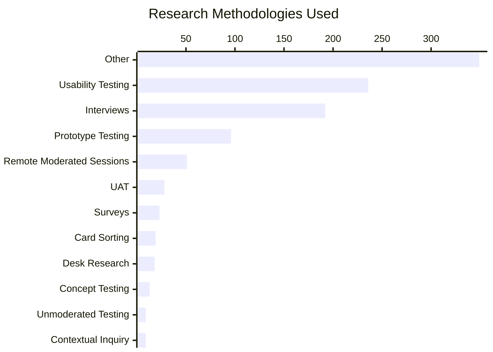
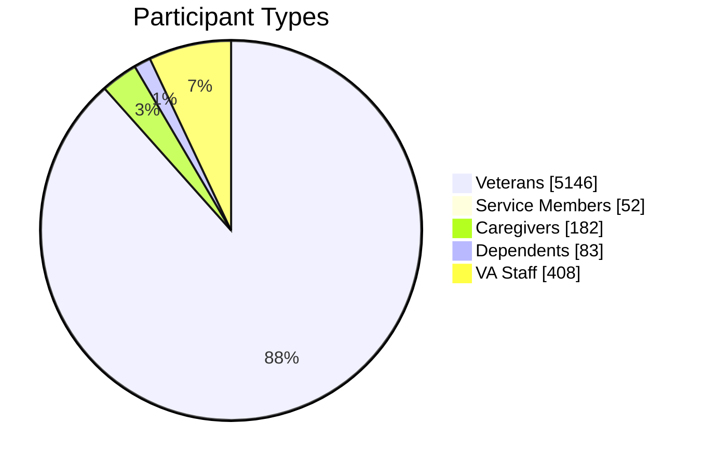
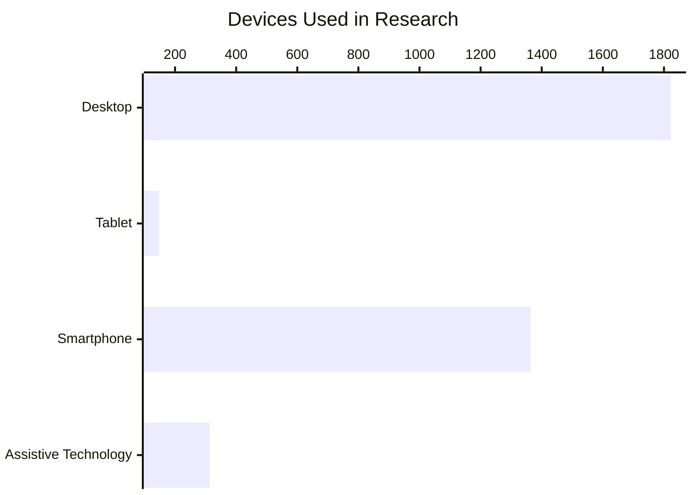
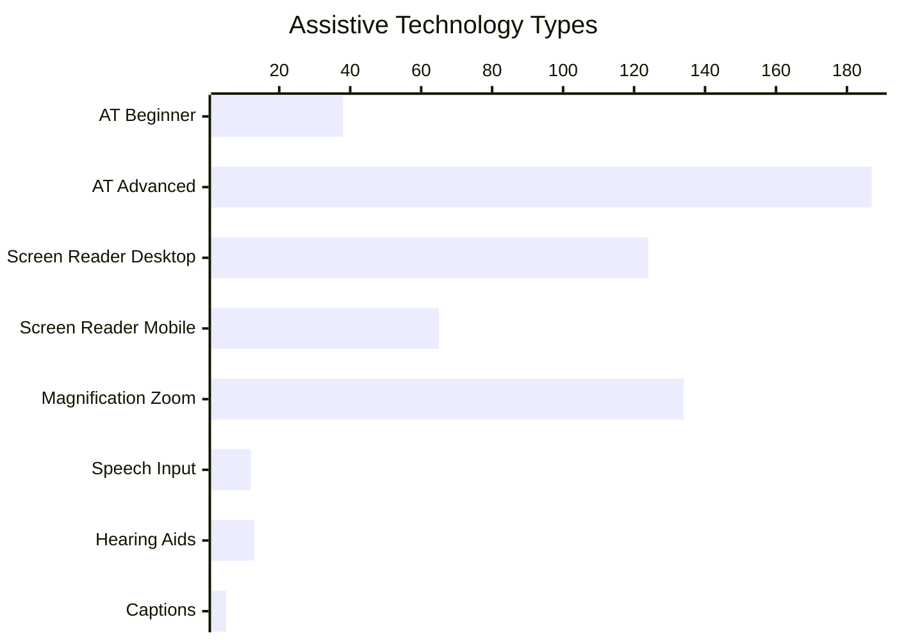
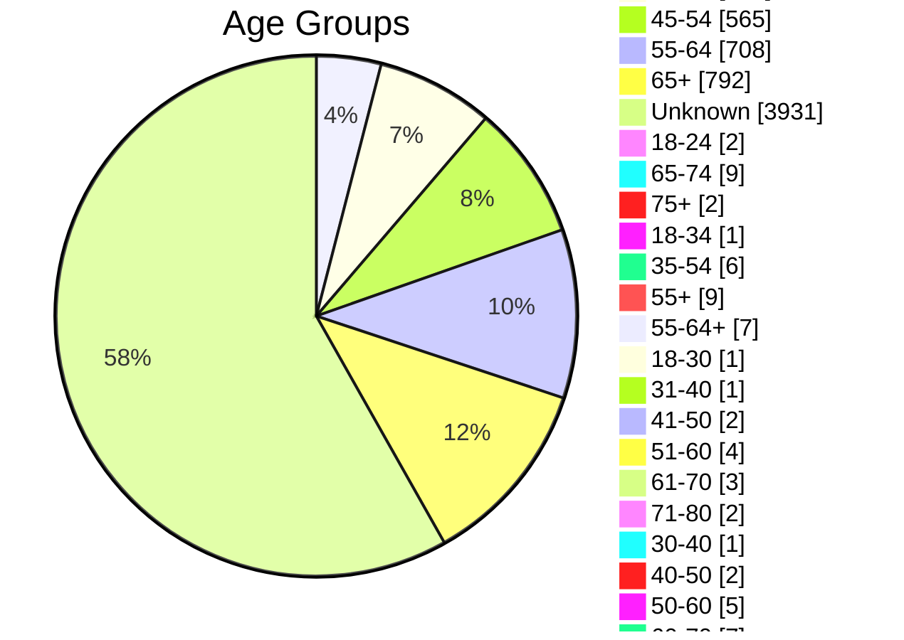
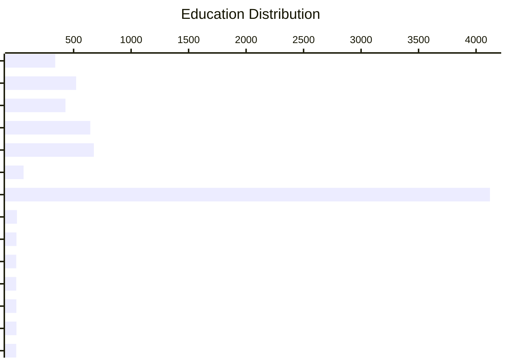
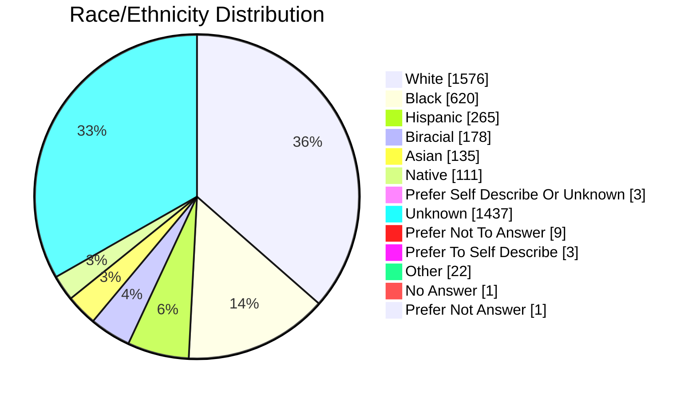

# 📊 Historical Participant Data Report (2017-2025)

> **Report Period:** 2017 - 2025 | **Total Years:** 9
> **Generated:** 2026-02-27T18:57:49.533Z
> 📖 **Purpose:** Comprehensive historical analysis of participant demographics from VA.gov research findings

## Table of Contents

1. [Overview Statistics](#-overview-statistics)
2. [Year-by-Year Breakdown](#-year-by-year-breakdown)
3. [Methodology Breakdown](#-methodology-breakdown)
4. [Participant Types](#-participant-types-overall)
5. [Devices Used](#-devices-used)
6. [Assistive Technology Inclusion](#-assistive-technology-inclusion)
7. [Age Distribution](#-age-distribution)
8. [Education Levels](#-education-levels)
9. [Geographic Location](#-geographic-location)
10. [Race/Ethnicity](#-raceethnicity)
11. [Disability & Accessibility Details](#-disability--accessibility-details)
12. [Research Practice Gap Analysis](#-research-practice-gap-analysis)
13. [Historical Pain Points by Product](#-historical-pain-points-by-product)
14. [AT vs Non-AT User Pain Points](#-at-vs-non-at-user-pain-points)
15. [Pain Point Resolution Analysis](#-pain-point-resolution-analysis)
16. [Rubric for Tracking Unaddressed Pain Points](#-rubric-for-tracking-unaddressed-pain-points)
17. [Statistical Methodology Notes](#-statistical-methodology-notes)
18. [Appendix: Studies Included](#-appendix-studies-included)

## 📈 Overview Statistics

| Metric | Value |
|--------|-------|
| 📚 **Total Studies** | 409 |
| 👥 **Total Participants** | 7343 |
| 📅 **Years Covered** | 2017-2025 (9 years with data) |
| ♿ **AT Inclusion Rate** | 87/409 studies (21.3%) |
| 🔬 **Avg Participants/Study** | 18.0 |

---
## 📅 Year-by-Year Breakdown

| Year | Studies | Participants | Avg/Study | Studies with AT | AT Rate | AT Participants |
|------|---------|--------------|-----------|----------------|---------|-----------------|
| 2017 | 4 | 16 | 4.0 | 0 | 0.0% | 0 |
| 2018 | 1 | 4 | 4.0 | 0 | 0.0% | 0 |
| 2019 | 7 | 47 | 6.7 | 0 | 0.0% | 0 |
| 2020 | 31 | 301 | 9.7 | 0 | 0.0% | 0 |
| 2021 | 52 | 671 | 12.9 | 4 | 7.7% | 13 |
| 2022 | 58 | 886 | 15.3 | 18 | 31.0% | 62 |
| 2023 | 59 | 954 | 16.2 | 17 | 28.8% | 63 |
| 2024 | 109 | 2497 | 22.9 | 29 | 26.6% | 141 |
| 2025 | 75 | 1861 | 24.8 | 16 | 21.3% | 61 |

### 📈 Year-over-Year Trend Analysis

> Statistical test: Ordinary Least Squares linear regression with t-test for slope significance

| Metric | Slope (per year) | R² | p-value | Significance |
|--------|------------------|----|---------|--------------|
| Studies conducted | +12.3 | 0.854 | 0.0000 | *** |
| Total participants | +287.6 | 0.811 | 0.0000 | *** |
| AT inclusion rate | +4.23pp | 0.700 | 0.0001 | *** |

> *Significance: \*\*\* p<0.001, \*\* p<0.01, \* p<0.05, ns = not significant*

**Key finding:** Research volume is increasing at a rate of ~12.3 studies per year (R²=0.854, p=0.0000).
**Key finding:** AT inclusion rate is improving at ~4.23 percentage points per year (R²=0.700, p=0.0001).

---
## 🔬 Methodology Breakdown

**Studies with methodology data:** 409 of 409 (100.0%)



| Methodology | Count | % of Studies | 95% CI | Distribution |
|-------------|------:|-------------|--------|--------------|
| Other | 349 | 85.3% | [81.6%, 88.4%] | █████████████░░ |
| Usability Testing | 236 | 57.7% | [52.9%, 62.4%] | █████████░░░░░░ |
| Interviews | 192 | 46.9% | [42.2%, 51.8%] | ███████░░░░░░░░ |
| Prototype Testing | 96 | 23.5% | [19.6%, 27.8%] | ████░░░░░░░░░░░ |
| Remote Moderated Sessions | 51 | 12.5% | [9.6%, 16.0%] | ██░░░░░░░░░░░░░ |
| UAT | 28 | 6.8% | [4.8%, 9.7%] | █░░░░░░░░░░░░░░ |
| Surveys | 23 | 5.6% | [3.8%, 8.3%] | █░░░░░░░░░░░░░░ |
| Card Sorting | 19 | 4.6% | [3.0%, 7.1%] | █░░░░░░░░░░░░░░ |
| Desk Research | 18 | 4.4% | [2.8%, 6.8%] | █░░░░░░░░░░░░░░ |
| Concept Testing | 13 | 3.2% | [1.9%, 5.4%] | ░░░░░░░░░░░░░░░ |
| Unmoderated Testing | 9 | 2.2% | [1.2%, 4.1%] | ░░░░░░░░░░░░░░░ |
| Contextual Inquiry | 9 | 2.2% | [1.2%, 4.1%] | ░░░░░░░░░░░░░░░ |
| Wayfinding | 9 | 2.2% | [1.2%, 4.1%] | ░░░░░░░░░░░░░░░ |
| Comparative Evaluation | 8 | 2.0% | [1.0%, 3.8%] | ░░░░░░░░░░░░░░░ |
| Workshops/Co-Design | 6 | 1.5% | [0.7%, 3.2%] | ░░░░░░░░░░░░░░░ |
| Tree Testing | 6 | 1.5% | [0.7%, 3.2%] | ░░░░░░░░░░░░░░░ |
| A/B Testing | 5 | 1.2% | [0.5%, 2.8%] | ░░░░░░░░░░░░░░░ |
| Heuristic Evaluation | 2 | 0.5% | [0.1%, 1.8%] | ░░░░░░░░░░░░░░░ |
| Cognitive Walkthrough | 2 | 0.5% | [0.1%, 1.8%] | ░░░░░░░░░░░░░░░ |
| Accessibility Testing | 2 | 0.5% | [0.1%, 1.8%] | ░░░░░░░░░░░░░░░ |
| Focus Groups | 1 | 0.2% | [0.0%, 1.4%] | ░░░░░░░░░░░░░░░ |

### Methodology Trends Over Time

| Methodology | 2017 | 2018 | 2019 | 2020 | 2021 | 2022 | 2023 | 2024 | 2025 |
|-------------|----:|----:|----:|----:|----:|----:|----:|----:|----:|
| Other | 0 | 0 | 4 | 17 | 33 | 40 | 43 | 160 | 40 |
| Usability Testing | 4 | 1 | 5 | 21 | 34 | 34 | 34 | 54 | 43 |
| Interviews | 0 | 0 | 6 | 15 | 20 | 34 | 30 | 47 | 36 |
| Prototype Testing | 0 | 0 | 1 | 6 | 18 | 13 | 8 | 36 | 10 |
| Remote Moderated Sessions | 0 | 0 | 0 | 3 | 10 | 8 | 7 | 12 | 7 |
| UAT | 4 | 0 | 0 | 2 | 2 | 7 | 4 | 7 | 1 |
| Surveys | 0 | 0 | 0 | 0 | 0 | 6 | 2 | 7 | 8 |
| Card Sorting | 0 | 0 | 0 | 4 | 6 | 2 | 2 | 5 | 0 |

### Methodology Diversity

- **Average methods per study:** 2.65
- **Single-method studies:** 44 (10.8%)
- **Multi-method studies:** 365 (89.2%)
- **Unique methodology categories:** 21

### ⚠️ Underutilized Methodologies

The following established UX research methodologies are underrepresented (fewer than 5 studies each):

- **Diary Studies:** 0 studies
- **Focus Groups:** 1 studies
- **Cognitive Walkthrough:** 2 studies

> **Recommendation:** Consider expanding methodological repertoire to include longitudinal methods (diary studies), quantitative methods (A/B testing, unmoderated testing), and contextual methods (field studies) for more comprehensive insights.

---
## 👥 Participant Types (Overall)



<details>
<summary>View detailed breakdown</summary>

| Type | Count | Percentage | 95% CI | Distribution |
|------|------:|------------|--------|--------------|
| Veterans | 5146 | 87.7% | [86.8%, 88.5%] | █████████████░░ |
| Service Members | 52 | 0.9% | [0.7%, 1.2%] | ░░░░░░░░░░░░░░░ |
| Caregivers | 182 | 3.1% | [2.7%, 3.6%] | ░░░░░░░░░░░░░░░ |
| Dependents | 83 | 1.4% | [1.1%, 1.7%] | ░░░░░░░░░░░░░░░ |
| VA Staff | 408 | 6.9% | [6.3%, 7.6%] | █░░░░░░░░░░░░░░ |

</details>

---
## 💻 Devices Used



| Device | Count | Percentage | Distribution |
|--------|------:|------------|--------------|
| Desktop | 1822 | 50.0% | ███████░░░░░░░░ |
| Tablet | 148 | 4.1% | █░░░░░░░░░░░░░░ |
| Smartphone | 1363 | 37.4% | ██████░░░░░░░░░ |
| Assistive Technology | 313 | 8.6% | █░░░░░░░░░░░░░░ |

---
## ♿ Assistive Technology Inclusion

| Metric | Value |
|--------|-------|
| Studies with AT Users | **87** of 409 (21.3%, 95% CI: [17.6%, 25.5%]) |
| Total AT Participants | **348** |
| AT Participant Rate | 4.7% of all participants |

> **Section 508 Benchmark Test:** Against the target of 100% AT inclusion, the observed rate of 21.3% is not significantly different from target (z=0, p=1).

### AT Types Used



### AT Inclusion Trend by Year

| Year | Total Studies | AT Studies | AT Rate | 95% CI |
|------|-------------|-----------|---------|--------|
| 2017 | 4 | 0 | 0.0% | [0.0%, 49.0%] |
| 2018 | 1 | 0 | 0.0% | [0.0%, 79.3%] |
| 2019 | 7 | 0 | 0.0% | [0.0%, 35.4%] |
| 2020 | 31 | 0 | 0.0% | [0.0%, 11.0%] |
| 2021 | 52 | 4 | 7.7% | [3.0%, 18.2%] |
| 2022 | 58 | 18 | 31.0% | [20.6%, 43.8%] |
| 2023 | 59 | 17 | 28.8% | [18.8%, 41.4%] |
| 2024 | 109 | 29 | 26.6% | [19.2%, 35.6%] |
| 2025 | 75 | 16 | 21.3% | [13.6%, 31.9%] |

---
## 📅 Age Distribution



<details>
<summary>View detailed breakdown</summary>

| Age Group | Count | Percentage | Distribution |
|-----------|------:|------------|--------------|
| 25-34 | 271 | 4.0% | █░░░░░░░░░░░░░░ |
| 35-44 | 490 | 7.2% | █░░░░░░░░░░░░░░ |
| 45-54 | 565 | 8.3% | █░░░░░░░░░░░░░░ |
| 55-64 | 708 | 10.4% | ██░░░░░░░░░░░░░ |
| 65+ | 792 | 11.6% | ██░░░░░░░░░░░░░ |
| unknown | 3931 | 57.6% | █████████░░░░░░ |
| 18-24 | 2 | 0.0% | ░░░░░░░░░░░░░░░ |
| 65-74 | 9 | 0.1% | ░░░░░░░░░░░░░░░ |
| 75+ | 2 | 0.0% | ░░░░░░░░░░░░░░░ |
| 18-34 | 1 | 0.0% | ░░░░░░░░░░░░░░░ |
| 35-54 | 6 | 0.1% | ░░░░░░░░░░░░░░░ |
| 55+ | 9 | 0.1% | ░░░░░░░░░░░░░░░ |
| 55-64+ | 7 | 0.1% | ░░░░░░░░░░░░░░░ |
| 18-30 | 1 | 0.0% | ░░░░░░░░░░░░░░░ |
| 31-40 | 1 | 0.0% | ░░░░░░░░░░░░░░░ |
| 41-50 | 2 | 0.0% | ░░░░░░░░░░░░░░░ |
| 51-60 | 4 | 0.1% | ░░░░░░░░░░░░░░░ |
| 61-70 | 3 | 0.0% | ░░░░░░░░░░░░░░░ |
| 71-80 | 2 | 0.0% | ░░░░░░░░░░░░░░░ |
| 80+ | 0 | 0.0% | ░░░░░░░░░░░░░░░ |
| 30-40 | 1 | 0.0% | ░░░░░░░░░░░░░░░ |
| 40-50 | 2 | 0.0% | ░░░░░░░░░░░░░░░ |
| 50-60 | 5 | 0.1% | ░░░░░░░░░░░░░░░ |
| 60-70 | 7 | 0.1% | ░░░░░░░░░░░░░░░ |
| 70-80 | 2 | 0.0% | ░░░░░░░░░░░░░░░ |

</details>

---
## 🎓 Education Levels



<details>
<summary>View detailed breakdown</summary>

| Education Level | Count | Percentage | Distribution |
|-----------------|------:|------------|--------------|
| High School | 340 | 5.0% | █░░░░░░░░░░░░░░ |
| Some College | 522 | 7.7% | █░░░░░░░░░░░░░░ |
| Associates | 429 | 6.3% | █░░░░░░░░░░░░░░ |
| Bachelors | 645 | 9.5% | █░░░░░░░░░░░░░░ |
| Masters | 676 | 9.9% | █░░░░░░░░░░░░░░ |
| Doctorate | 65 | 1.0% | ░░░░░░░░░░░░░░░ |
| Unknown | 4121 | 60.5% | █████████░░░░░░ |
| Post Hs Degree | 7 | 0.1% | ░░░░░░░░░░░░░░░ |
| Professional | 3 | 0.0% | ░░░░░░░░░░░░░░░ |
| Some College (No Degree) | 1 | 0.0% | ░░░░░░░░░░░░░░░ |
| Associate'S Degree, Trade Certificate Or Vocational Training | 1 | 0.0% | ░░░░░░░░░░░░░░░ |
| Bachelor'S Degree | 2 | 0.0% | ░░░░░░░░░░░░░░░ |
| Master'S Degree | 3 | 0.0% | ░░░░░░░░░░░░░░░ |
| Doctorate Degree | 1 | 0.0% | ░░░░░░░░░░░░░░░ |

</details>

---
## 🗺️ Geographic Location

| Location | Count | Percentage | Distribution |
|----------|------:|------------|--------------|
| 🏙️ Urban | 1134 | 16.6% | ███░░░░░░░░░░░░░░░░░ |
| 🌾 Rural | 800 | 11.7% | ██░░░░░░░░░░░░░░░░░░ |
| ❓ Unknown | 4879 | 71.6% | ██████████████░░░░░░ |

> **Rural representation benchmark:** ~25% of Veterans live in rural areas (VA OIG). Observed rural rate among participants with known location: 41.4% (95% CI: [39.2%, 43.6%]). This is significantly above the benchmark (z=16.621, p=0).

---
## 🌍 Race/Ethnicity



<details>
<summary>View detailed breakdown</summary>

| Race/Ethnicity | Count | Percentage | 95% CI | Distribution |
|----------------|------:|------------|--------|--------------|
| White | 1576 | 36.1% | [34.7%, 37.5%] | █████░░░░░░░░░░ |
| Black | 620 | 14.2% | [13.2%, 15.3%] | ██░░░░░░░░░░░░░ |
| Hispanic | 265 | 6.1% | [5.4%, 6.8%] | █░░░░░░░░░░░░░░ |
| Biracial | 178 | 4.1% | [3.5%, 4.7%] | █░░░░░░░░░░░░░░ |
| Asian | 135 | 3.1% | [2.6%, 3.6%] | ░░░░░░░░░░░░░░░ |
| Native | 111 | 2.5% | [2.1%, 3.0%] | ░░░░░░░░░░░░░░░ |
| Prefer Self Describe Or Unknown | 3 | 0.1% | [0.0%, 0.2%] | ░░░░░░░░░░░░░░░ |
| Unknown | 1437 | 32.9% | [31.5%, 34.3%] | █████░░░░░░░░░░ |
| Prefer Not To Answer | 9 | 0.2% | [0.1%, 0.4%] | ░░░░░░░░░░░░░░░ |
| Prefer To Self Describe | 3 | 0.1% | [0.0%, 0.2%] | ░░░░░░░░░░░░░░░ |
| Prefer To Self Describe | 1 | 0.0% | [0.0%, 0.1%] | ░░░░░░░░░░░░░░░ |
| Other | 22 | 0.5% | [0.3%, 0.8%] | ░░░░░░░░░░░░░░░ |
| No Answer | 1 | 0.0% | [0.0%, 0.1%] | ░░░░░░░░░░░░░░░ |
| White | 4 | 0.1% | [0.0%, 0.2%] | ░░░░░░░░░░░░░░░ |
| Black | 1 | 0.0% | [0.0%, 0.1%] | ░░░░░░░░░░░░░░░ |
| Hispanic | 2 | 0.0% | [0.0%, 0.2%] | ░░░░░░░░░░░░░░░ |
| Asian | 1 | 0.0% | [0.0%, 0.1%] | ░░░░░░░░░░░░░░░ |
| Prefer Not Answer | 1 | 0.0% | [0.0%, 0.1%] | ░░░░░░░░░░░░░░░ |

</details>

---
## ♿ Disability & Accessibility Details

| Category | Count | Distribution |
|----------|------:|--------------|
| Cognitive | 591 | ███████████████ |
| AT Beginner | 38 | █░░░░░░░░░░░░░░ |
| AT Advanced | 187 | █████░░░░░░░░░░ |
| Screen Reader Desktop | 124 | ███░░░░░░░░░░░░ |
| Screen Reader Mobile | 65 | ██░░░░░░░░░░░░░ |
| Magnification Zoom | 134 | ███░░░░░░░░░░░░ |
| Speech Input | 12 | ░░░░░░░░░░░░░░░ |
| Hearing Aids | 13 | ░░░░░░░░░░░░░░░ |
| Captions | 5 | ░░░░░░░░░░░░░░░ |
| General Assistive Technology | 1 | ░░░░░░░░░░░░░░░ |
| Unknown | 362 | █████████░░░░░░ |
| Blind Users | 2 | ░░░░░░░░░░░░░░░ |
| Assistive Technology Users | 16 | ░░░░░░░░░░░░░░░ |
| Intermediate Level AT | 8 | ░░░░░░░░░░░░░░░ |
| AT Intermediate | 4 | ░░░░░░░░░░░░░░░ |
| General Disability | 7 | ░░░░░░░░░░░░░░░ |
| Wheelchair User | 1 | ░░░░░░░░░░░░░░░ |
| Completely Blind | 3 | ░░░░░░░░░░░░░░░ |
| Low Vision | 3 | ░░░░░░░░░░░░░░░ |
| Visually Impaired | 1 | ░░░░░░░░░░░░░░░ |
| Visual Impairment | 2 | ░░░░░░░░░░░░░░░ |

---
## 🔍 Research Practice Gap Analysis

This section analyzes systematic gaps in VA.gov research practices using statistical tests against known benchmarks and best practices.

### Gap 1: Demographic Data Completeness

| Demographic Field | Studies Reporting | % | 95% CI | Status |
|-------------------|------------------:|---|--------|--------|
| Age | 363/409 | 88.8% | [85.3%, 91.5%] | ✅ Good |
| Race/Ethnicity | 299/409 | 73.1% | [68.6%, 77.2%] | ⚠️ Moderate |
| Education | 360/409 | 88.0% | [84.5%, 90.8%] | ✅ Good |
| Location | 363/409 | 88.8% | [85.3%, 91.5%] | ✅ Good |
| Disability/AT | 177/409 | 43.3% | [38.6%, 48.1%] | 🔴 Low |

> **Chi-square test for uniform completeness across fields:** χ²=177.401, df=4, p=0. Demographic data collection is significantly uneven across fields.

### Gap 2: Underserved Population Representation

**Studies reporting underserved groups data:** 409

| Underserved Group | Times Identified as Missing | % of Reporting Studies |
|-------------------|----------------------------:|----------------------:|
| Immigrant origin | 65 | 15.9% |
| Expat (living abroad) | 40 | 9.8% |
| Other than honorable | 34 | 8.3% |
| Other than honorable discharge | 34 | 8.3% |
| LGBTQ+ | 31 | 7.6% |
| Assistive technology users | 22 | 5.4% |
| LGBTQ+ Veterans | 22 | 5.4% |
| Expat | 21 | 5.1% |
| Asian Veterans | 19 | 4.6% |
| Transgender | 16 | 3.9% |
| Veterans with cognitive disabilities | 16 | 3.9% |
| Veterans with other than honorable discharge | 16 | 3.9% |
| Cognitive Disability | 15 | 3.7% |
| Native | 15 | 3.7% |
| Cognitive disability | 15 | 3.7% |

### Gap 3: Participant Type Coverage

| Participant Type | Observed % | Expected % (approx) | z-statistic | p-value | Sig. |
|-----------------|----------:|--------------------:|------------|---------|------|
| Veterans | 87.7% | 70% | 29.513 | 0 | *** |
| Service Members | 0.9% | 5% | -14.465 | 0 | *** |
| Caregivers | 3.1% | 5% | -6.68 | 0 | *** |
| Dependents | 1.4% | 15% | -29.154 | 0 | *** |
| VA Staff | 6.9% | 5% | 6.854 | 0 | *** |

> *Expected proportions are approximate benchmarks based on VA beneficiary population composition. Deviations indicate potential over- or under-representation in research.*

### Gap 4: Methodological Diversity

- **Dominant methodology:** Other (32.2% of all method instances)
- **Top 3 methods account for:** 71.7% of all method usage
- **Herfindahl-Hirschman Index (HHI):** 0.1947 (normalized: 0.1544)
  - HHI < 0.15 = unconcentrated (diverse), 0.15-0.25 = moderate, > 0.25 = highly concentrated
  - **Assessment:** ⚠️ Moderate concentration; consider broader methods

---
## 📋 Historical Pain Points by Product

This section aggregates key findings from research studies across product areas to identify recurring pain points.

### Product Research Volume

| Product | Studies | Participants | Time Span | Avg Participants/Study |
|---------|--------:|-------------:|-----------|----------------------:|
| Facility Locator | 15 | 171 | 2019-2025 | 11.4 |
| VA Online Scheduling (VAOS) | 12 | 110 | 2020-2024 | 9.2 |
| Accredited Representative Portal (ARP) | 10 | 229 | 2024-2025 | 22.9 |
| Modernized Check-In Experience | 10 | 273 | 2022-2023 | 27.3 |
| My VA | 9 | 83 | 2020-2025 | 9.2 |
| VA.gov Profile | 7 | 77 | 2021-2025 | 11.0 |
| My HealtheVet on VA.gov | 7 | 138 | 2023-2024 | 19.7 |
| 10-10CG Caregiver Application | 6 | 35 | 2021-2024 | 5.8 |
| Claim Status Tool | 6 | 84 | 2022-2024 | 14.0 |
| Accredited Representative Management | 6 | 41 | 2024-2025 | 6.8 |
| Beneficiary Travel Pay | 6 | 122 | 2024-2025 | 20.3 |
| Ask VA | 6 | 58 | 2024-2025 | 9.7 |
| Dependents | 5 | 35 | 2025-2025 | 7.0 |
| Authenticated Experience Design Patterns | 5 | 19 | 2024-2025 | 3.8 |
| Veteran Transition Support (VTS) | 4 | 58 | 2024-2024 | 14.5 |
| My HealtheVet Account Creation | 4 | 16 | 2017-2017 | 4.0 |
| Facilities | 4 | 46 | 2022-2023 | 11.5 |
| Disability Benefits - 526EZ | 4 | 30 | 2024-2025 | 7.5 |
| VA Mobile App | 4 | 71 | 2022-2024 | 17.8 |
| Check-in Experience | 4 | 45 | 2021-2022 | 11.3 |

### Pain Point Concentration by Product

Products with the highest study frequency may indicate persistent usability challenges or complexity that requires ongoing research investment.

**Products with 3+ years of research activity** (potential indicators of persistent challenges):

| Product | Years Active | Total Studies | AT Studies | AT Rate |
|---------|:-------------|-------------:|----------:|---------:|
| Facility Locator | 2019, 2020, 2021, 2022, 2025 | 15 | 3 | 20.0% |
| VA Online Scheduling (VAOS) | 2020, 2021, 2023, 2024 | 12 | 2 | 16.7% |
| My VA | 2020, 2021, 2022, 2023, 2024, 2025 | 9 | 4 | 44.4% |
| VA.gov Profile | 2021, 2022, 2023, 2025 | 7 | 3 | 42.9% |
| 10-10CG Caregiver Application | 2021, 2022, 2024 | 6 | 0 | 0.0% |
| Claim Status Tool | 2022, 2023, 2024 | 6 | 1 | 16.7% |

---
## ♿ AT vs Non-AT User Pain Points

This section compares research patterns between studies that included Assistive Technology (AT) users and those that did not.

### Study Comparison

| Metric | AT Studies | Non-AT Studies | Difference |
|--------|----------:|---------------:|------------|
| Number of studies | 87 | 322 | - |
| Total participants | 973 | 6370 | - |
| Avg participants/study | 11.2 | 19.8 | -8.6 |

### Methodology Comparison: AT vs Non-AT Studies

| Methodology | AT Studies | Non-AT Studies | AT % | Non-AT % |
|-------------|----------:|---------------:|------:|---------:|
| A/B Testing | 1 | 4 | 1.1% | 1.2% |
| Accessibility Testing | 2 | 0 | 2.3% | 0.0% |
| Card Sorting | 1 | 18 | 1.1% | 5.6% |
| Cognitive Walkthrough | 0 | 2 | 0.0% | 0.6% |
| Comparative Evaluation | 1 | 7 | 1.1% | 2.2% |
| Concept Testing | 2 | 11 | 2.3% | 3.4% |
| Contextual Inquiry | 3 | 6 | 3.4% | 1.9% |
| Desk Research | 2 | 16 | 2.3% | 5.0% |
| Focus Groups | 0 | 1 | 0.0% | 0.3% |
| Heuristic Evaluation | 0 | 2 | 0.0% | 0.6% |
| Interviews | 32 | 160 | 36.8% | 49.7% |
| Other | 76 | 273 | 87.4% | 84.8% |
| Prototype Testing | 19 | 77 | 21.8% | 23.9% |
| Remote Moderated Sessions | 13 | 38 | 14.9% | 11.8% |
| Surveys | 2 | 21 | 2.3% | 6.5% |
| Tree Testing | 0 | 6 | 0.0% | 1.9% |
| UAT | 10 | 18 | 11.5% | 5.6% |
| Unmoderated Testing | 1 | 8 | 1.1% | 2.5% |
| Usability Testing | 73 | 163 | 83.9% | 50.6% |
| Wayfinding | 5 | 4 | 5.7% | 1.2% |
| Workshops/Co-Design | 0 | 6 | 0.0% | 1.9% |

### AT Inclusion by Product Area

| Product | Total Studies | AT Studies | AT Rate | 95% CI |
|---------|-------------:|----------:|--------:|--------|
| Facility Locator | 15 | 3 | 20.0% | [7.0%, 45.2%] |
| VA Online Scheduling (VAOS) | 12 | 2 | 16.7% | [4.7%, 44.8%] |
| Accredited Representative Portal (ARP) | 10 | 1 | 10.0% | [1.8%, 40.4%] |
| Modernized Check-In Experience | 10 | 0 | 0.0% | [0.0%, 27.8%] |
| My VA | 9 | 4 | 44.4% | [18.9%, 73.3%] |
| VA.gov Profile | 7 | 3 | 42.9% | [15.8%, 75.0%] |
| My HealtheVet on VA.gov | 7 | 3 | 42.9% | [15.8%, 75.0%] |
| 10-10CG Caregiver Application | 6 | 0 | 0.0% | [0.0%, 39.0%] |
| Claim Status Tool | 6 | 1 | 16.7% | [3.0%, 56.4%] |
| Accredited Representative Management | 6 | 0 | 0.0% | [0.0%, 39.0%] |
| Beneficiary Travel Pay | 6 | 0 | 0.0% | [0.0%, 39.0%] |
| Ask VA | 6 | 2 | 33.3% | [9.7%, 70.0%] |
| Dependents | 5 | 0 | 0.0% | [0.0%, 43.4%] |
| Authenticated Experience Design Patterns | 5 | 1 | 20.0% | [3.6%, 62.4%] |
| Veteran Transition Support (VTS) | 4 | 0 | 0.0% | [0.0%, 49.0%] |

> **AT inclusion trend:** Increasing at 4.23 percentage points per year (R²=0.700, p=0.0001, ***). This trend is statistically significant.

---
## 📊 Pain Point Resolution Analysis

This section examines whether identified research gaps and pain points have been addressed over time by comparing early-period data (2017-2021) vs. later-period data (2022-2025).

### Early Period (2017-2021) vs Later Period (2022-2025)

| Metric | Early (2017-2021) | Later (2022-2025) | Δ Change | Improved? |
|--------|------------------:|------------------:|---------:|-----------|
| Studies | 95 | 301 | +206 | ✅ |
| AT inclusion rate | 4.2% | 26.6% | 22.4pp | ✅ |
| Age data reported | 93.7% | 87.0% | -6.6pp | 🔴 |
| Race data reported | 67.4% | 75.4% | 8.0pp | ✅ |
| Location data reported | 93.7% | 87.0% | -6.6pp | 🔴 |

### Product-Level Pain Point Tracking

Products researched in both time periods, showing whether AT inclusion improved:

| Product | Early Studies | Early AT Rate | Later Studies | Later AT Rate | Δ AT Rate | Status |
|---------|:-------------|:-------------|:-------------|:-------------|:---------|--------|
| Facility Locator | 12 | 8% | 3 | 67% | +58pp | ✅ Improved |
| VA Online Scheduling (VAOS) | 6 | 0% | 6 | 33% | +33pp | ✅ Improved |
| My VA | 3 | 0% | 6 | 67% | +67pp | ✅ Improved |
| VA.gov Profile | 1 | 0% | 6 | 50% | +50pp | ✅ Improved |
| 10-10CG Caregiver Application | 4 | 0% | 2 | 0% | 0pp | ➖ Unchanged |
| Check-in Experience | 2 | 0% | 2 | 50% | +50pp | ✅ Improved |

### Unresolved Systematic Issues

| Issue | Severity | Current Metric | Target |
|-------|----------|---------------|--------|
| Low AT inclusion across studies | **High** | 21.3% of studies include AT users | ≥50% for Section 508 compliance alignment |

---
## 📐 Rubric for Tracking Unaddressed Pain Points

This rubric provides a statistically grounded framework for VA.gov product, design, research, and engineering teams to systematically track and manage addressing pain points as a cohesive organization.

### Pain Point Severity Classification

| Severity Level | Definition | Response SLA | Tracking Frequency |
|:---------------|:-----------|:-------------|:-------------------|
| 🔴 **Critical** (P0) | Blocks task completion for >25% of tested users OR any AT user unable to complete core task | Fix within current sprint | Weekly review |
| 🟠 **High** (P1) | Causes significant confusion/delay for >15% of tested users; identified in ≥3 studies | Fix within current quarter | Bi-weekly review |
| 🟡 **Medium** (P2) | Causes moderate friction for 5-15% of tested users; identified in 2 studies | Schedule for next quarter | Monthly review |
| 🟢 **Low** (P3) | Minor usability issue affecting <5% of tested users; identified in 1 study | Backlog with annual review | Quarterly review |

### Statistical Thresholds for Escalation

The following statistical criteria should trigger escalation of a pain point:

1. **Recurrence Test:** If a pain point appears in ≥3 independent studies across ≥2 different products, escalate by one severity level.
   - *Rationale:* Under a binomial model with baseline probability p=0.05 per study and n=409 studies, P(X≥3) = 1 − Σ(k=0..2) C(n,k)·p^k·(1−p)^(n−k) < 0.001, indicating the recurrence is unlikely due to chance.
2. **AT Disparity Test:** If the pain point affects AT users at a rate ≥2x that of non-AT users (using Fisher's exact test, α=0.05), classify as Critical regardless of overall frequency.
3. **Trend Persistence Test:** If linear regression of the pain point frequency over time shows no significant decrease (p≥0.10 for negative slope), the issue is classified as "unresolved."
4. **Population Impact Threshold:** Apply Wilson score intervals (95% CI) to estimate true population impact. If the lower bound of the CI exceeds 10%, escalate by one severity level.

### Organizational Tracking Framework

```
┌─────────────────────────────────────────────────────────────────┐
│                  PAIN POINT LIFECYCLE MANAGEMENT                │
├─────────────────────────────────────────────────────────────────┤
│                                                                 │
│  1. IDENTIFICATION (Research Team)                              │
│     ├─ Extract from key_findings in YAML frontmatter            │
│     ├─ Classify severity using rubric above                     │
│     ├─ Tag with product area, user type (AT/non-AT)             │
│     └─ Compute confidence interval for impact rate              │
│                                                                 │
│  2. TRIAGE (Product + Design)                                   │
│     ├─ Cross-reference against existing backlog                 │
│     ├─ Apply recurrence test: check for prior occurrences       │
│     ├─ Assign owner and target resolution quarter               │
│     └─ Add to organizational pain point registry                │
│                                                                 │
│  3. RESOLUTION (Engineering + Design)                           │
│     ├─ Implement fix with measurable success criteria           │
│     ├─ Define validation study requirements                     │
│     └─ Schedule follow-up research to confirm resolution        │
│                                                                 │
│  4. VALIDATION (Research Team)                                  │
│     ├─ Conduct follow-up study with comparable sample           │
│     ├─ Apply proportional z-test: compare pre/post rates        │
│     ├─ Require p<0.05 AND ≥50% reduction for "Resolved"        │
│     └─ If not resolved, re-enter lifecycle at Step 2            │
│                                                                 │
│  5. MONITORING (All Teams - Quarterly)                          │
│     ├─ Run automated extraction from YAML frontmatter           │
│     ├─ Generate trend analysis with regression tests            │
│     ├─ Flag any metric with negative or flat trend              │
│     └─ Report to leadership with statistical summary            │
│                                                                 │
└─────────────────────────────────────────────────────────────────┘
```

### Key Performance Indicators (KPIs) for Pain Point Management

| KPI | Current Value | Target | Measurement Method |
|-----|:-------------|:-------|:-------------------|
| AT inclusion rate | 21.3% | ≥50% | Wilson CI on quarterly data |
| Demographic completeness | 88.8% (age) | ≥80% all fields | Proportion test per field |
| Research volume trend | 75 studies/year | Maintain or increase | OLS regression on annual counts |
| Methodology diversity (HHI) | 0.195 | <0.15 | Herfindahl-Hirschman Index |
| Rural representation | 41.4% | ≥25% | Proportional z-test vs 25% benchmark |
| Pain point resolution rate | Track quarterly | ≥75% within SLA | Count resolved / total by SLA |

### Recommended Quarterly Review Process

1. **Data Collection:** Run `node .github/scripts/run-historical-report.js` to generate updated metrics
2. **Trend Analysis:** Compare current quarter KPIs against prior quarter using proportional z-tests
3. **Gap Identification:** Flag any KPI below target with >95% confidence (Wilson CI lower bound below target)
4. **Action Planning:** For each flagged KPI, assign responsible team and create OKR-aligned action items
5. **Cross-Team Review:** Present findings at Team of Teams meeting for organizational alignment
6. **Documentation:** Update pain point registry and archive quarterly report

---
## 📏 Statistical Methodology Notes

All statistical analyses in this report use the following methods:

| Method | Purpose | Application |
|--------|---------|-------------|
| **Wilson Score Interval** | 95% confidence intervals for proportions | All percentage-based metrics; preferred over Wald intervals for small samples and extreme proportions |
| **Proportional z-test** | Compare observed proportion to known benchmark | Rural representation (vs 25%), AT inclusion (vs target), participant type distribution |
| **OLS Linear Regression** | Detect year-over-year trends | Research volume, AT inclusion rate, methodology trends; t-test on slope for significance |
| **Chi-square Goodness-of-Fit** | Test uniformity of categorical distributions | Demographic completeness across fields |
| **Herfindahl-Hirschman Index** | Measure concentration/diversity | Methodology portfolio diversity; lower values indicate better diversification |
| **Cramér's V** | Effect size for categorical associations | When chi-square tests are significant, quantifies strength of the relationship |

### Significance Levels

- \*\*\* p < 0.001 (highly significant)
- \*\* p < 0.01 (very significant)
- \* p < 0.05 (significant)
- ns = not significant (p ≥ 0.05)

### Limitations

1. **Self-reported frontmatter data:** All data comes from researcher-completed YAML frontmatter. Data quality depends on completeness and accuracy of researcher input.
2. **Missing data:** Of 409 total studies, demographic completeness varies by field (see Gap Analysis). Missing data is excluded from proportion calculations rather than imputed.
3. **Selection bias:** Only studies with valid frontmatter are included. Studies without frontmatter (especially older ones) may systematically differ from included studies.
4. **Multiple comparisons:** This report conducts multiple statistical tests. Individual p-values should be interpreted cautiously; patterns across multiple tests are more reliable than single test results.
5. **Ecological inference:** Aggregate trends across products do not necessarily apply to individual products. Product-level analysis should be conducted separately when making product-specific decisions.

---
## 📋 Appendix: Studies Included

<details>
<summary>View all 409 studies</summary>

| Study | Date | Year | Product | Participants | AT? |
|-------|------|------|---------|-------------:|-----|
| [VA Form 21P-534EZ (Application for DIC, Su...](https://github.com/department-of-veterans-affairs/va.gov-team/blob/master/products/pension/research/2026-01%20534EZ%20Usability%20Study/research-findings.md) | 2026-02-18 | 2026 | VA Form 21P-534EZ | 9 | ♿ Yes |
| [[2025-10 Supplemental Claims Design Direct...](https://github.com/department-of-veterans-affairs/va.gov-team/blob/master/products/disability/526ez/research/CC-Team-Research/2025-10-Supplemental-Claim/Research%20Findings%20-%20Mental%20Model.md) | 2026-02-03 | 2026 | Online Form 526 (Disab... | 10 | No |
| [Side Navigation Research Findings](https://github.com/department-of-veterans-affairs/va.gov-team/blob/master/products/disability/526ez/research/2025-11%20Side%20Navigation/Side%20Nav%20Research%20Findings%20Report.md) | 2026-01-30 | 2026 | VA Form 21-526EZ (Disa... | 8 | No |
| [Travel Pay Complex Claims UAT Research Fin...](https://github.com/department-of-veterans-affairs/va.gov-team/blob/master/products/health-care/beneficiary-travel/research/2025-12%20Complex%20Claims%20UAT/research%20report.md) | 2026-01-29 | 2026 | Travel Pay | 8 | ♿ Yes |
| [Pension Disability Alert Research Findings](https://github.com/department-of-veterans-affairs/va.gov-team/blob/master/products/pension/research/2025-12%20Pension%20Disability%20Alert/research-findings.md) | 2026-01-15 | 2026 | Veterans Pension | 6 | No |
| [[2025-10 Supplemental Claims Design Direct...](https://github.com/department-of-veterans-affairs/va.gov-team/blob/master/products/disability/526ez/research/CC-Team-Research/2025-10-Supplemental-Claim/Research%20Findings%20-%20Usability.md) | 2026-01-15 | 2026 | Online Form 526 (Disab... | 10 | No |
| [Topline Findings: Medication renewal flow ...](https://github.com/department-of-veterans-affairs/va.gov-team/blob/master/products/health-care/digital-health-modernization/mhv-to-va.gov/medications/research/2025-11-medications-messaging-and-status-labels-usability-study/topline-findings.md) | 2026-01-06 | 2026 | My HealtheVet on VA.go... | 12 | No |
| [Medication renewal flow and prescription s...](https://github.com/department-of-veterans-affairs/va.gov-team/blob/master/products/health-care/digital-health-modernization/mhv-to-va.gov/medications/research/2025-11-medications-messaging-and-status-labels-usability-study/findings.md) | 2026-01-06 | 2026 | Medications | 12 | ♿ Yes |
| [2026-01 Dissatisfaction Discovery - Resear...](https://github.com/department-of-veterans-affairs/va.gov-team/blob/master/products/identity/Research/2026-01%20dissatisfaction%20discovery/2026-01%20Dissatisfaction%20Discovery%20-%20Research%20Findings.md) | 2026-01-01 | 2026 | Sign in, Identity | 0 | No |
| [Benefits Management Notifications Study Re...](https://github.com/department-of-veterans-affairs/va.gov-team/blob/master/products/claim-appeal-status/research/2025-10-Notifications-Research/Notifications_Research_Findings.md) | 2025-12-19 | 2025 | VA Benefits Management... | 11 | No |
| [One VA Debt Letter in mobile app Research ...](https://github.com/department-of-veterans-affairs/va.gov-team/blob/master/products/Debt%20Resolution/one_va_debt_letter/mobile/research-findings.md) | 2025-12-16 | 2025 | Mobile app One VA Debt... | 10 | No |
| [Ask VA Form + Inbox Usability Study Resear...](https://github.com/department-of-veterans-affairs/va.gov-team/blob/master/products/ask-va/design/User%20research/2025-10%20Form%20and%20Inbox%20Usability%20Study/Co-pilot%20Findings.md) | 2025-12-15 | 2025 | Ask VA | 13 | No |
| [686c Fully Digital Form Viewer MVP Usabili...](https://github.com/department-of-veterans-affairs/va.gov-team/blob/master/products/disability/526ez/research/2025-11-686c-Fully-Digital-Form-Viewer-MVP-Usability-Testing/veteran-research-readout.md) | 2025-12-11 | 2025 | VA Form 21-526EZ (Disa... | 8 | No |
| [Time of Need Lite Research Findings](https://github.com/department-of-veterans-affairs/va.gov-team/blob/master/products/burials-memorials/time-of-need/research/Time%20of%20Need%20Lite%20Research%20Findings.md) | 2025-12-10 | 2025 | Form: Schedule a buria... | 14 | No |
| [FMP Claims Content Comprehension Study Res...](https://github.com/department-of-veterans-affairs/va.gov-team/blob/master/products/health-care/foreign-medical-program/10-7959f-2/research/2025-10-FMP-Claims-Direct-Deposit-Content-Study/research-findings.md) | 2025-12-04 | 2025 | 10-7959f-2 Foreign Med... | 8 | No |
| [Form 21P-537 Marital Status Questionnaire ...](https://github.com/department-of-veterans-affairs/va.gov-team/blob/master/teams/benefits-portfolio/benefits-intake-optimization/research/2025-11%20BIO%20Heart%2021P-537%20User%20Research/research-report.md) | 2025-11-26 | 2025 | Form 21P-537 | 8 | No |
| [Veteran Onboarding Modal Research Findings](https://github.com/department-of-veterans-affairs/va.gov-team/blob/master/products/veteran-onboarding/research/2025-study/research-findings.md) | 2025-11-24 | 2025 | Welcome to VA. gov Onb... | 16 | No |
| [Chatbot User Testing Round 2 Research Find...](https://github.com/department-of-veterans-affairs/va.gov-team/blob/master/products/virtual-agent/research/2025-10-Chatbot%20User%20Testing%20Round%202/ResearchFindings.md) | 2025-11-21 | 2025 | VA Chatbot | 17 | ♿ Yes |
| [Oracle Health My VA Health Transition Nudg...](https://github.com/department-of-veterans-affairs/va.gov-team/blob/master/products/health-care/digital-health-modernization/mhv-to-va.gov/transition/My-VA-health-OH-transition/2025-10-Oracle-Health-My-VA-Health-transition-nudge-research/Topline-Findings.md) | 2025-11-19 | 2025 | My HealtheVet on VA.go... | 13 | No |
| [2025-10 Explore disability claim decision ...](https://github.com/department-of-veterans-affairs/va.gov-team/blob/master/products/decision-reviews/research/decision-reviews-onramp-2025/2025-10%20Explore%20disability%20claim%20decision%20review%20options%20Research%20Findings.md) | 2025-11-18 | 2025 | Decision Reviews | 7 | No |
| [Facility Locator Autosuggest and Progressi...](https://github.com/department-of-veterans-affairs/va.gov-team/blob/master/products/facilities/facility-locator/initiatives/2023-2025-search-improvements/research/services-and-progressive-disclosure/NonATResearchReport.md) | 2025-10-30 | 2025 | Facility Locator | 8 | ♿ Yes |
| [Forms MVP Usability Study 2 - Assistive Te...](https://github.com/department-of-veterans-affairs/va.gov-team/blob/master/products/va-mobile-app/research/Forms%20MVP%20Research/research-findings-AT-study2.md) | 2025-10-22 | 2025 | VA Health & Benefits M... | 10 | ♿ Yes |
| [Research Findings for Providing Veterans w...](https://github.com/department-of-veterans-affairs/va.gov-team/blob/master/products/disability/526ez/research/2025-09-Copy%20of%20Submission/research-report.md) | 2025-10-04 | 2025 | Disability Benefits Crew | 8 | No |
| [Calculator Detail Page Line Chart Testing ...](https://github.com/department-of-veterans-affairs/va.gov-team/blob/master/products/health-care/clinical-decision-support/medical-calculators/research/2025-09-Calculator-Detail-Page-Line-Chart-Testing/research-findings.md) | 2025-10-02 | 2025 | Medical Calculators | 5 | No |
| [0781 Evidence Upload Research Findings](https://github.com/department-of-veterans-affairs/va.gov-team/blob/master/products/disability/526ez/research/2025-10-0781-EvidenceUpload/0781%20Evidence%20Upload%20Research%20Report.md) | 2025-10-01 | 2025 | Disability 526EZ | 10 | No |
| [Intent to File Content Study Research Find...](https://github.com/department-of-veterans-affairs/va.gov-team/blob/master/products/pension/research/2025-09%20Intent%20to%20File%20Unmoderated%20Study/research-findings.md) | 2025-09-25 | 2025 | Veterans Pension | 20 | No |
| [Email verification desk research findings](https://github.com/department-of-veterans-affairs/va.gov-team/blob/master/products/identity-personalization/profile/Research/2025-09-email-verification-desk-research/research-findings.md) | 2025-09-15 | 2025 | VA.gov Profile - Conta... | 0 | No |
| [Save in Progress Usability Research Findings](https://github.com/department-of-veterans-affairs/va.gov-team/blob/master/teams/digital-experience/ADE/research/2025-05-save-in-progress/research-findings.md) | 2025-09-15 | 2025 | Save in Progress (auth... | 11 | ♿ Yes |
| [Travel Pay Complex Claims Concept Study Re...](https://github.com/department-of-veterans-affairs/va.gov-team/blob/master/products/health-care/beneficiary-travel/research/08-2025--Travel%20Complex%20Claims%20Concept%20Study/09-2025%20Travel%20Pay%20Complex%20Claims%20Concept%20Study%20Research%20Findings.md) | 2025-09-10 | 2025 | Travel Pay | 13 | No |
| [Chatbot User Testing Research Findings](https://github.com/department-of-veterans-affairs/va.gov-team/blob/master/products/virtual-agent/research/2025-07-Chatbot%20User%20Testing/ResearchFindings.md) | 2025-09-03 | 2025 | VA Chatbot | 14 | ♿ Yes |
| [Forms MVP Usability Study Research Findings](https://github.com/department-of-veterans-affairs/va.gov-team/blob/master/products/va-mobile-app/research/Forms%20MVP%20Research/research-findings.md) | 2025-08-28 | 2025 | VA Health & Benefits M... | 11 | No |
| [Evidence Request Study Research Findings](https://github.com/department-of-veterans-affairs/va.gov-team/blob/master/products/identity-personalization/my-va/research/2025-08-myva3.0-phase1-usabilitytesting/research-findings.md) | 2025-08-28 | 2025 | My VA 3.0, Profile | 10 | No |
| [Copilot findings for Auth Experience, My V...](https://github.com/department-of-veterans-affairs/va.gov-team/blob/master/products/identity-personalization/my-va/research/2025-08-myva3.0-phase1-usabilitytesting/copilot-findings.md) | 2025-08-28 | 2025 | My VA 3.0 | 9 | No |
| [Update Email Prompt Study Research Findings](https://github.com/department-of-veterans-affairs/va.gov-team/blob/master/products/health-care/digital-health-modernization/mhv-to-va.gov/landing-page/research/2025-08-Update%20Email%20Prompt/ResearchFindings.md) | 2025-08-28 | 2025 | MHV on VA.gov and VAHB | 8 | No |
| [Your VA benefit letters and documents Rese...](https://github.com/department-of-veterans-affairs/va.gov-team/blob/master/products/benefit-letters/research/2025-06-Your-VA-benefit-letters-and-documents/research-findings.md) | 2025-08-25 | 2025 | Benefit Letters | 11 | ♿ Yes |
| [Continuous Discovery Pilot - Round 1 Resea...](https://github.com/department-of-veterans-affairs/va.gov-team/blob/master/products/dependents/research/2025-08-continuous-discovery-pilot/Round%201/findings.md) | 2025-08-25 | 2025 | Dependents | 7 | No |
| [10-10d/10-7959c Merge Usability Research F...](https://github.com/department-of-veterans-affairs/va.gov-team/blob/master/products/health-care/champva/1010D/research/users/2025-05-1010D-OHI-merge-usability/Findings-report.md) | 2025-08-25 | 2025 | VA Forms 10-10d/10-795... | 18 | ♿ Yes |
| [Mobile App Debt Portal: Overpayments and C...](https://github.com/department-of-veterans-affairs/va.gov-team/blob/master/products/combined_va_debt_portal/mobile/research-findings.md) | 2025-08-21 | 2025 | Mobile App Debt Portal... | 12 | No |
| [Veteran Transition Experience Research Fin...](https://github.com/department-of-veterans-affairs/va.gov-team/blob/master/products/vet-transition-support/research/2025-07-generative-and-user-testing-study/research-findings.md) | 2025-08-15 | 2025 | Discover Your Benefits | 28 | No |
| [VA Form 21P-0969 Usability Study Research ...](https://github.com/department-of-veterans-affairs/va.gov-team/blob/master/products/pension/research/2025-07%200969%20Usability%20Study/research-findings.md) | 2025-08-15 | 2025 | VA Form 21P-0969 | 7 | No |
| [2025-06 New/Increase at Condition Level: R...](https://github.com/department-of-veterans-affairs/va.gov-team/blob/master/products/disability/526ez/research/CC-Team-Research/2025-06%20New%20or%20Increase%20at%20Condition%20Level/Research%20Findings%20-%20New%20or%20Increase%20at%20Condition%20level.md) | 2025-08-08 | 2025 | Disability Claim Appli... | 7 | No |
| [Dependent Verification with Picklist Resea...](https://github.com/department-of-veterans-affairs/va.gov-team/blob/master/products/dependents/research/2025-08-dependent-verification-with-picklist/findings.md) | 2025-08-01 | 2025 | Dependents | 10 | No |
| [Continuous Discovery Pilot - Round 5 Resea...](https://github.com/department-of-veterans-affairs/va.gov-team/blob/master/products/dependents/research/2025-08-continuous-discovery-pilot/Rounds%205%266/Round%205-%20findings.md) | 2025-08-01 | N/A | Dependents | 4 | No |
| [Continuous Discovery Pilot - Round 7 Resea...](https://github.com/department-of-veterans-affairs/va.gov-team/blob/master/products/dependents/research/2025-08-continuous-discovery-pilot/Round%207/findings.md) | 2025-08-01 | N/A | Dependents | 9 | No |
| [Continuous Discovery Pilot - Round 4 Resea...](https://github.com/department-of-veterans-affairs/va.gov-team/blob/master/products/dependents/research/2025-08-continuous-discovery-pilot/Round%204/findings.md) | 2025-08-01 | N/A | Dependents | 5 | No |
| [Appoint a Representative Digital Submit Us...](https://github.com/department-of-veterans-affairs/va.gov-team/blob/master/products/accredited-representation-management/research/2025-02-ARM-appointarep-live-usertest/2025_08_AppointRep_Research%20Report.md) | 2025-08-01 | 2025 | Accredited Representat... | 2 | No |
| [2025-06 New/Increase at Condition Level: T...](https://github.com/department-of-veterans-affairs/va.gov-team/blob/master/products/disability/526ez/research/CC-Team-Research/2025-06%20New%20or%20Increase%20at%20Condition%20Level/Preliminary%20findings%20%26%20Next%20Steps.md) | 2025-07-25 | 2025 | Disability Compensatio... | 7 | No |
| [EZR Confirmation Flow Research Findings](https://github.com/department-of-veterans-affairs/va.gov-team/blob/master/products/health-care/application/va-application/research/2025-05-EZR-Confirmation-Flow/Research-Findings.md) | 2025-07-24 | 2025 | 10-10EZR Health Benefi... | 10 | No |
| [My health on VA.gov IA – Research findings](https://github.com/department-of-veterans-affairs/va.gov-team/blob/master/products/health-care/digital-health-modernization/mhv-to-va.gov/overall-content-IA/2025-06-appointments-and-other-tasks-tree-test/research-findings.md) | 2025-07-23 | 2025 | My HealtheVet on VA.go... | 48 | No |
| [Certificate of Eligibility (C.O.E.) Usabil...](https://github.com/department-of-veterans-affairs/va.gov-team/blob/master/products/apply-for-home-loan-COE/research-design/usability-testing-3/COE-usability-3-Research-Findings.md) | 2025-07-10 | 2025 | Certificate of Eligibi... | 11 | ♿ Yes |
| [Medications In Product Education (IPE) A/B...](https://github.com/department-of-veterans-affairs/va.gov-team/blob/master/products/health-care/digital-health-modernization/mhv-to-va.gov/medications/research/2025-06-IPE-ABC-testing/research-findings.md) | 2025-07-10 | 2025 | Medications | 227 | No |
| [Secure Messages Curated List Usability Res...](https://github.com/department-of-veterans-affairs/va.gov-team/blob/master/products/health-care/digital-health-modernization/mhv-to-va.gov/secure-messaging/research/2025-06-curated-list-usability-testing/research-findings.md) | 2025-07-09 | 2025 | My HealtheVet on VA.go... | 9 | ♿ Yes |
| [2025-07 - CYOA Task List Early Exploration...](https://github.com/department-of-veterans-affairs/va.gov-team/blob/master/products/health-care/application/va-application/research/2025-06-Task%20List%20and%20Traditional%20Form%20Unmoderated/research-findings.md) | 2025-07-01 | 2025 | 10-10EZ Health Care Ap... | 42 | No |
| [Resubmissions and File Verification Resear...](https://github.com/department-of-veterans-affairs/va.gov-team/blob/master/products/health-care/champva/10-7959a/research/user-research/2025-07-Claims-Resubmissions-and-File-Verification/2025-07-Claims-Resubmissions-Findings-Report.md) | 2025-07-01 | 2025 | CHAMPVA Claims (VA For... | 14 | ♿ Yes |
| [NACVSO Conference Intercept Interviews and...](https://github.com/department-of-veterans-affairs/va.gov-team/blob/master/products/accredited-representative-facing/research/2025-07%20NACVSO%20Intercept%20interviews%20and%20survey/research-report.md) | 2025-07-01 | 2025 | Accredited Representat... | 125 | No |
| [Email Survey > VSO Representative Contact ...](https://github.com/department-of-veterans-affairs/va.gov-team/blob/master/products/accredited-representation-management/research/2025-06-Email%20Survey-Cross-Accredited-Reps/Email%20Survey%20Research%20Report.md) | 2025-06-17 | 2025 | Accredited Representat... | 0 | No |
| [Form 21a v4 User Test Research Findings](https://github.com/department-of-veterans-affairs/va.gov-team/blob/master/products/accredited-representation-management/research/2025-06-ARM-Form21a-usertest/2025_06_ARM_21a_v4_ResearchReport.md) | 2025-06-17 | 2025 | Accredited Representat... | 6 | No |
| [Data Grid Usability Test Research Findings](https://github.com/department-of-veterans-affairs/va.gov-team/blob/master/products/health-care/clinical-decision-support/VA-CDS-data-visualization-patterns/patterns/data-grid/research/research-findings.md) | 2025-06-11 | 2025 | Data Grid | 5 | No |
| [VA Mobile Doc Site Research Findings](https://github.com/department-of-veterans-affairs/va.gov-team/blob/master/products/va-mobile-app/platform/VA%20Mobile%20Docs%20site%20/research-findings.md) | 2025-06-06 | 2025 | VA Mobile Doc Site | 6 | No |
| [Financial Management Team, Resources & Sup...](https://github.com/department-of-veterans-affairs/va.gov-team/blob/master/products/Debt%20Resolution/digital-dispute/research/research-findings.md) | 2025-06-02 | 2025 | Digital Dispute Form | 14 | ♿ Yes |
| [User Testing of Find Claimant, Claimant pa...](https://github.com/department-of-veterans-affairs/va.gov-team/blob/master/products/accredited-representative-facing/research/2025-06%20User%20testing%20(Navigation%2C%20Find%20Claimant%2C%20Claimant%20Page%20to%20Submission)/research-report.md) | 2025-06-01 | 2025 | Accredited Representat... | 5 | No |
| [Pension Application Generative Research Fi...](https://github.com/department-of-veterans-affairs/va.gov-team/blob/master/products/pension/research/2025%2004%20Pension%20Exploratory%20Research/Pension%20Application%20Generative%20Research%20Findings.md) | 2025-05-20 | 2025 | Form 21P-527EZ Veteran... | 5 | No |
| [Profile Hub Tree Test Research Findings](https://github.com/department-of-veterans-affairs/va.gov-team/blob/master/products/identity-personalization/profile/Research/profile-hub/2025-05-profile-hub-tree-test/research-findings.md) | 2025-05-16 | 2025 | VA.gov Profile | 45 | No |
| [Healthcare Representative Research Findings](https://github.com/department-of-veterans-affairs/va.gov-team/blob/master/products/identity/delegate-access%20/Research/2025-05-Healthcare%20Representative%20Research%20Findings.md) | 2025-05-14 | 2025 | Delegate Access | 0 | No |
| [SMOC UAT Beta Research Findings](https://github.com/department-of-veterans-affairs/va.gov-team/blob/master/products/health-care/beneficiary-travel/research/2025-03-SMOC-UAT-Beta/ResearchFindings.md) | 2025-05-08 | 2025 | Beneficiary Travel Pay | 12 | No |
| [Pre-Need Burial Research Findings](https://github.com/department-of-veterans-affairs/va.gov-team/blob/master/products/burials-memorials/pre-need/mobile/research/research-report.md) | 2025-05-05 | 2025 | VA Health and Benefits... | 13 | ♿ Yes |
| [Medications on VA.gov IPE Study Research F...](https://github.com/department-of-veterans-affairs/va.gov-team/blob/master/products/health-care/digital-health-modernization/mhv-to-va.gov/medications/research/2025-03-IPE-study/research-findings.md) | 2025-05-01 | 2025 | Medications | 6 | ♿ Yes |
| [ARP pilot (POA request management) Researc...](https://github.com/department-of-veterans-affairs/va.gov-team/blob/master/products/accredited-representative-facing/research/2025-04%20Accredited%20Rep%20Portal%20pilot/research-report.md) | 2025-05-01 | 2025 | Accredited Representat... | 8 | No |
| [2025 Q1 Survey Data Findings](https://github.com/department-of-veterans-affairs/va.gov-team/blob/master/products/identity/Research/Ongoing%20-%20quantitative%20data/2025%20Q1%20survey%20data%20findings.md) | 2025-04-30 | 2025 | Identity and Sign-in | 0 | No |
| [Multistep task pattern Research Findings](https://github.com/department-of-veterans-affairs/va.gov-team/blob/master/products/health-care/supply-reordering-tool/research/2025-02%20Multistep%20task%20pattern%20research/research-findings.md) | 2025-04-22 | 2025 | My HealtheVet Portal -... | 766 | No |
| [Facility Locator Mobile Map Research - Int...](https://github.com/department-of-veterans-affairs/va.gov-team/blob/master/products/facilities/facility-locator/initiatives/2023-2025-search-improvements/research/mobile-map/2025-03-interim-findings.md) | 2025-04-01 | 2025 | Facility Locator | 5 | ♿ Yes |
| [Marital Status Pattern Discovery Research ...](https://github.com/department-of-veterans-affairs/va.gov-team/blob/master/products/authenticated-patterns/Patterns/marital-status/Discovery%20Research%20Report.md) | 2025-04-01 | 2025 | Authenticated Experien... | 0 | No |
| [0781 Concept Testing Research Findings](https://github.com/department-of-veterans-affairs/va.gov-team/blob/master/products/disability/526ez/research/2025-02%200781%20Research/Research%20Findings.md) | 2025-03-27 | 2025 | Form 526 EZ | 9 | No |
| [2025-02 Dependent Verification MVP Researc...](https://github.com/department-of-veterans-affairs/va.gov-team/blob/master/products/dependents/research/2025-02-dependents-verification-mvp-research/2025-02-dependents-verification-mvp-research-findings.md) | 2025-03-13 | 2025 | Dependent Verification | 10 | No |
| [VA.gov Profile Desk Research for the Authe...](https://github.com/department-of-veterans-affairs/va.gov-team/blob/master/products/identity-personalization/profile/Research/2025-03-profile-secondary-research/research-findings.md) | 2025-03-01 | 2025 | VA.gov Profile | 0 | No |
| [My VA Desk Research for the Authenticated ...](https://github.com/department-of-veterans-affairs/va.gov-team/blob/master/products/identity-personalization/my-va/research/2025-03-secondaryresearch/research-findings.md) | 2025-03-01 | 2025 | My VA | 0 | No |
| [Critical Action Component Desk Research Fi...](https://github.com/department-of-veterans-affairs/va.gov-team/blob/master/products/authenticated-patterns/Patterns/Critical-Information/Desk%20research%20report.md) | 2025-03-01 | 2025 | Authenticated Experien... | 0 | No |
| [Burial Benefit Desk Research Findings](https://github.com/department-of-veterans-affairs/va.gov-team/blob/master/products/burials-memorials/Desk%20Research/Burial%20Benefit%20Desk%20Research%20Findings%20Presentation_plain%20text.md) | 2025-02-28 | 2025 | VA Form 21P-530EZ, App... | 0 | No |
| [Pension-Related Research Review and Priori...](https://github.com/department-of-veterans-affairs/va.gov-team/blob/master/products/pension/research/Pension-Related%20Research%20Discovery%20Findings%20and%20Prioritization.md) | 2025-02-12 | 2025 | Pension Benefits (527EZ) | 0 | No |
| [My HealtheVet Email Appointment Reminder C...](https://github.com/department-of-veterans-affairs/va.gov-team/blob/master/products/vetext/research/2025-01-VEText-MyHealtheVet-email-appointment-reminder-content-research/research-findings.md) | 2025-02-05 | 2025 | VEText | 11 | No |
| [Medical Records on VA.gov Usability Study ...](https://github.com/department-of-veterans-affairs/va.gov-team/blob/master/products/health-care/digital-health-modernization/mhv-to-va.gov/medical-records/research/2025-01-usability-testing-rd4-at/research-findings.md) | 2025-02-01 | 2025 | Medical Records | 11 | ♿ Yes |
| [Service List Pattern Desk Research Report](https://github.com/department-of-veterans-affairs/va.gov-team/blob/master/products/authenticated-patterns/Patterns/understand-current-benefits-eligibility/Desk%20Research%20Report.md) | 2025-02-01 | 2025 | Authenticated Experien... | 0 | No |
| [Usability Test of Claims Submission (Searc...](https://github.com/department-of-veterans-affairs/va.gov-team/blob/master/products/accredited-representative-facing/research/2025-04-Usability%20Test%20Claims%20Submission%20(search%2C%2021-686c%2C%20submissions)/research-report.md) | 2025-02-01 | 2025 | Accredited Representat... | 5 | No |
| [QuickSubmit Review for ARP Research Findings](https://github.com/department-of-veterans-affairs/va.gov-team/blob/master/products/accredited-representative-facing/research/2025-02-QuickSubmit/research-report.md) | 2025-02-01 | 2025 | Accredited Representat... | 3 | No |
| [Condition Information Entry Assistive Tech...](https://github.com/department-of-veterans-affairs/va.gov-team/blob/master/products/disability/526ez/research/CC-Team-Research/2024-11%20Conditions%20Info%20Entry/2024-11%20Condition%20Info%20Entry%20Report.md) | 2025-01-14 | 2025 | Disability Benefits - ... | 7 | ♿ Yes |
| [Patient Details Research Findings](https://github.com/department-of-veterans-affairs/va.gov-team/blob/master/products/health-care/clinical-decision-support/platform/research/2025-12-Patient-Details-Testing/research-findings.md) | 2025-01-09 | 2025 | CDS Console | 8 | No |
| [Check-in with an MSA after eCheck-in Unmod...](https://github.com/department-of-veterans-affairs/va.gov-team/blob/master/products/health-care/checkin/research/2024-10%20Check%20in%20with%20an%20MSA%20after%20eCheck-in%20Unmoderated%20Survey/Check-in%20with%20MSAs%20after%20eCheck-in%20Findings%20Report.md) | 2025-01-06 | 2025 | Health Care Check-in | 44 | No |
| [2024 Q4 Quantitative Data Findings](https://github.com/department-of-veterans-affairs/va.gov-team/blob/master/products/identity/Research/Ongoing%20-%20quantitative%20data/2024%20Q4%20quantitative%20data%20findings.md) | 2024-12-31 | 2024 | Sign-in Experience | 15 | No |
| [Toxic Exposure Release 1.0-1.1 Evaluative ...](https://github.com/department-of-veterans-affairs/va.gov-team/blob/master/products/disability/526ez/research/2024-11-Toxic%20Exposure/Toxic%20Exposure%20Research%20Findings.md) | 2024-12-26 | 2024 | VA Form 21-526EZ Disab... | 11 | ♿ Yes |
| [Veteran Status Card Research Findings](https://github.com/department-of-veterans-affairs/va.gov-team/blob/master/products/veteran-status/v2-IIR/Research/Veteran%20Status%20Card%20Research%20Findings.md) | 2024-12-18 | 2024 | Veteran Status Card | 9 | No |
| [Appointments Details Card Sort Research Fi...](https://github.com/department-of-veterans-affairs/va.gov-team/blob/master/products/health-care/appointments/va-online-scheduling/research/2024-08-appointment-details-card-sort/research-findings.md) | 2024-12-18 | 2024 | VA Online Scheduling | 48 | No |
| [Veteran Transition Support Version 2 User ...](https://github.com/department-of-veterans-affairs/va.gov-team/blob/master/products/vet-transition-support/research/2024-10-user-testing-v2/research-findings.md) | 2024-12-12 | 2024 | Veteran Transition Sup... | 12 | No |
| [Research Findings for AEDP Update Prefill ...](https://github.com/department-of-veterans-affairs/va.gov-team/blob/master/products/authenticated-patterns/Design-and-research/2024-09-Research-Initiative-Two-Update-Prefill/Update%20Prefill%20Research%20Report.md) | 2024-12-12 | 2024 | Authenticated Experien... | 9 | ♿ Yes |
| [Burial VSOs Research Findings](https://github.com/department-of-veterans-affairs/va.gov-team/blob/master/products/burials-memorials/burial-allowance/research/2024-09-VSO-Research/research-findings.md) | 2024-12-09 | 2024 | Burial Benefits | 6 | No |
| [Medical Records, Secure Messages, and Medi...](https://github.com/department-of-veterans-affairs/va.gov-team/blob/master/products/health-care/digital-health-modernization/mhv-to-va.gov/medical-records/research/2024-11-MR-SM-RX-usability-study/research-findings.md) | 2024-12-09 | 2024 | My HealtheVet on VA.gov | 12 | No |
| [VSO Research Findings](https://github.com/department-of-veterans-affairs/va.gov-team/blob/master/products/pension/research/2024-09%20527EZ%20VSO%20Research/research-findings.md) | 2024-12-04 | 2024 | Veterans Pension (VA F... | 6 | No |
| [Intent to File Comprehension - Research Fi...](https://github.com/department-of-veterans-affairs/va.gov-team/blob/master/products/pension/research/2024-10%20Intent%20to%20File%20Comprehension/research-findings.md) | 2024-12-02 | 2024 | VA Form 21P-527EZ Vete... | 7 | No |
| [MHV on VA.gov Adoption of My HealtheVet Re...](https://github.com/department-of-veterans-affairs/va.gov-team/blob/master/products/health-care/digital-health-modernization/mhv-to-va.gov/overall-content-IA/2024-11-adoption-study/research-findings.md) | 2024-12-02 | 2024 | My HealtheVet on VA.gov | 10 | No |
| [Document Status Research Findings](https://github.com/department-of-veterans-affairs/va.gov-team/blob/master/products/claim-appeal-status/research/2024-11-Document-Status/research-findings.md) | 2024-11-20 | 2024 | Claim Status Tool | 8 | No |
| [Discharge Upgrade Wizard Usability Testing...](https://github.com/department-of-veterans-affairs/va.gov-team/blob/master/products/veteran-military-records/discharge-upgrade-wizard/research/2024-Review-Flow/research-findings.md) | 2024-11-14 | 2024 | Discharge Upgrade Wizard | 10 | ♿ Yes |
| [Historical Findings on 10-10CG Signatures ...](https://github.com/department-of-veterans-affairs/va.gov-team/blob/master/products/caregivers/research/11-2024%20-%20Historical%20findings%20on%20Signature%20and%20Save%20In-progress.md) | 2024-11-01 | 2024 | 10-10CG Caregiver Appl... | 0 | No |
| [Version 1 User Testing Research Findings](https://github.com/department-of-veterans-affairs/va.gov-team/blob/master/products/vet-transition-support/research/2024-07-user-testing-v1/research-findings.md) | 2024-11-01 | 2024 | Veteran Transition Sup... | 12 | No |
| [2024-10 Caregiver Study Research Findings](https://github.com/department-of-veterans-affairs/va.gov-team/blob/master/products/caregivers/research/2024-09-%20Caregivers%20Study%20-%20form%20content%20and%20user%20interviews/research-findings.md) | 2024-11-01 | 2024 | 10-10CG | 21 | ♿ Yes |
| [Medical Records on VA.gov Findability Stud...](https://github.com/department-of-veterans-affairs/va.gov-team/blob/master/products/health-care/digital-health-modernization/mhv-to-va.gov/medical-records/research/2024-10-findability-study/research-findings.md) | 2024-11-01 | 2024 | My HealtheVet on VA.gov | 12 | No |
| [Benefits Discovery Tool V1 SME and VSO Use...](https://github.com/department-of-veterans-affairs/va.gov-team/blob/master/products/vet-transition-support/research/2024-07-user-testing-v1/v1-sme-vso-user-testing-research-findings.md) | 2024-10-31 | 2024 | Veteran Transition Sup... | 7 | No |
| [Supplemental Claims 2024 Updates Research ...](https://github.com/department-of-veterans-affairs/va.gov-team/blob/master/products/decision-reviews/Supplemental-Claims/Research/0924-2024-SC-Updates/research-findings.md) | 2024-10-31 | 2024 | Supplemental Claims (2... | 11 | ♿ Yes |
| [VA Form 40-1330M Medallions Research Findings](https://github.com/department-of-veterans-affairs/va.gov-team/blob/master/products/burials-memorials/medallions/research/2024-10-Apply%20for%20a%20medallion%20in%20a%20private%20cemetery%20to%20products/VA-Form-40-1330M-Medallions-Research-Findings.md) | 2024-10-30 | 2024 | VA-Form 40-1330M Medal... | 8 | No |
| [Find Help on Contact Us - Research Findings](https://github.com/department-of-veterans-affairs/va.gov-team/blob/master/teams/digital-experience/veteran-support/Contact%20us%20page/User%20research/09-2024%20Find%20help%20on%20Contact%20us/Findings.md) | 2024-10-22 | 2024 | Contact Us Page | 10 | No |
| [Find Help on Contact Us - Additional Resea...](https://github.com/department-of-veterans-affairs/va.gov-team/blob/master/teams/digital-experience/veteran-support/Contact%20us%20page/User%20research/09-2024%20Find%20help%20on%20Contact%20us/Additional%20findings.md) | 2024-10-22 | 2024 | Contact Us Page | 10 | No |
| [VHA Debt Portal Payment History Usability ...](https://github.com/department-of-veterans-affairs/va.gov-team/blob/master/products/combined_va_debt_portal/payment-history/research/2024-9-copay-usability/research-findings.md) | 2024-10-11 | 2024 | VHA Debt Portal Paymen... | 10 | ♿ Yes |
| [Ask VA: Assistive Tech – Dashboard Researc...](https://github.com/department-of-veterans-affairs/va.gov-team/blob/master/products/ask-va/design/User%20research/2024-08%20Assistive%20technology%20-%20Dashboard/Findings.md) | 2024-10-04 | 2024 | Ask VA | 9 | ♿ Yes |
| [Community Care Self-Scheduling Research Pr...](https://github.com/department-of-veterans-affairs/va.gov-team/blob/master/products/health-care/appointments/va-online-scheduling/initiatives/community-care-direct-scheduling/research/2024-06%20Community%20Care%20Self-Scheduling%20-%20Usability%20and%20Concept%20Testing/findings-presentation.md) | 2024-10-03 | 2024 | VA Online Scheduling (... | 0 | No |
| [Research Findings for AR Team, VSO - VA Be...](https://github.com/department-of-veterans-affairs/va.gov-team/blob/master/products/accredited-representation-management/research/2024-10-VSO-VAbenefits-interviews/research-findings.md) | 2024-10-01 | 2024 | Accredited Representat... | 9 | ♿ Yes |
| [CHAMPVA Claims 10-7959a Usability/Intervie...](https://github.com/department-of-veterans-affairs/va.gov-team/blob/master/products/health-care/champva/10-7959a/research/user-research/2024-08-CHAMPVA-claim-usability/2024-09-Research-Report-for-champva-claims-usability-interviews.md) | 2024-09-27 | 2024 | CHAMPVA Claims Form 10... | 7 | ♿ Yes |
| [Travel Claims Status Language Generative S...](https://github.com/department-of-veterans-affairs/va.gov-team/blob/master/products/health-care/beneficiary-travel/research/2024-06-Travel-Claim-Status-Language-Generative-Study/ResearchFindings.md) | 2024-09-26 | 2024 | Beneficiary Travel Pay | 16 | No |
| [Drupal CMS Image Upload Research Findings](https://github.com/department-of-veterans-affairs/va.gov-team/blob/master/products/facilities/medical-centers/research/2024%20VAMC%20CMS/ImageUploader/PostStudy/Findings/Drupal%20CMS%20Image%20Upload%20Research%20Findings.md) | 2024-09-26 | 2024 | VA.gov Drupal CMS | 8 | No |
| [Research Findings for AEDP Prefill Study](https://github.com/department-of-veterans-affairs/va.gov-team/blob/master/products/authenticated-patterns/Design-and-research/2024-07-Research-Initiative-One-Prefill/Prefill%20Research%20Report%2009_2024.md) | 2024-09-25 | 2024 | Authenticated Experien... | 10 | No |
| [Development Letter Experience and 5103 Not...](https://github.com/department-of-veterans-affairs/va.gov-team/blob/master/products/claim-appeal-status/research/2024-07-Development-Letters/research-findings.md) | 2024-09-10 | 2024 | Claim and Appeal Status | 13 | No |
| [10-10EZR | User Generated Content Analysis...](https://github.com/department-of-veterans-affairs/va.gov-team/blob/master/products/health-care/application/va-application/research/2024-09-Social%20Listening/Research-Findings.md) | 2024-09-01 | 2024 | 10-10EZR Health Care B... | 159 | No |
| [Medical Records on VA.gov Usability Study ...](https://github.com/department-of-veterans-affairs/va.gov-team/blob/master/products/health-care/digital-health-modernization/mhv-to-va.gov/medical-records/research/2024-08-usability-testing-rd3-at/research-findings.md) | 2024-09-01 | 2024 | My HealtheVet on VA.gov | 18 | ♿ Yes |
| [Welcome to My VA and Profile Completion, U...](https://github.com/department-of-veterans-affairs/va.gov-team/blob/master/products/veteran-onboarding/research/research%20findings.md) | 2024-08-31 | 2024 | Veteran Onboarding / M... | 10 | No |
| [Sign-in Transition Usability Testing Resea...](https://github.com/department-of-veterans-affairs/va.gov-team/blob/master/products/identity/Research/2024-08%20Sign%20in%20transition/2024-08%20Research%20Findings.md) | 2024-08-31 | 2024 | Sign-in Experience | 10 | ♿ Yes |
| [Ask VA: Assistive Tech – Form Research Fin...](https://github.com/department-of-veterans-affairs/va.gov-team/blob/master/products/ask-va/design/User%20research/2024-07%20Assistive%20technology%20-%20Form/Findings.md) | 2024-08-29 | 2024 | Ask VA | 10 | ♿ Yes |
| [Community Care Self-Scheduling - Usability...](https://github.com/department-of-veterans-affairs/va.gov-team/blob/master/products/health-care/appointments/va-online-scheduling/initiatives/community-care-direct-scheduling/research/2024-06%20Community%20Care%20Self-Scheduling%20-%20Usability%20and%20Concept%20Testing/research-findings.md) | 2024-08-29 | 2024 | VA Online Scheduling (... | 15 | ♿ Yes |
| [Conditions Page Assistive Technology Usabi...](https://github.com/department-of-veterans-affairs/va.gov-team/blob/master/products/disability/526ez/research/CC-Team-Research/2024-07%20Conditions%20Page%20Assistive%20Technology%20Testing/researchreport.md) | 2024-08-20 | 2024 | Disability Benefits - ... | 7 | ♿ Yes |
| [Form 0781 Updates Concept Testing and User...](https://github.com/department-of-veterans-affairs/va.gov-team/blob/master/products/disability/526ez/research/2024-06%200781%20Research/Research%20Findings.md) | 2024-08-15 | 2024 | Disability Benefits 526EZ | 12 | No |
| [Google Analytics Identity Related Findings](https://github.com/department-of-veterans-affairs/va.gov-team/blob/master/products/identity/Research/2024-08%20Analytics/2024-08%20Google%20Analytics%20identity%20related%20findings.md) | 2024-08-12 | 2024 | Sign-in Experience | 31 | No |
| [Appointments Oracle Health Integration and...](https://github.com/department-of-veterans-affairs/va.gov-team/blob/master/products/health-care/appointments/va-online-scheduling/research/2024-05-oh-scheduling/research-findings.md) | 2024-08-12 | 2024 | VA Online Scheduling (... | 13 | No |
| [ARM Team Appoint a Representative Cross-Ac...](https://github.com/department-of-veterans-affairs/va.gov-team/blob/master/products/accredited-representation-management/research/2024-08-ARM-appointarep-crossaccreditedVSOR-usertest/research-findings.md) | 2024-08-01 | 2024 | Accredited Representat... | 8 | No |
| [Updating Contact Information, VSO Certifyi...](https://github.com/department-of-veterans-affairs/va.gov-team/blob/master/products/accredited-representative-facing/research/2024-07%20OGC%20Contact%20Information%20Updates/research-report.md) | 2024-08-01 | 2024 | Accredited Representat... | 8 | No |
| [CHAMPVA Claims User Research Topline Summary](https://github.com/department-of-veterans-affairs/va.gov-team/blob/master/products/health-care/champva/10-7959a/research/user-research/2024-08-CHAMPVA-claim-usability/2024-08-Topline-Summary-for-champva-claims-usability-interviews-research-report.md) | 2024-08-01 | 2024 | CHAMPVA Claims Form 10... | 7 | No |
| [Direct Deposit Payment Instruction Consoli...](https://github.com/department-of-veterans-affairs/va.gov-team/blob/master/products/identity-personalization/profile/Research/2024-04-direct-deposit-ch33-UAT/Direct%20deposit%20payment%20instruction%20consolidation%20UAT%20Findings-July%202024.md) | 2024-07-31 | 2024 | Profile - Direct Deposit | 5 | No |
| [526 Submission Status Research Findings](https://github.com/department-of-veterans-affairs/va.gov-team/blob/master/products/disability/526ez/research/2024-07-Submission-Status/Research-findings.md) | 2024-07-29 | 2024 | Disability Benefits - ... | 8 | No |
| [VBA Debt Portal Payment History Study - Us...](https://github.com/department-of-veterans-affairs/va.gov-team/blob/master/products/combined_va_debt_portal/payment-history/research/2024-6-overpayment-usability/research-findings.md) | 2024-07-16 | 2024 | Debt Portal | 9 | ♿ Yes |
| [Ask VA: Dashboard Research Findings](https://github.com/department-of-veterans-affairs/va.gov-team/blob/master/products/ask-va/design/User%20research/2024-05%20Dashboard/Findings.md) | 2024-07-03 | 2024 | Ask VA | 10 | No |
| [VA Mobile App Personalized Home Screen Eva...](https://github.com/department-of-veterans-affairs/va.gov-team/blob/master/products/va-mobile-app/research/ux/personalized-homescreen/2024-04%20evaluative%20research/personalized%20home%20screen%20-%20findings.md) | 2024-07-03 | 2024 | VA Mobile App | 13 | ♿ Yes |
| [June 2024 Medallia Findings Summary](https://github.com/department-of-veterans-affairs/va.gov-team/blob/master/products/home-page/research/2024-medallia-feedback/findings-summary.md) | 2024-06-30 | 2024 | VA.gov Home Page | 743 | No |
| [Travel Claims Management Usability Study R...](https://github.com/department-of-veterans-affairs/va.gov-team/blob/master/products/health-care/beneficiary-travel/research/2025-05-Travel%20Claim%20Management%20Usability/ResearchFindings.md) | 2024-06-26 | 2024 | Beneficiary Travel Pay | 10 | No |
| [CHAMPVA Claims (10-7959a) Stakeholder Rese...](https://github.com/department-of-veterans-affairs/va.gov-team/blob/master/products/health-care/champva/10-7959a/stakeholders/2024-06-CHAMPVA-Claims-(10-7959a)-Stakeholder-Research-Findings.md) | 2024-06-21 | 2024 | CHAMPVA Claims Form 10... | 4 | No |
| [CHAMPVA 10-10d Usability/Interviews Resear...](https://github.com/department-of-veterans-affairs/va.gov-team/blob/master/products/health-care/champva/1010D/research/users/2024-04-Usability-Accessibility%20Test/1010d-research-report.md) | 2024-06-17 | 2024 | CHAMPVA Application Fo... | 13 | ♿ Yes |
| [In-Person Proofing Pilot Research Findings...](https://github.com/department-of-veterans-affairs/va.gov-team/blob/master/products/login.gov-adoption/in-person-proofing/research/2024-03_Pilot/Research%20Findings/IPP%20Pilot%20Research%20Findings%20High%20Level%20Summary.md) | 2024-06-14 | 2024 | In-Person Identity Pro... | 16 | No |
| [In-Person Proofing Pilot - Comprehensive R...](https://github.com/department-of-veterans-affairs/va.gov-team/blob/master/products/login.gov-adoption/in-person-proofing/research/2024-03_Pilot/IPP-Pilot-Report.md) | 2024-06-14 | 2024 | In-Person Identity Pro... | 16 | No |
| [MHV on VA.gov Medications Usability Testin...](https://github.com/department-of-veterans-affairs/va.gov-team/blob/master/products/health-care/digital-health-modernization/mhv-to-va.gov/medications/research/2024-05-medications-usability-testing-round3-AT/research-findings.md) | 2024-06-10 | 2024 | My HealtheVet on VA.go... | 13 | ♿ Yes |
| [Medical Records on VA.gov Usability Study ...](https://github.com/department-of-veterans-affairs/va.gov-team/blob/master/products/health-care/digital-health-modernization/mhv-to-va.gov/medical-records/research/2024-03-usability-testing-rd2-at/research-findings.md) | 2024-06-10 | 2024 | My HealtheVet on VA.gov | 25 | ♿ Yes |
| [VAMC CMS Help Desk Data Findings - Researc...](https://github.com/department-of-veterans-affairs/va.gov-team/blob/master/products/facilities/medical-centers/research/2024%20VAMC%20CMS/Desk%20Research-%20Help%20desk%2C%20KB%2C%20CMS%20audit/VAMC%20CMS%20Help%20Desk%20Data%20Findings.md) | 2024-06-05 | 2024 | VA Medical Centers (VA... | 0 | No |
| [VAMC CMS Knowledge Base Audit Report - Res...](https://github.com/department-of-veterans-affairs/va.gov-team/blob/master/products/facilities/medical-centers/research/2024%20VAMC%20CMS/Desk%20Research-%20Help%20desk%2C%20KB%2C%20CMS%20audit/VAMC%20CMS%20Knowledge%20Base%20Audit%20Report.md) | 2024-06-05 | 2024 | VA Medical Centers (VA... | 0 | No |
| [ARM Team Appoint a Representative Digital ...](https://github.com/department-of-veterans-affairs/va.gov-team/blob/master/products/accredited-representation-management/research/2024-06-ARM-appointarep-digitalsubmit-usertest/research-findings.md) | 2024-06-01 | 2024 | Accredited Representat... | 7 | No |
| [VA Drupal CMS Image Uploading Experience A...](https://github.com/department-of-veterans-affairs/va.gov-team/blob/master/products/facilities/medical-centers/research/2024%20VAMC%20CMS/ImageUploader/PreStudy/VA%20CMS%20Image%20Uploading%20Experience%20Audit%20Findings.md) | 2024-06-01 | 2024 | VA Medical Centers (VA... | 0 | No |
| [2024 Medallia Feedback - Outreach and Even...](https://github.com/department-of-veterans-affairs/va.gov-team/blob/master/products/outreach-events/research/2024-Medallia-feedback/findings-summary.md) | 2024-05-17 | 2024 | Outreach and Events | 189 | No |
| [Transition Experience Interview Research F...](https://github.com/department-of-veterans-affairs/va.gov-team/blob/master/products/vet-transition-support/research/2024-02-discovery/research-findings.md) | 2024-05-15 | 2024 | Veteran Transition Sup... | 27 | No |
| [Reimbursement Status Look and Feel Study R...](https://github.com/department-of-veterans-affairs/va.gov-team/blob/master/products/health-care/beneficiary-travel/research/2024-04-Reimbursement-Status-Look-and-Feel-Study/ResearchFindings.md) | 2024-05-15 | 2024 | Beneficiary Travel Pay | 9 | No |
| [Ask VA: Progress bar Research Findings](https://github.com/department-of-veterans-affairs/va.gov-team/blob/master/products/ask-va/design/User%20research/2024-04%20Progress%20bar/Findings.md) | 2024-05-13 | 2024 | Ask VA | 8 | No |
| [Form 10-7959f-1 Content and FMP Experience...](https://github.com/department-of-veterans-affairs/va.gov-team/blob/master/products/health-care/foreign-medical-program/10-7959f-1/research/users/2024-03-research-report.md) | 2024-05-09 | 2024 | Foreign Medical Progra... | 11 | ♿ Yes |
| [Reimbursement Status Look and Feel Study -...](https://github.com/department-of-veterans-affairs/va.gov-team/blob/master/products/health-care/beneficiary-travel/research/2024-04-Reimbursement-Status-Look-and-Feel-Study/05.08Findings.md) | 2024-05-08 | 2024 | Beneficiary Travel Pay | 9 | No |
| [Improved Autosuggest Component Research Fi...](https://github.com/department-of-veterans-affairs/va.gov-team/blob/master/products/disability/526ez/research/CC-Team-Research/202403%20Improved%20Autosuggest/Report.md) | 2024-05-07 | 2024 | Disability Benefits - ... | 8 | No |
| [Medications and Medical Supplies Concept T...](https://github.com/department-of-veterans-affairs/va.gov-team/blob/master/products/health-care/supply-reordering-tool/research/2024-04-Meds%20and%20supplies%20concept%20testing/Findings.md) | 2024-05-06 | 2024 | Medical Supplies Reorder | 15 | No |
| [County VSO Representatives, NACVSO Interce...](https://github.com/department-of-veterans-affairs/va.gov-team/blob/master/products/accredited-representative-facing/research/2024-05%20NACVSO/research-report.md) | 2024-05-01 | 2024 | Accredited Representat... | 105 | No |
| [Research Findings: ARP Single Accredited V...](https://github.com/department-of-veterans-affairs/va.gov-team/blob/master/products/accredited-representative-facing/research/2024-03%20Single%20Accredited%20Testing/research-report.md) | 2024-05-01 | 2024 | Accredited Representat... | 9 | No |
| [Unmoderated Content Evaluation for Multipl...](https://github.com/department-of-veterans-affairs/va.gov-team/blob/master/products/health-care/checkin/research/2024-04%20Unmoderated%20Content%20Evaluation%20for%20Multiple%20Facilities%20Selection%20in%20BT%20Oracle%20Health%20App/research-findings.md) | 2024-04-30 | 2024 | Health Care Check-in | 60 | No |
| [Health Questionnaire Clinical Reminders St...](https://github.com/department-of-veterans-affairs/va.gov-team/blob/master/products/health-care/questionnaire/research/2023-11-clinical-reminders-staff/Staff%20Interviews%20Phase%201b/Research%20Findings%20Staff%20Interview%201b%20Clinical%20Reminders.md) | 2024-04-25 | 2024 | Health Questionnaire -... | 6 | No |
| [Transitioning Service Member Engagement wi...](https://github.com/department-of-veterans-affairs/va.gov-team/blob/master/products/identity-personalization/onboarding/discovery-research/2024-03-onboarding-generative-research/findings-summary.md) | 2024-04-08 | 2024 | Onboarding | 10 | No |
| [Research Findings for 2024-03 Dot Indicato...](https://github.com/department-of-veterans-affairs/va.gov-team/blob/master/products/identity-personalization/onsite-notifications/dot-indicator/research/2024-03%20Dot%20Indicator%20and%20Slim%20Alert%20Usability%20Study/Research%20Findings%20for%202024-03%20Dot%20Indicator%20and%20Slim%20Alert%20Research%20Study.md) | 2024-04-03 | 2024 | My VA | 15 | ♿ Yes |
| [Accredited Representative Management - Vet...](https://github.com/department-of-veterans-affairs/va.gov-team/blob/master/products/accredited-representation-management/research/2024-04-ARM-veteran-representative-experience-interviews/research-findings.md) | 2024-04-01 | 2024 | Accredited Representat... | 24 | No |
| [ARM Team - Find a Representative LIVE User...](https://github.com/department-of-veterans-affairs/va.gov-team/blob/master/products/accredited-representation-management/research/2024-03-ARM-findarep-live-usertest/research-findings.md) | 2024-04-01 | 2024 | Accredited Representat... | 11 | ♿ Yes |
| [Research Findings for Health Questionnaire...](https://github.com/department-of-veterans-affairs/va.gov-team/blob/master/products/health-care/questionnaire/research/2024-04-clinincal-reminders-PCP/Research%20Findings%20for%20Primary%20Care%20Provider%20Survey%20Phase%201b.md) | 2024-04-01 | 2024 | Health Questionnaire -... | 5 | No |
| [VA Health Chat and Health Connect Research...](https://github.com/department-of-veterans-affairs/va.gov-team/blob/master/products/facilities/medical-centers/research/VA-health-chat/tree-test-research-findings.md) | 2024-04-01 | 2024 | VAMC (VA Medical Center) | 41 | No |
| [Research Findings for 10-10EZ Toxic Exposu...](https://github.com/department-of-veterans-affairs/va.gov-team/blob/master/products/health-care/application/va-application/research/2024-04-ToxicExposure-UsabilityStudy/research-findings.md) | 2024-04-01 | 2024 | 10-10EZ Health Care Ap... | 7 | ♿ Yes |
| [R&S Search and Filtering - Research Findings](https://github.com/department-of-veterans-affairs/va.gov-team/blob/master/products/resources-and-support/research/2024-search-filters/research-report.md) | 2024-03-31 | 2024 | Resources and Support | 12 | No |
| [In-Person Proofing Pilot SME Interviews Re...](https://github.com/department-of-veterans-affairs/va.gov-team/blob/master/products/login.gov-adoption/in-person-proofing/research/2023-12-in-person-proofing-pilot-SME%20Interviews/2023-12-in-person-proofing-pilot-SME%20Interviews-Research%20Findings.md) | 2024-03-25 | 2024 | Login.gov Adoption - I... | 6 | No |
| [Usability Test of VA Pension Benefits (527...](https://github.com/department-of-veterans-affairs/va.gov-team/blob/master/products/pension/research/2024%2002%20Pension%20Usability%20Evaluation/research-findings.md) | 2024-03-24 | 2024 | VA Form 21P-527EZ Vete... | 10 | No |
| [2024-03-Supply Reordering Usability Testin...](https://github.com/department-of-veterans-affairs/va.gov-team/blob/master/products/health-care/supply-reordering-tool/research/2024-03-Supply-Reordering-Research/Findings%20and%20recommendations.md) | 2024-03-22 | 2024 | Medical Supply Reorder... | 9 | No |
| [Enhanced Military Information Research Fin...](https://github.com/department-of-veterans-affairs/va.gov-team/blob/master/products/identity-personalization/profile/Research/2024-01-military-info-enhancement-mvp/research-findings.md) | 2024-03-08 | 2024 | Profile - Military Inf... | 16 | No |
| [Federal Standardized Header/Footer Usabili...](https://github.com/department-of-veterans-affairs/va.gov-team/blob/master/products/header-footer/initiatives/2024-federal-standardized-header-footer/research/research-findings-phases1%262.md) | 2024-03-06 | 2024 | Sitewide Header and Fo... | 19 | ♿ Yes |
| [MHV on VA.gov Medications Findability Stud...](https://github.com/department-of-veterans-affairs/va.gov-team/blob/master/products/health-care/digital-health-modernization/mhv-to-va.gov/medications/research/2024-02-findability-study/research-findings.md) | 2024-03-04 | 2024 | My HealtheVet on VA.go... | 18 | No |
| [ARM Team - Appoint a Representative Form U...](https://github.com/department-of-veterans-affairs/va.gov-team/blob/master/products/accredited-representation-management/research/2024-02-appointarep-unauth-usertest/research-findings.md) | 2024-03-01 | 2024 | Accredited Representat... | 8 | No |
| [Preliminary Form Improvements: Form 10-795...](https://github.com/department-of-veterans-affairs/va.gov-team/blob/master/products/health-care/foreign-medical-program/10-7959f-1/research/users/2024-03-preliminary-research-findings.md) | 2024-03-01 | 2024 | Form 10-7959f-1 (FMP R... | 0 | No |
| [Combined VA Debt Portal Exploratory Resear...](https://github.com/department-of-veterans-affairs/va.gov-team/blob/master/products/combined_va_debt_portal/research/exploratory-2024/research-findings.md) | 2024-02-28 | 2024 | Combined VA Debt Portal | 9 | ♿ Yes |
| [2023-12 In-Person Proofing Veteran Usabili...](https://github.com/department-of-veterans-affairs/va.gov-team/blob/master/products/login.gov-adoption/in-person-proofing/research/IPP%20Usability%20Testing%20Veterans/2023-12-in-person-proofing-pilot-Veteran-usability-test/2023-12-in-person-proofing-Veteran-usability-test%20Research%20Report.MD) | 2024-02-28 | 2024 | In-Person Identity Pro... | 13 | ♿ Yes |
| [In-Person Proofing Pilot - Proofing Agent ...](https://github.com/department-of-veterans-affairs/va.gov-team/blob/master/products/login.gov-adoption/in-person-proofing/research/IPP%20Usability%20Testing%20Proofing%20Agent/2024-1-pilot/2024-1-in-person-proofing-pilot-proofing-agent-usability-test-research-report.md) | 2024-02-28 | 2024 | In-Person Identity Pro... | 7 | No |
| [Travel Pay Status Visibility Study Researc...](https://github.com/department-of-veterans-affairs/va.gov-team/blob/master/products/health-care/beneficiary-travel/research/2024-01-Status%20Visibility%20IA%20Study/ResearchFindings.md) | 2024-02-21 | 2024 | Beneficiary Travel Pay | 66 | No |
| [Ask VA: Submit an inquiry (Round 1) Resear...](https://github.com/department-of-veterans-affairs/va.gov-team/blob/master/products/ask-va/design/User%20research/2024-01%20Submit%20an%20inquiry/Findings.md) | 2024-02-15 | 2024 | Ask VA | 8 | No |
| [My Healthevet Secondary Navigation Compari...](https://github.com/department-of-veterans-affairs/va.gov-team/blob/master/products/health-care/digital-health-modernization/mhv-to-va.gov/secondary-nav/Comparison-study/research-findings.md) | 2024-02-12 | 2024 | My HealtheVet on VA.gov | 16 | ♿ Yes |
| [Veteran Status Use Case Discovery Research...](https://github.com/department-of-veterans-affairs/va.gov-team/blob/master/products/veteran-status/v1/Research/2023-12-VetStatus-Use-Case-Discovery/2023-12-Findings.md) | 2024-02-08 | 2024 | Veteran Status | 12 | No |
| [Claim Contextualization Research Findings](https://github.com/department-of-veterans-affairs/va.gov-team/blob/master/products/claim-appeal-status/research/2023-10-Claim-Contextualization/research-findings.md) | 2024-02-05 | 2024 | Claim Status Tool | 15 | No |
| [Clinical Reminders: Health Questionnaire T...](https://github.com/department-of-veterans-affairs/va.gov-team/blob/master/products/health-care/questionnaire/research/2023-11-clinical-reminders-staff/Staff%20Interviews%20Phase%201a/Research%20Findings%20for%201a%20Staff%20Interviews.md) | 2024-02-02 | 2024 | Health Questionnaires | 7 | No |
| [VSO Listening Session Findings](https://github.com/department-of-veterans-affairs/va.gov-team/blob/master/products/accredited-representative-facing/research/2024-01%20Listening%20Session/research-report.md) | 2024-02-02 | 2024 | Accredited Representat... | 54 | No |
| [Analytics Findings for ARM Team](https://github.com/department-of-veterans-affairs/va.gov-team/blob/master/products/accredited-representation-management/research/2023-12-ARM-analytics/research-findings.md) | 2024-02-01 | 2024 | Accredited Representat... | 0 | No |
| [Appointment Details Page Redesign Research...](https://github.com/department-of-veterans-affairs/va.gov-team/blob/master/products/health-care/appointments/va-online-scheduling/research/2023-10-appt-details-redesign/research-findings.md) | 2024-02-01 | 2024 | VA Online Scheduling | 13 | No |
| [Research Findings: Accredited Representati...](https://github.com/department-of-veterans-affairs/va.gov-team/blob/master/products/accredited-representative-facing/research/2024-02%20User%20Interviews/research-report.md) | 2024-02-01 | 2024 | Accredited Representat... | 11 | No |
| [Accessible Record of Appeal Submission Res...](https://github.com/department-of-veterans-affairs/va.gov-team/blob/master/products/decision-reviews/Notice-of-Disagreement/Research/012024-accessible-submission-download/research-findings.md) | 2024-01-31 | 2024 | Notice of Disagreement | 16 | ♿ Yes |
| [Resources for Schools Usability Study Rese...](https://github.com/department-of-veterans-affairs/va.gov-team/blob/master/products/resources-for-schools/research/research%20findings%20summary.md) | 2024-01-19 | 2024 | Resources for Schools | 6 | No |
| [Past Appointments Travel Reimbursement Gen...](https://github.com/department-of-veterans-affairs/va.gov-team/blob/master/products/health-care/checkin/research/2023-11%20Past%20Appointments%20Travel%20Reimbursement%20Generative%20Usability%20Study/research-findings.md) | 2024-01-19 | 2024 | Health Care Check-in | 10 | ♿ Yes |
| [Appointments on MHV on VA.gov UAT Research...](https://github.com/department-of-veterans-affairs/va.gov-team/blob/master/products/health-care/appointments/va-online-scheduling/research/2023-11-mhv-on-va-gov-phase-2b-vaos-uat/research-findings.md) | 2024-01-17 | 2024 | VA Online Scheduling (... | 12 | No |
| [526ez Shadowing Veteran Research Findings](https://github.com/department-of-veterans-affairs/va.gov-team/blob/master/products/disability/526ez/research/2023-11-Shadowing-Research/research-findings.md) | 2024-01-11 | 2024 | Disability Compensatio... | 11 | No |
| [SEP Audit Findings - Current State Analysis](https://github.com/department-of-veterans-affairs/va.gov-team/blob/master/products/accredited-representative-facing/research/2024-01%20Current%20State%20Analysis/SEP-audit-findings.md) | 2024-01-01 | 2024 | Accredited Representat... | 0 | No |
| [ARM Team - Authenticated Appoint a Represe...](https://github.com/department-of-veterans-affairs/va.gov-team/blob/master/products/accredited-representation-management/research/2024-01-ARM-appointarep-usertest/research-findings.md) | 2024-01-01 | 2024 | Accredited Representat... | 8 | No |
| [Outreach Exploration Research Findings](https://github.com/department-of-veterans-affairs/va.gov-team/blob/master/products/proactive-benefits/research/2023-11-Outreach%20Exploration/research-findings.md) | 2023-12-18 | 2023 | Proactive Benefits | 9 | No |
| [Personal Health Care Contacts Research Fin...](https://github.com/department-of-veterans-affairs/va.gov-team/blob/master/products/identity-personalization/profile/personal-health-care-contacts/discovery-research/2023-10-personal-health-care-contacts-usability/findings-report.md) | 2023-12-08 | 2023 | VA.gov Profile - Perso... | 9 | ♿ Yes |
| [Verify Your Enrollment MVP Research Findings](https://github.com/department-of-veterans-affairs/va.gov-team/blob/master/products/verify-your-enrollment/research-folder/2023-11-Research-Initiative-One/2024.03%20VYE%20unmoderated%20research%20report.md) | 2023-12-08 | 2023 | Verify Your Enrollment... | 28 | No |
| [Email Content Research Findings](https://github.com/department-of-veterans-affairs/va.gov-team/blob/master/products/va-notify/research/Email%20Content%20Research%20Findings.md) | 2023-12-07 | 2023 | VA Notify | 11 | No |
| [Email Content Research Findings](https://github.com/department-of-veterans-affairs/va.gov-team/blob/master/products/va-notify/research/2023-10-Email-Content-Research/Email%20Content%20Research%20Findings.md) | 2023-12-07 | 2023 | VA Notify | 11 | No |
| [MHV on VA.gov, Medications, November 2023 ...](https://github.com/department-of-veterans-affairs/va.gov-team/blob/master/products/health-care/digital-health-modernization/mhv-to-va.gov/medications/research/2023-11-medications-usability-testing-round2-AT/research-findings.md) | 2023-12-07 | 2023 | MHV on VA.gov - Medica... | 13 | ♿ Yes |
| [Find a Representative User Test Research F...](https://github.com/department-of-veterans-affairs/va.gov-team/blob/master/products/accredited-representation-management/research/2023-11-ARM-findarep-nav-usertest/research-findings.md) | 2023-12-01 | 2023 | Find a Representative | 8 | No |
| [10-10EZ Registration Reasons Tree Test - R...](https://github.com/department-of-veterans-affairs/va.gov-team/blob/master/products/health-care/application/va-application/research/2023-11-Registration%20Reasons%20Tree%20Test/research-findings.md) | 2023-12-01 | 2023 | 10-10EZ Health Enrollm... | 35 | No |
| [Manage Signed-in Devices Research Findings](https://github.com/department-of-veterans-affairs/va.gov-team/blob/master/products/identity/Research/2023-11%20Manage%20Signed-in%20Devices/2023-11%20Manage%20Signed-in%20Devices%20Research%20Findings.md) | 2023-11-30 | 2023 | Manage Signed-in Devices | 13 | No |
| [11-2023 Family benefit hub Research Findings](https://github.com/department-of-veterans-affairs/va.gov-team/blob/master/products/content/audience-hubs/family-member-hub/research/11-2023-family-hub-research-findings.md) | 2023-11-30 | 2023 | Family and Caregiver B... | 41 | No |
| [MHV Coordinator Feedback Research Findings](https://github.com/department-of-veterans-affairs/va.gov-team/blob/master/products/health-care/appointments/va-online-scheduling/research/2023-10-coordinator-feedback/research-report.md) | 2023-11-30 | 2023 | VA Online Scheduling | 3 | No |
| [Dependents Research, September 2023, Resea...](https://github.com/department-of-veterans-affairs/va.gov-team/blob/master/products/dependents/research/2023-09-dependents-research/research-findings.md) | 2023-11-24 | 2023 | Dependent Verification | 15 | No |
| [Conditions List Veteran Research Findings](https://github.com/department-of-veterans-affairs/va.gov-team/blob/master/products/disability/526ez/research/CC-Team-Research/2023-10%20Conditions%20List/research-findings.md) | 2023-11-15 | 2023 | VA Form 21-526EZ | 8 | No |
| [Profile Hub Research Findings](https://github.com/department-of-veterans-affairs/va.gov-team/blob/master/products/identity-personalization/profile/Research/2023-10-profile-hub-usability/research-findings.md) | 2023-11-06 | 2023 | VA.gov Profile | 9 | ♿ Yes |
| [Streamlined Waiver Accessibility Study Res...](https://github.com/department-of-veterans-affairs/va.gov-team/blob/master/products/streamlined_waiver/accessibility_research/research-findings.md) | 2023-11-03 | 2023 | Financial Status Repor... | 6 | ♿ Yes |
| [PACT Act Wizard Usability Testing - Resear...](https://github.com/department-of-veterans-affairs/va.gov-team/blob/master/products/pact-act-wizard/research/2023-2024-launch/research-findings.md) | 2023-11-01 | 2023 | PACT Act Wizard | 9 | No |
| [Medallia Research Share Out Research Findings](https://github.com/department-of-veterans-affairs/va.gov-team/blob/master/products/disability/526ez/research/2023-10-Medallia-Research/2023-10%20Research%20Findings.md) | 2023-10-31 | 2023 | Disability Compensatio... | 150 | No |
| [MHV Secure Messaging - Accessibility Resea...](https://github.com/department-of-veterans-affairs/va.gov-team/blob/master/products/health-care/digital-health-modernization/mhv-to-va.gov/secure-messaging/research/2023-09-usability-round3-phase0/2023-Sept-Oct-Secure-Messaging-accessibility-findings.md) | 2023-10-31 | 2023 | My HealtheVet (MHV) on... | 4 | ♿ Yes |
| [Veteran Facing Forms - Form Header Accessi...](https://github.com/department-of-veterans-affairs/va.gov-team/blob/master/teams/digital-experience/content-and-information-architecture/accessibility/Deliverables/Veteran%20Facing%20Forms/2023-Oct-Veteran-Facing-Forms-Form-Header-accessibility-findings.md) | 2023-10-31 | 2023 | Veteran Facing Forms | 9 | ♿ Yes |
| [VBA Regional Office Veteran-Facing Researc...](https://github.com/department-of-veterans-affairs/va.gov-team/blob/master/products/facilities/regional-offices/research/2023-06-veteran-facing/research-findings.md) | 2023-10-13 | 2023 | Facilities | 10 | No |
| [Triage Group Naming Generative Research, A...](https://github.com/department-of-veterans-affairs/va.gov-team/blob/master/products/health-care/digital-health-modernization/mhv-to-va.gov/secure-messaging/research/2023-08-triage-group-generative-study/research-findings.md) | 2023-10-12 | 2023 | Secure Messaging | 10 | No |
| [MHV on VA.gov, Secure Messaging, September...](https://github.com/department-of-veterans-affairs/va.gov-team/blob/master/products/health-care/digital-health-modernization/mhv-to-va.gov/secure-messaging/research/2023-09-usability-round3-phase0/research-findings.md) | 2023-10-06 | 2023 | Secure Messaging (My H... | 17 | ♿ Yes |
| [Request a Board Appeal Enhancement Validat...](https://github.com/department-of-veterans-affairs/va.gov-team/blob/master/products/decision-reviews/Notice-of-Disagreement/Research/082023-NOD-Enhancement-Validation/research-findings.md) | 2023-10-01 | 2023 | Decision Reviews - Not... | 15 | No |
| [Health care application registration gener...](https://github.com/department-of-veterans-affairs/va.gov-team/blob/master/products/health-care/application/va-application/research/2023-06-Registration%20flow%20exploration/research-findings.md) | 2023-10-01 | 2023 | 10-10EZ Health Care Ap... | 10 | No |
| [GI Bill Comparison Tool, Specialized Missi...](https://github.com/department-of-veterans-affairs/va.gov-team/blob/master/products/Comparison%20Tool%20Enhancements/research/GIBCT_Specialized%20Mission%20Filter_govcio-vfep_Research%20Findings.md) | 2023-09-29 | 2023 | GI Bill Comparison Tool | 9 | ♿ Yes |
| [Mocked Authentication Research Findings](https://github.com/department-of-veterans-affairs/va.gov-team/blob/master/products/identity/Research/2023-06%20Mocked%20Authentication/Mocked%20Authentication%20research%20findings.md) | 2023-09-15 | 2023 | Sign-in / Mocked Authe... | 3 | No |
| [2023-08 Terms of use Research Findings](https://github.com/department-of-veterans-affairs/va.gov-team/blob/master/products/identity/Research/2023-07%20Terms%20of%20Use/2023-08%20Terms%20of%20use%20research%20findings.md) | 2023-09-12 | 2023 | Terms of Use | 13 | ♿ Yes |
| [Print Button Analytics and Feedback - Augu...](https://github.com/department-of-veterans-affairs/va.gov-team/blob/master/products/health-care/appointments/va-online-scheduling/research/2023-08-print-button-analytics/research-report.md) | 2023-09-05 | 2023 | VA Online Scheduling (... | 0 | No |
| [Profile | Direct Deposit Migration UAT Fin...](https://github.com/department-of-veterans-affairs/va.gov-team/blob/master/products/identity-personalization/direct-deposit/Research/2023-08-direct-deposit-UAT/2023-08%20UAT%20findings.md) | 2023-08-31 | 2023 | Direct Deposit | 5 | No |
| [MHV on VA.gov, Medications, July 2023 Rese...](https://github.com/department-of-veterans-affairs/va.gov-team/blob/master/products/health-care/digital-health-modernization/mhv-to-va.gov/medications/research/2023-07-medications-usability-testing-round1/research-findings.md) | 2023-08-18 | 2023 | MHV on VA.gov - Medica... | 18 | No |
| [Streamlined Waiver (Transparency) Research...](https://github.com/department-of-veterans-affairs/va.gov-team/blob/master/products/streamlined_waiver/research/research-findings.md) | 2023-08-17 | 2023 | Streamlined Waiver | 9 | ♿ Yes |
| [Patient Check In (PCI): Travel Reimburseme...](https://github.com/department-of-veterans-affairs/va.gov-team/blob/master/products/health-care/checkin/research/2022-12%20Patient%20Check%20In%20Travel%20Reimbursement%20Veteran%20Intercept%20at%20Wilkes-Barre/research-findings.md) | 2023-08-08 | 2023 | Patient Check In | 41 | No |
| [Patient Check In (PCI): Travel Reimburseme...](https://github.com/department-of-veterans-affairs/va.gov-team/blob/master/products/health-care/checkin/research/2022-12%20Patient%20Check%20In%20Travel%20Reimbursement%20Staff%20Interviews%20at%20Wilkes-Barre/research-findings.md) | 2023-08-08 | 2023 | Patient Check In | 41 | No |
| [2023-04-Household Information Section Usab...](https://github.com/department-of-veterans-affairs/va.gov-team/blob/master/products/health-care/application/va-application/research/2023-04-Household%20information%20section%20usability/research-findings.md) | 2023-08-01 | 2023 | Form 10-10EZ (Health C... | 7 | No |
| [Live Agent - Veteran Interview Research Fi...](https://github.com/department-of-veterans-affairs/va.gov-team/blob/master/products/live-agent/research/2023-07-Live%20Agent%20Chatbot_Interviews%20with%20Veterans/research-findings.md) | 2023-07-27 | 2023 | Live Agent Chatbot | 5 | No |
| [Patient Check In (PCI): Unified Check-In G...](https://github.com/department-of-veterans-affairs/va.gov-team/blob/master/products/health-care/checkin/research/2023-04%20Unified%20Check-In%20Experience%20Usability%20Study/research-findings.md) | 2023-07-21 | 2023 | Modernized Check-In Ex... | 13 | No |
| [Request a Board Appeal Post-Launch Evaluat...](https://github.com/department-of-veterans-affairs/va.gov-team/blob/master/products/decision-reviews/Notice-of-Disagreement/Research/042023%20NoD%20Evaluative%20Research/research-findings.md) | 2023-07-01 | 2023 | Notice of Disagreement... | 10 | No |
| [VA Health and Benefits Mobile App User Ret...](https://github.com/department-of-veterans-affairs/va.gov-team/blob/master/products/va-mobile-app/research/ux/post-launch-discovery/2023-07-mobile-app-retention/Research%20Findings.md) | 2023-07-01 | 2023 | VA Health and Benefits... | 17 | ♿ Yes |
| [2023-06 Priority Group and Financial Discl...](https://github.com/department-of-veterans-affairs/va.gov-team/blob/master/products/health-care/application/va-application/research/2023-06-Priority%20Group%20and%20Financial%20Disclosure/research-findings.md) | 2023-07-01 | 2023 | VA Health Care Applica... | 12 | No |
| [MHV on VA.gov, Medical Records, May 2023 R...](https://github.com/department-of-veterans-affairs/va.gov-team/blob/master/products/health-care/digital-health-modernization/mhv-to-va.gov/medical-records/research/2023-05-usability-testing-round-1/research-findings.md) | 2023-06-13 | 2023 | MHV on VA.gov Medical ... | 21 | No |
| [Enhanced Financial Status Report (VA Form ...](https://github.com/department-of-veterans-affairs/va.gov-team/blob/master/products/combined_fsr/research/enhanced_fsr/research-findings.md) | 2023-06-01 | 2023 | Combined FSR / Enhance... | 7 | No |
| [Evidence Submission Usability Testing Rese...](https://github.com/department-of-veterans-affairs/va.gov-team/blob/master/products/claim-appeal-status/research/2023-05-Evidence-Submission/research-findings.md) | 2023-06-01 | 2023 | Claim Status Tool | 10 | No |
| [2023-04 Proactive CSP migration Research F...](https://github.com/department-of-veterans-affairs/va.gov-team/blob/master/products/identity/Research/2023-04%20Proactive%20CSP%20Migration/2023-04%20Proactive%20CSP%20Migration%20research%20findings.md) | 2023-05-31 | 2023 | Sign in | 14 | ♿ Yes |
| [2023 Appointments List Screen Reader Usabi...](https://github.com/department-of-veterans-affairs/va.gov-team/blob/master/products/health-care/appointments/va-online-scheduling/research/2023-02-appt-list-usability-screenreader/research-findings.md) | 2023-05-31 | 2023 | VA Online Scheduling (... | 9 | ♿ Yes |
| [Income Limits App Usability Testing](https://github.com/department-of-veterans-affairs/va.gov-team/blob/master/products/income-limits-app/initiatives/2023-launch/research/2023-01-income-limits-usability/research-findings.md) | 2023-05-25 | 2023 | Income Limits applicat... | 8 | No |
| [My VA 2023 Scaling On-site Notifications -...](https://github.com/department-of-veterans-affairs/va.gov-team/blob/master/products/identity-personalization/onsite-notifications/2023-scaling-onsite-notifications/notification-center-discovery/scaling-onsite-notifications-stakeholder-research-findings.md) | 2023-05-05 | 2023 | My VA | 15 | No |
| [CST Initial Decisions Research Findings](https://github.com/department-of-veterans-affairs/va.gov-team/blob/master/products/claim-appeal-status/research/2023-03-Initial-Decisions-CST/research-findings.md) | 2023-04-19 | 2023 | Claim Status Tool | 16 | ♿ Yes |
| [Rx Post Launch Research Findings](https://github.com/department-of-veterans-affairs/va.gov-team/blob/master/products/va-mobile-app/research/ux/rx/2023-03-rx-post-launch/Research%20Findings.md) | 2023-04-13 | 2023 | VA Flagship Health + B... | 9 | No |
| [Deferred Identity Proofing Round 1: Usabil...](https://github.com/department-of-veterans-affairs/va.gov-team/blob/master/products/login.gov-adoption/discovery/research/2023-03-Deferred-Identity-Proofing-Round-1-Usability/research%20findings.md) | 2023-04-12 | 2023 | Login.gov Adoption | 10 | No |
| [After-visit Summary MVP Usability Research...](https://github.com/department-of-veterans-affairs/va.gov-team/blob/master/products/health-care/digital-health-modernization/mhv-to-va.gov/avs/research/2023-04-MVP-Usability/research%20findings.md) | 2023-04-01 | N/A | After-Visit Summary (A... | 13 | No |
| [Portals What's New Page Research Findings](https://github.com/department-of-veterans-affairs/va.gov-team/blob/master/products/health-care/patient-portal/mhv/2023-03-what's-new-page-usability-testing/research-findings.md) | 2023-03-14 | 2023 | My HealtheVet | 20 | No |
| [MHV Drug Image Display Usability Research ...](https://github.com/department-of-veterans-affairs/va.gov-team/blob/master/products/health-care/prescription-refills/mhv-prescription-refill/2023-01-pharmacy-drug-image-display/Research/Drug_Image_Display_ResearchFindings.md) | 2023-03-10 | 2023 | My HealtheVet (MHV) Ph... | 19 | ♿ Yes |
| [My VA 2023 Audit Usability Testing Researc...](https://github.com/department-of-veterans-affairs/va.gov-team/blob/master/products/identity-personalization/my-va/2022-audit/research/MyVA-audit-research-findings.md) | 2023-03-03 | 2023 | My VA | 13 | ♿ Yes |
| [Supplemental Claims MVP - PACT Research Fi...](https://github.com/department-of-veterans-affairs/va.gov-team/blob/master/products/decision-reviews/Supplemental-Claims/Research/1222-PACT-Act/research-findings.md) | 2023-03-01 | 2023 | Decision Reviews - Sup... | 10 | No |
| [2023-01 Patient Safety Notice Usability Te...](https://github.com/department-of-veterans-affairs/va.gov-team/blob/master/products/health-care/digital-health-modernization/mhv-to-va.gov/secure-messaging/research/2023-01-patient-safety-notice-usability-testing/research-findings.md) | 2023-02-14 | 2023 | Secure Messaging (MHV ... | 19 | No |
| [Decision Reviews Research Findings](https://github.com/department-of-veterans-affairs/va.gov-team/blob/master/products/claim-appeal-status/research/2022-11-Decision-Reviews/research-findings.md) | 2023-02-01 | 2023 | Claim Status Tool | 25 | No |
| [2023-01 10-10EZ Usability baseline tasks s...](https://github.com/department-of-veterans-affairs/va.gov-team/blob/master/products/health-care/application/va-application/research/2023-01-Baseline%20Task%20Research/research-findings.md) | 2023-02-01 | 2023 | 10-10EZ health care ap... | 10 | No |
| [My health IA tree test - Research Findings](https://github.com/department-of-veterans-affairs/va.gov-team/blob/master/products/health-care/digital-health-modernization/mhv-to-va.gov/overall-content-IA/2023-01-my-health-ia-tree-test/my-health-tree-test-findings.md) | 2023-01-31 | 2023 | My HealtheVet on VA.gov | 45 | No |
| [10-10EZ Healthcare Application household i...](https://github.com/department-of-veterans-affairs/va.gov-team/blob/master/products/health-care/application/va-application/research/2022-10-Household%20Information%20Section/Research%20Findings.md) | 2023-01-31 | 2023 | Health Care Applicatio... | 10 | No |
| [VA Mobile App Blind and Low Vision Usabili...](https://github.com/department-of-veterans-affairs/va.gov-team/blob/master/products/va-mobile-app/research/ux/blind-low-vision/2022-11-Blind-Low-vision/Research-findings.md) | 2023-01-11 | 2023 | VA Mobile App - Access... | 8 | ♿ Yes |
| [VBA Public Contact Staff Research Findings](https://github.com/department-of-veterans-affairs/va.gov-team/blob/master/products/facilities/regional-offices/research/2022-9-public-contact/research-findings.md) | 2022-12-23 | 2022 | Facilities | 12 | No |
| [Login.gov Remote Identity Proofing and MFA...](https://github.com/department-of-veterans-affairs/va.gov-team/blob/master/products/identity/Research/2022-11%20Login.gov%20Remote%20Identity%20Proofing/2022-11%20%20Research%20Findings%20-%20Remote%20Identity%20Proofing%20and%20MFA.md) | 2022-12-20 | 2022 | Login.gov | 21 | ♿ Yes |
| [Secure Messaging Round 2 Usability Testing...](https://github.com/department-of-veterans-affairs/va.gov-team/blob/master/products/health-care/digital-health-modernization/mhv-to-va.gov/secure-messaging/research/2022-09-usability_testing_2/research-findings.md) | 2022-12-09 | 2022 | Secure Messaging | 17 | No |
| [Refill Status Usability Testing December 2...](https://github.com/department-of-veterans-affairs/va.gov-team/blob/master/products/health-care/digital-health-modernization/mhv-to-va.gov/medications/research/Discovery/RefillStatus_ResearchFindings.md) | 2022-12-06 | 2022 | My HealtheVet Pharmacy | 11 | No |
| [Refill Status Usability Testing Research F...](https://github.com/department-of-veterans-affairs/va.gov-team/blob/master/products/health-care/prescription-refills/mhv-prescription-refill/2022-medication-refill-statuses/Research/RefillStatus_ResearchFindings.md) | 2022-12-05 | 2022 | MHV Prescription Refill | 11 | No |
| [Login.gov Adoption Discovery Research Find...](https://github.com/department-of-veterans-affairs/va.gov-team/blob/master/products/login.gov-adoption/discovery/research/2022-10-Login.gov-Adoption-Discovery-Research/login.gov%20adoption%20discovery%20research%20findings.md) | 2022-11-23 | 2022 | Login.gov | 36 | No |
| [VA.gov Home Page Redesign Round 2 Usabilit...](https://github.com/department-of-veterans-affairs/va.gov-team/blob/master/products/home-page/research/2022-09-redesign-usability-round2/research-findings.md) | 2022-11-16 | 2022 | VA.gov Home Page | 11 | ♿ Yes |
| [Appointment List Usability Research Findings](https://github.com/department-of-veterans-affairs/va.gov-team/blob/master/products/health-care/appointments/va-online-scheduling/research/2022-09-appts-list-usability/research-findings.md) | 2022-10-31 | 2022 | VA Online Scheduling | 10 | ♿ Yes |
| [How Disabled Veterans Provide Accessibilit...](https://github.com/department-of-veterans-affairs/va.gov-team/blob/master/teams/digital-experience/ADE/research/2022-10-a11y-feedback/research-findings.md) | 2022-10-31 | 2022 | Accessibility Feedback... | 0 | ♿ Yes |
| [How Disabled Veterans Provide Accessibilit...](https://github.com/department-of-veterans-affairs/va.gov-team/blob/master/teams/_archive/shared-support/accessibility/research/2022-10-a11y-feedback/research-findings.md) | 2022-10-31 | 2022 | Accessibility Feedback... | 0 | ♿ Yes |
| [Patient Check In ID Verification - SSN4 Te...](https://github.com/department-of-veterans-affairs/va.gov-team/blob/master/products/health-care/checkin/research/2022-10%20Patient%20Check%20In%20ID%20Verification%20-%20SSN4%20Text%20Input%20vs.%20Date%20of%20Birth%20(DoB)%20Memorable%20Date%20Comparison/research-findings.md) | 2022-10-21 | 2022 | Modernized Check-In Ex... | 0 | No |
| [Unmoderated Appointment Information Priori...](https://github.com/department-of-veterans-affairs/va.gov-team/blob/master/products/health-care/checkin/research/2022-09-precheckin-appointment-info-prioritization/research-report.md) | 2022-10-18 | 2022 | Modernized Check-In Ex... | 34 | No |
| [Unmoderated Appointment Information Priori...](https://github.com/department-of-veterans-affairs/va.gov-team/blob/master/products/health-care/checkin/research/2022-09-checkin-appointment-info-prioritization/research-report.md) | 2022-10-18 | 2022 | Modernized Check-In Ex... | 32 | No |
| [Profile Editing Research Findings](https://github.com/department-of-veterans-affairs/va.gov-team/blob/master/products/identity-personalization/profile/Research/2022-09-profile-editing-evaluation/findings-summary.md) | 2022-10-17 | 2022 | VA.gov Profile | 11 | ♿ Yes |
| [Veteran Facing VBA Research Findings](https://github.com/department-of-veterans-affairs/va.gov-team/blob/master/products/facilities/regional-offices/research/2022-8-veteran-facing/research-findings.md) | 2022-10-17 | 2022 | Facilities | 12 | No |
| [Modernized Check-In Experience: Travel Rei...](https://github.com/department-of-veterans-affairs/va.gov-team/blob/master/products/health-care/checkin/research/veteran-facing/travel-reimbursement-mvp-remote-test/research-findings.md) | 2022-10-05 | 2022 | Modernized Check-In Ex... | 20 | No |
| [Medical Records Discovery Research Findings](https://github.com/department-of-veterans-affairs/va.gov-team/blob/master/products/health-care/digital-health-modernization/mhv-to-va.gov/medical-records/research/2022-09-informational-interviews/research-findings.md) | 2022-10-03 | 2022 | Medical Records | 16 | No |
| [Supplemental Claims MVP Prototype Research...](https://github.com/department-of-veterans-affairs/va.gov-team/blob/master/products/decision-reviews/Supplemental-Claims/Research/MVP%20Usability%20Research/research-findings.md) | 2022-10-01 | 2022 | Decision Reviews | 9 | ♿ Yes |
| [Decision Letter Download: Research Findings](https://github.com/department-of-veterans-affairs/va.gov-team/blob/master/products/claim-appeal-status/research/2022-08-Decision-Letter-Download/research-findings.md) | 2022-09-29 | 2022 | Claim Status Tool | 10 | No |
| [VA Mobile App - IA & Navigation: Evaluativ...](https://github.com/department-of-veterans-affairs/va.gov-team/blob/master/products/va-mobile-app/research/ux/navigation/new%20navigation%20usability/usability-findings.md) | 2022-09-26 | 2022 | VA Mobile App | 13 | No |
| [Veteran Eligibility and Enrollment Experie...](https://github.com/department-of-veterans-affairs/va.gov-team/blob/master/teams/digital-experience/VES-EE/research-findings.md) | 2022-09-16 | 2022 | VES Eligibility and En... | 16 | No |
| [VA.gov Home Page Redesign Usability Test F...](https://github.com/department-of-veterans-affairs/va.gov-team/blob/master/products/home-page/research/redesign-usability/research-findings.md) | 2022-08-31 | 2022 | VA.gov Home page | 19 | No |
| [2022 VA Mobile Rx Refill/Pharmacy Usabilit...](https://github.com/department-of-veterans-affairs/va.gov-team/blob/master/products/va-mobile-app/features/medication/usability-testing/august-2022/research-findings.md) | 2022-08-31 | 2022 | VA Mobile App - Rx Refill | 13 | No |
| [Veteran Facing VBA research Topline Summary](https://github.com/department-of-veterans-affairs/va.gov-team/blob/master/products/facilities/regional-offices/research/2022-8-veteran-facing/topline-report.md) | 2022-08-31 | 2022 | Facilities | 12 | No |
| [Self-Service Login Tool Research Findings](https://github.com/department-of-veterans-affairs/va.gov-team/blob/master/products/platform/login-self-service-tool/research/2022-Q3/research-findings.md) | 2022-08-16 | 2022 | Self-Service Login Tool | 12 | ♿ Yes |
| [Modernized Check-In Experience: Corpus Chr...](https://github.com/department-of-veterans-affairs/va.gov-team/blob/master/products/health-care/checkin/research/veteran-facing/corpus-christi-in-person/research-report.md) | 2022-08-16 | 2022 | Modernized Check-In Ex... | 71 | No |
| [Modernized Check-In Experience: Corpus Chr...](https://github.com/department-of-veterans-affairs/va.gov-team/blob/master/products/health-care/checkin/research/staff-facing/corpus-christi-in-person/research-report.md) | 2022-08-16 | 2022 | Modernized Check-In Ex... | 71 | No |
| [My VA Redirect UAT Research Findings](https://github.com/department-of-veterans-affairs/va.gov-team/blob/master/products/identity-personalization/my-va/my-va-redirect/UAT/research-findings.md) | 2022-08-15 | 2022 | My VA | 10 | ♿ Yes |
| [My VA Benefit Payments and Debts 2022 Rese...](https://github.com/department-of-veterans-affairs/va.gov-team/blob/master/products/identity-personalization/my-va/payment-history/discovery-and-research/june-2022-research/research-findings.md) | 2022-08-10 | 2022 | My VA | 8 | ♿ Yes |
| [Review Page Round Two Research Findings](https://github.com/department-of-veterans-affairs/va.gov-team/blob/master/teams/digital-experience/_archive/pst-forms-library/research/review-page-round-two/round-2-research-findings.md) | 2022-08-08 | 2022 | Application for Burial... | 13 | ♿ Yes |
| [Pre-Checkin Usability Testing Research Fin...](https://github.com/department-of-veterans-affairs/va.gov-team/blob/master/products/health-care/checkin/research/veteran-facing/Spanish/research-findings.md) | 2022-08-01 | 2022 | Check-in Experience | 11 | No |
| [VA Mobile App Discovery Research: Post-Lau...](https://github.com/department-of-veterans-affairs/va.gov-team/blob/master/products/va-mobile-app/research/ux/post-launch-discovery/2022-07-current-experience-discovery/final%20report.md) | 2022-07-31 | 2022 | VA Mobile App | 0 | No |
| [Modernized Check-In Experience: Bay Pines ...](https://github.com/department-of-veterans-affairs/va.gov-team/blob/master/products/health-care/checkin/research/staff-facing/bay-pines-in-person/research-findings.md) | 2022-07-12 | 2022 | Modernized Check-In Ex... | 0 | No |
| [Modernized Check-In Experience: Bay Pines ...](https://github.com/department-of-veterans-affairs/va.gov-team/blob/master/products/health-care/checkin/research/veteran-facing/bay-pines-in-person-uat/research-findings.md) | 2022-07-12 | 2022 | Modernized Check-In Ex... | 17 | No |
| [Veteran Top Tasks Unmoderated Survey Findings](https://github.com/department-of-veterans-affairs/va.gov-team/blob/master/teams/digital-experience/public-websites-2020-2022/research/Veteran-tasks/unmoderated/research-findings.md) | 2022-07-08 | 2022 | Sitewide Home Page | 55 | No |
| [Combined Debt Portal Research Findings](https://github.com/department-of-veterans-affairs/va.gov-team/blob/master/products/combined_va_debt_portal/research/usability-apr-2022/research-findings.md) | 2022-07-07 | 2022 | Combined VA Debt Portal | 11 | ♿ Yes |
| [PACT Act and presumptives Veteran discover...](https://github.com/department-of-veterans-affairs/va.gov-team/blob/master/products/disability/abd-vro/2022-06-PACT-Act-presumptive-veterans/PACT-Act-research-report.md) | 2022-07-01 | 2022 | Automated Benefits Del... | 8 | No |
| [2022 VA Mobile Rx Refill/Pharmacy Usabilit...](https://github.com/department-of-veterans-affairs/va.gov-team/blob/master/products/va-mobile-app/features/medication/usability-testing/june-2022/research-findings.md) | 2022-06-30 | 2022 | VA Mobile App - Rx Refill | 10 | No |
| [Personal information UAT Findings](https://github.com/department-of-veterans-affairs/va.gov-team/blob/master/products/identity-personalization/profile/personal-information/personal-information-revision/uat/uat-findings.md) | 2022-06-27 | 2022 | VA.gov Profile | 7 | ♿ Yes |
| [10-10 applications team, Usability researc...](https://github.com/department-of-veterans-affairs/va.gov-team/blob/master/products/health-care/application/va-application/research/2022-06-Short%20form%20usability/research-findings.md) | 2022-06-23 | 2022 | Health Care Applicatio... | 10 | ♿ Yes |
| [Veteran Top Tasks Moderated Research Findings](https://github.com/department-of-veterans-affairs/va.gov-team/blob/master/teams/digital-experience/public-websites-2020-2022/research/Veteran-tasks/moderated/research-findings.md) | 2022-06-03 | 2022 | Sitewide Home Page | 7 | No |
| [2022 VA Mobile Appointment Request Researc...](https://github.com/department-of-veterans-affairs/va.gov-team/blob/master/products/va-mobile-app/research/ux/appointments/2022-04-Appointment-Scheduling/research-findings.md) | 2022-05-31 | 2022 | VA Mobile App - Appoin... | 8 | No |
| [MHV and VA.gov Profile Evaluation and Comp...](https://github.com/department-of-veterans-affairs/va.gov-team/blob/master/products/identity-personalization/profile/Research/2022-05-MHV-profile-research/comparison/findings.md) | 2022-05-31 | 2022 | VA.gov Profile | 0 | No |
| [Enabling Pre-check-in for Telephone Appoin...](https://github.com/department-of-veterans-affairs/va.gov-team/blob/master/products/health-care/checkin/research/veteran-facing/telephone/research-findings.md) | 2022-05-31 | 2022 | Check-in Experience | 13 | ♿ Yes |
| [Review Page Round 1 Research Findings](https://github.com/department-of-veterans-affairs/va.gov-team/blob/master/teams/digital-experience/_archive/pst-forms-library/research/review-page-round-one/Round%201%20Research%20findings.md) | 2022-05-23 | 2022 | Forms Library | 6 | No |
| [Modernized Check-In Experience: St. Louis ...](https://github.com/department-of-veterans-affairs/va.gov-team/blob/master/products/health-care/checkin/research/veteran-facing/StLouis-pilot-feedback/research-findings.md) | 2022-05-17 | 2022 | Healthcare Check-In | 59 | No |
| [Modernized Check-In Experience: St. Louis ...](https://github.com/department-of-veterans-affairs/va.gov-team/blob/master/products/health-care/checkin/research/staff-facing/st-louis/pilot-feedback/research-findings.md) | 2022-05-17 | 2022 | Modernized Check-In Ex... | 15 | No |
| [Harassment Reporting Landing Page & Poster...](https://github.com/department-of-veterans-affairs/va.gov-team/blob/master/products/harassment-reporting/research/static-landing-page/research-findings.md) | 2022-04-05 | 2022 | Harassment Reporting L... | 14 | ♿ Yes |
| [COE Usability Study Round 2 Research Findings](https://github.com/department-of-veterans-affairs/va.gov-team/blob/master/products/apply-for-home-loan-COE/research-design/usability-testing-2/research-findings.md) | 2022-03-24 | 2022 | Certificate of Eligibi... | 6 | No |
| [VA Mobile App - IA & Navigation Research: ...](https://github.com/department-of-veterans-affairs/va.gov-team/blob/master/products/va-mobile-app/research/ux/information-architecture/2022-03-closed%20card%20sort/closed-card-sort-research-report.md) | 2022-03-10 | 2022 | VA Mobile App | 45 | No |
| [1095-B Tax Document Research Findings – Ro...](https://github.com/department-of-veterans-affairs/va.gov-team/blob/master/products/health-care/1095b-tax-form/research/round2/round2-research-report.md) | 2022-03-08 | 2022 | 1095-B Tax Form | 8 | No |
| [Appointments List Research Findings](https://github.com/department-of-veterans-affairs/va.gov-team/blob/master/products/health-care/appointments/va-online-scheduling/research/2022-01-mhv-and-vaos-appts-list-discovery/research-findings.md) | 2022-02-28 | 2022 | VA Online Scheduling a... | 9 | No |
| [VA.gov Sign-in Accessibility Research Find...](https://github.com/department-of-veterans-affairs/va.gov-team/blob/master/products/identity/Research/login.gov/Sign-In%20Accessibility/Sign-in_Accessibilty_Research_Findings.md) | 2022-02-24 | 2022 | VA.gov Sign-in / Authe... | 8 | ♿ Yes |
| [VA.gov Sign-in Accessibility Research Find...](https://github.com/department-of-veterans-affairs/va.gov-team/blob/master/products/identity/Products/login.gov/Sign-In%20Accessibility/Sign-in_Accessibilty_Research_Findings.md) | 2022-02-24 | 2022 | VA.gov Sign-in | 8 | ♿ Yes |
| [1095-B Tax Document Research Findings – Ro...](https://github.com/department-of-veterans-affairs/va.gov-team/blob/master/products/health-care/1095b-tax-form/research/round%201%20Research%20Findings%20Report.md) | 2022-02-22 | 2022 | 1095-B Tax Form | 6 | No |
| [1095-B Tax Document Research Findings – Ro...](https://github.com/department-of-veterans-affairs/va.gov-team/blob/master/products/health-care/1095b-tax-form/research/Research-Findings-Round1.md) | 2022-02-22 | 2022 | 1095-B Tax Form | 6 | No |
| [VBA Service Label Usability Research Findings](https://github.com/department-of-veterans-affairs/va.gov-team/blob/master/products/facilities/facility-locator/research/user-research/services-benefits-taxonomy-USERS/VBA-service-labels-usability-research-findings.md) | 2022-02-21 | 2022 | Facility Locator | 0 | No |
| [VSA Caregiver, Representative and Primary ...](https://github.com/department-of-veterans-affairs/va.gov-team/blob/master/products/caregivers/1010cg-mvp/Sign-as-a%20Rep-Round3-Oct2021/Usability%20research/research-findings.md) | 2022-01-21 | 2022 | 10-10CG Caregiver Appl... | 8 | No |
| [Outreach & Events Usability Research Findings](https://github.com/department-of-veterans-affairs/va.gov-team/blob/master/products/outreach-events/research/2021-filtering-recurring-events/research-findings.md) | 2021-12-16 | 2021 | Outreach Events | 8 | No |
| [Non-Clinical Services Taxonomy - Research ...](https://github.com/department-of-veterans-affairs/va.gov-team/blob/master/products/facilities/facility-locator/research/user-research/services-taxonomy/Research-Findings.md) | 2021-12-14 | 2021 | Facility Locator | 14 | No |
| [Informal research on health homepage conce...](https://github.com/department-of-veterans-affairs/va.gov-team/blob/master/products/health-care/health-apartment/research/2021/homepage-guerilla-test-12-2021/research-report-12-2021.md) | 2021-12-13 | 2021 | Health Apartment (MyHe... | 6 | No |
| [VBA Service Naming Research, Round 1 (with...](https://github.com/department-of-veterans-affairs/va.gov-team/blob/master/products/facilities/facility-locator/research/user-research/benefits-taxonomy-research-SME/research-findings.md) | 2021-12-01 | 2021 | Facility Locator | 5 | No |
| [Pre-Checkin Usability Testing Research Fin...](https://github.com/department-of-veterans-affairs/va.gov-team/blob/master/products/health-care/checkin/research/veteran-facing/pre-check-in-usability/research-findings.md) | 2021-11-24 | 2021 | Check-in Experience | 11 | No |
| [VSA Caregiver, Mental model and Content-sp...](https://github.com/department-of-veterans-affairs/va.gov-team/blob/master/products/caregivers/1010cg-mvp/Sign-as-a%20Rep-Round3-Oct2021/Content%20specific%20research/Research%20findings.md) | 2021-11-23 | 2021 | 10-10CG Caregiver Appl... | 7 | No |
| [St. Louis Research Visit Findings Nov. 202...](https://github.com/department-of-veterans-affairs/va.gov-team/blob/master/products/health-care/checkin/research/staff-facing/st-louis/nov-site-visit/research-findings.md) | 2021-11-23 | 2021 | Check-in Experience | 10 | No |
| [Sign-in Modal Redesign Research Findings](https://github.com/department-of-veterans-affairs/va.gov-team/blob/master/products/identity/Research/login.gov/Sign-In%20Accessibility/SignIn%20Redesign-Research-Findings-Synthesis.md) | 2021-11-10 | 2021 | VA.gov Sign-in Modal | 32 | No |
| [Sign-in Modal Redesign Research Findings](https://github.com/department-of-veterans-affairs/va.gov-team/blob/master/products/identity/Products/login.gov/Sign-In%20Accessibility/SignIn%20Redesign-Research-Findings-Synthesis.md) | 2021-11-10 | 2021 | VA.gov Sign-in Modal | 32 | No |
| [Virtual Agent Claims and Automated Content...](https://github.com/department-of-veterans-affairs/va.gov-team/blob/master/products/virtual-agent/research/claims-and-automated-content-study/research-report.md) | 2021-11-08 | 2021 | Virtual Agent (Chatbot) | 7 | ♿ Yes |
| [VA.gov Sign-in/ Login.gov Card Sort Resear...](https://github.com/department-of-veterans-affairs/va.gov-team/blob/master/products/identity/Research/login.gov/Login.gov-Sign-In-Attributes-Card-Sort-Research-Findings.md) | 2021-11-05 | 2021 | Identity | 60 | No |
| [VA.gov Sign-in/Login.gov Card Sort Researc...](https://github.com/department-of-veterans-affairs/va.gov-team/blob/master/products/identity/Products/login.gov/Login.gov-Sign-In-Attributes-Card-Sort-Research-Findings.md) | 2021-11-05 | 2021 | Login.gov / VA.gov Sig... | 60 | No |
| [VA Health and Benefits Information Archite...](https://github.com/department-of-veterans-affairs/va.gov-team/blob/master/products/va-mobile-app/research/ux/information-architecture/2021-10-open%20card%20sort/Card-sort-research-report.md) | 2021-11-02 | 2021 | VA: Health and Benefit... | 9 | No |
| [Requests discovery - report Research Findings](https://github.com/department-of-veterans-affairs/va.gov-team/blob/master/products/health-care/appointments/va-online-scheduling/research/2021-11-request-clarification-research/research-findings.md) | 2021-11-01 | 2021 | VA Online Scheduling (... | 8 | No |
| [Usability research of shortened form based...](https://github.com/department-of-veterans-affairs/va.gov-team/blob/master/products/health-care/application/va-application/research/2021-11-short-form-usability/topline-summary-research%20findings.md) | 2021-11-01 | 2021 | Health Care Applicatio... | 0 | No |
| [Audit VAMC Non-Clinical Service Taxonomy R...](https://github.com/department-of-veterans-affairs/va.gov-team/blob/master/products/facilities/va-service-taxonomy/health-taxonomy-research/2021-research/audit-vamc-nonclinical-service-taxonomy-findings.md) | 2021-10-31 | 2021 | VA Medical Centers | 0 | No |
| [VAMC VHA Mobile Redesign Discovery Round 2...](https://github.com/department-of-veterans-affairs/va.gov-team/blob/master/products/facilities/medical-centers/initiatives/2021-vamc-vha-mobile-redesign/discovery-round-2/research-findings.md) | 2021-10-11 | 2021 | VA Medical Centers | 0 | No |
| [Check-in: identity verification and multip...](https://github.com/department-of-veterans-affairs/va.gov-team/blob/master/products/health-care/checkin/research/veteran-facing/phase2-usability/research-findings.md) | 2021-10-05 | 2021 | Patient Check-in (eChe... | 9 | No |
| [Search Design Concepts Usability Research ...](https://github.com/department-of-veterans-affairs/va.gov-team/blob/master/products/on-site-search/research/user-research/2021-Aug-research-study/research-findings.md) | 2021-09-27 | 2021 | On-site Search | 7 | No |
| [Martinsburg Research Visit Discovery Resea...](https://github.com/department-of-veterans-affairs/va.gov-team/blob/master/products/health-care/checkin/research/veteran-facing/mvp-UAT/research-findings.md) | 2021-09-20 | 2021 | Healthcare Check-in (M... | 15 | No |
| [Caregiver, Usability research of shortened...](https://github.com/department-of-veterans-affairs/va.gov-team/blob/master/products/health-care/application/va-application/research/2021-09-Flow%20Research/research-findings.md) | 2021-09-17 | 2021 | 10-10EZ Health Care Ap... | 14 | No |
| [Dependency Verification Research Findings](https://github.com/department-of-veterans-affairs/va.gov-team/blob/master/products/ebenefits/dependency-verification/modal/research-design/usability-testing/dependency-verification-research-findings.md) | 2021-09-03 | 2021 | Dependency Verification | 6 | No |
| [Check-In Staff Facing Discovery Research F...](https://github.com/department-of-veterans-affairs/va.gov-team/blob/master/products/health-care/checkin/research/staff-facing/staff-facing-research-report-09-2021.md) | 2021-09-01 | 2021 | VA Health Appointment ... | 69 | No |
| [VA.gov Sign-in/Login.gov Research Findings](https://github.com/department-of-veterans-affairs/va.gov-team/blob/master/products/identity/Research/login.gov/Login.gov-Research-Findings-Synthesis.md) | 2021-08-24 | 2021 | VA.gov Sign-in / Login... | 7 | No |
| [VA.gov Sign-in/Login.gov Research Findings](https://github.com/department-of-veterans-affairs/va.gov-team/blob/master/products/identity/Products/login.gov/Login.gov-Research-Findings-Synthesis.md) | 2021-08-24 | 2021 | Sign-in/Authentication | 7 | No |
| [VSO Discovery Interviews for Search and Ap...](https://github.com/department-of-veterans-affairs/va.gov-team/blob/master/products/ebenefits/view-update-POA/research-design/vso-discovery-interviews/vso-discovery-research-findings.md) | 2021-08-24 | 2021 | eBenefits - Power of A... | 5 | No |
| [Find a Form PDF Downloading Usability Rese...](https://github.com/department-of-veterans-affairs/va.gov-team/blob/master/products/find-a-va-form/initiatives/2021-post-mvp-releases/research/research-findings.md) | 2021-08-10 | 2021 | Find a VA form | 11 | ♿ Yes |
| [VAMC VHA Mobile Redesign Discovery Researc...](https://github.com/department-of-veterans-affairs/va.gov-team/blob/master/products/facilities/medical-centers/initiatives/2021-vamc-vha-mobile-redesign/discovery/research-findings.md) | 2021-07-28 | 2021 | VAMC Facilities | 16 | No |
| [Profile Notification Settings Research Fin...](https://github.com/department-of-veterans-affairs/va.gov-team/blob/master/products/identity-personalization/profile/notification-preferences/discovery-and-research/usability-june-2021/notifications-research-findings.md) | 2021-07-02 | 2021 | VA.gov Profile - Notif... | 9 | No |
| [Check-in MVP Usability Research Findings](https://github.com/department-of-veterans-affairs/va.gov-team/blob/master/products/health-care/checkin/research/veteran-facing/mvp-usability/research-findings.md) | 2021-07-01 | 2021 | Check-in | 10 | No |
| [Veteran Preferred Facilities Research Find...](https://github.com/department-of-veterans-affairs/va.gov-team/blob/master/products/health-care/appointments/va-online-scheduling/research/2021-05-facilities-personalization-research/research-findings.md) | 2021-07-01 | 2021 | VA Online Scheduling (... | 8 | No |
| [Facility Locator - Assistive Technology Di...](https://github.com/department-of-veterans-affairs/va.gov-team/blob/master/products/facilities/facility-locator/research/user-research/screenreader-usability-study/research-findings.md) | 2021-06-24 | 2021 | Facility Locator | 7 | ♿ Yes |
| [Facility Locator - Emergency Care Mashup R...](https://github.com/department-of-veterans-affairs/va.gov-team/blob/master/products/facilities/facility-locator/research/user-research/emergency-care-mashup/research-findings.md) | 2021-06-03 | 2021 | Facility Locator | 9 | No |
| [Baseline Wayfinding on VA.gov Research Fin...](https://github.com/department-of-veterans-affairs/va.gov-team/blob/master/products/public-websites/research/202104-baseline-wayfinding/research-report.md) | 2021-05-21 | 2021 | VA.gov Home Page / Pub... | 13 | ♿ Yes |
| [Caregiver, 10-10EZ Discovery research find...](https://github.com/department-of-veterans-affairs/va.gov-team/blob/master/products/health-care/application/va-application/research/april-may-2021/end-user-discovery/research%20findings.md) | 2021-05-20 | 2021 | Health Care Applicatio... | 9 | No |
| [My VA Usability Internal Research Study Fi...](https://github.com/department-of-veterans-affairs/va.gov-team/blob/master/products/identity-personalization/my-va/2.0-redesign/discovery-and-research/MyVA-mini-usability/My%20VA-mini-usability-findings.md) | 2021-05-18 | 2021 | My VA | 6 | No |
| [Profile Your VA Health Facilities Internal...](https://github.com/department-of-veterans-affairs/va.gov-team/blob/master/products/identity-personalization/profile/preferred-facility/research/2021-05-preferred-facilities/internal-usability-study-findings.md) | 2021-05-10 | 2021 | VA.gov Profile | 5 | No |
| [10-10CG Sign as Representative Round 2 Tes...](https://github.com/department-of-veterans-affairs/va.gov-team/blob/master/products/caregivers/1010cg-mvp/Sign-as-Rep-Round2-Usability-April%202021/topline%20summary_research%20findings.md) | 2021-04-30 | 2021 | 10-10CG Caregiver Appl... | 5 | No |
| [Caregiver Sign as a Representative Round 2...](https://github.com/department-of-veterans-affairs/va.gov-team/blob/master/products/caregivers/1010cg-mvp/Sign-as-Rep-Round2-Usability-April%202021/research%20findings.md) | 2021-04-20 | 2021 | 10-10CG Caregiver Appl... | 5 | No |
| [Vet Centers - Services Taxonomy Study Rese...](https://github.com/department-of-veterans-affairs/va.gov-team/blob/master/products/facilities/vet-centers/initiatives/2021-03-services-taxonomy/taxonomy-study/research-findings.md) | 2021-04-20 | 2021 | Facility Locator | 41 | No |
| [Check-in Remote Discovery Research Findings](https://github.com/department-of-veterans-affairs/va.gov-team/blob/master/products/health-care/checkin/research/remote-discovery/research-findings.md) | 2021-04-01 | 2021 | Check-in | 11 | No |
| [Board Appeals (Notice of Disagreement) Usa...](https://github.com/department-of-veterans-affairs/va.gov-team/blob/master/products/decision-reviews/Notice-of-Disagreement/Research/032021-NOD-usability/findings.md) | 2021-03-31 | 2021 | Decision Reviews - Not... | 7 | No |
| [My VA Redesign 2 Research Findings](https://github.com/department-of-veterans-affairs/va.gov-team/blob/master/products/identity-personalization/my-va/2.0-redesign/product/Research%20V2/MyVA2-research-findings.md) | 2021-03-03 | 2021 | My VA | 8 | No |
| [Caregiver, Sign as a Representative Resear...](https://github.com/department-of-veterans-affairs/va.gov-team/blob/master/products/caregivers/1010cg-mvp/Usability%20Study-Sign%20as%20Representative-%20February%202021/research-findings.md) | 2021-02-28 | 2021 | 10-10CG Caregiver Appl... | 10 | No |
| [Mobile Experience Research Findings](https://github.com/department-of-veterans-affairs/va.gov-team/blob/master/products/facilities/facility-locator/research/user-research/2021-mobile-experience-research/research-findings.md) | 2021-02-23 | 2021 | VA Facility Locator | 10 | No |
| [Vet Centers Product - Usability Study - V2...](https://github.com/department-of-veterans-affairs/va.gov-team/blob/master/products/facilities/vet-centers/initiatives/2020-2021-modernization/discovery/client-usability-tests/research-findings.md) | 2021-02-10 | 2021 | Vet Centers | 11 | No |
| [Digital Notifications Self Service Researc...](https://github.com/department-of-veterans-affairs/va.gov-team/blob/master/products/va-notify/research/self-service-research-report.md) | 2021-02-09 | 2021 | VANotify | 7 | No |
| [VA.gov Search Research Findings](https://github.com/department-of-veterans-affairs/va.gov-team/blob/master/products/on-site-search/research/user-research/research-study-jan-2021/research-findings.md) | 2021-02-08 | 2021 | On-Site Search | 10 | No |
| [January 2021 VAOS Appointments List Usabil...](https://github.com/department-of-veterans-affairs/va.gov-team/blob/master/products/health-care/appointments/va-online-scheduling/research/2021-01-appts-list-test/research-findings.md) | 2021-01-31 | 2021 | VA Online Scheduling (... | 5 | No |
| [IRIS Usability Testing Research Findings](https://github.com/department-of-veterans-affairs/va.gov-team/blob/master/products/iris/research/usability-testing/IRIS%20Usability%20Testing%20Research%20Report%20Fall%202020.md) | 2021-01-12 | 2021 | IRIS (Inquiry Routing ... | 8 | No |
| [Caregiver, Primary Caregiver/Secondary Car...](https://github.com/department-of-veterans-affairs/va.gov-team/blob/master/products/caregivers/1010cg-mvp/Usability-Test-Dec-2020/research-findings.md) | 2021-01-04 | 2021 | Caregiver 10-10CG | 13 | No |
| [Vet Center - non-client, Veteran - detail ...](https://github.com/department-of-veterans-affairs/va.gov-team/blob/master/products/facilities/vet-centers/initiatives/2020-2021-modernization/discovery/veteran-usability-tests/research-findings.md) | 2021-01-04 | 2021 | Vet Centers | 9 | No |
| [Digital Health Modernization: Generative R...](https://github.com/department-of-veterans-affairs/va.gov-team/blob/master/products/health-care/digital-health-modernization/pre-mhv-prototype/research/generative-research-study-1/research-findings.md) | 2020-12-31 | 2020 | Digital Health Moderni... | 23 | No |
| [MyVA Redesign Research Findings](https://github.com/department-of-veterans-affairs/va.gov-team/blob/master/products/identity-personalization/my-va/2.0-redesign/product/Research/MyVA-research-findings.md) | 2020-12-07 | 2020 | My VA | 8 | No |
| [All 'Primary care questionnaire' MVP Workf...](https://github.com/department-of-veterans-affairs/va.gov-team/blob/master/products/health-care/questionnaire/research/all-mvp-workflows/research-findings.md) | 2020-12-01 | 2020 | Primary Care Questionn... | 10 | No |
| [Community Care Managers Study Research Fin...](https://github.com/department-of-veterans-affairs/va.gov-team/blob/master/products/facilities/medical-centers/initiatives/2020-community-care/research-findings.md) | 2020-11-30 | 2020 | VAOS, Facility Locator | 7 | No |
| [IRIS / Contact Center Research Findings Su...](https://github.com/department-of-veterans-affairs/va.gov-team/blob/master/products/content/tier-2-content-IA-and-design/learning-center-mvp/discovery-and-research/iris/research-findings-supplement.md) | 2020-11-19 | 2020 | Learning Center MVP | 0 | No |
| [CC Provider Selection Usability Study Rese...](https://github.com/department-of-veterans-affairs/va.gov-team/blob/master/products/health-care/appointments/va-online-scheduling/research/2020-10-cc-provider-selection-usability/research-findings.md) | 2020-10-31 | 2020 | VA Online Scheduling (... | 11 | No |
| [CC Provider Selection Usability Study Rese...](https://github.com/department-of-veterans-affairs/va.gov-team/blob/master/products/health-care/appointments/va-online-scheduling/initiatives/community-care-direct-scheduling/research/2020-10-cc-provider-selection-usability/research-findings.md) | 2020-10-31 | 2020 | VA Online Scheduling (... | 11 | No |
| [Vet Center - Client Interviews Research Fi...](https://github.com/department-of-veterans-affairs/va.gov-team/blob/master/products/facilities/vet-centers/initiatives/2020-2021-modernization/discovery/veteran-interviews/research-findings.md) | 2020-10-23 | 2020 | Vet Centers | 15 | No |
| [Upcoming Appointment Questionnaire MVP Usa...](https://github.com/department-of-veterans-affairs/va.gov-team/blob/master/products/health-care/questionnaire/research/mvp-usability/research-findings.md) | 2020-10-01 | 2020 | Healthcare Questionnaire | 8 | No |
| [Outreach Specialist Interviews Research Fi...](https://github.com/department-of-veterans-affairs/va.gov-team/blob/master/products/facilities/vet-centers/initiatives/2020-2021-modernization/discovery/outreach-specialist-interviews/research-findings.md) | 2020-09-08 | 2020 | Vet Centers | 5 | No |
| [Mobile Month Research Findings](https://github.com/department-of-veterans-affairs/va.gov-team/blob/master/teams/cross-team-initiatives/_archive/mobile-month/research/research-findings.md) | 2020-09-08 | 2020 | VA.gov | 6 | No |
| [COVID Vaccine Trial Enrollment Form Protot...](https://github.com/department-of-veterans-affairs/va.gov-team/blob/master/products/health-care/covid-vaccine-trials/research/research-findings.md) | 2020-08-17 | 2020 | COVID-19 Vaccine Trial... | 6 | No |
| [IRIS Discovery Phase Research Findings](https://github.com/department-of-veterans-affairs/va.gov-team/blob/master/products/iris/research/discovery-interviews/iris-research-report-discovery-phase.md) | 2020-08-10 | 2020 | IRIS (Inquiry Routing ... | 7 | No |
| [Healthcare Experience Initiative Prioritiz...](https://github.com/department-of-veterans-affairs/va.gov-team/blob/master/products/health-care/questionnaire/research/veteran-prioritization/research-findings.md) | 2020-08-01 | 2020 | Healthcare Experience ... | 8 | No |
| [VA Online Scheduling: VAOSR and Express Ca...](https://github.com/department-of-veterans-affairs/va.gov-team/blob/master/products/health-care/appointments/va-online-scheduling/research/2020-07-vaos-mvp-and-express-care-user-research/research-findings.md) | 2020-07-31 | 2020 | VA Online Scheduling (... | 15 | No |
| [Disability Compensation Notifications Rese...](https://github.com/department-of-veterans-affairs/va.gov-team/blob/master/products/va-notify/research/notifications-research-report.md) | 2020-07-30 | 2020 | VA Notify | 8 | No |
| [Urgent Care Mashup Study Research Findings](https://github.com/department-of-veterans-affairs/va.gov-team/blob/master/products/facilities/facility-locator/research/user-research/urgent-care-mashup/research-findings.md) | 2020-07-20 | 2020 | Facility Locator | 8 | No |
| [Healthcare Experience Discovery Interviews...](https://github.com/department-of-veterans-affairs/va.gov-team/blob/master/products/health-care/questionnaire/discovery/user-research/research-findings.md) | 2020-07-01 | 2020 | Healthcare Questionnaire | 8 | No |
| [Facility Operating Status Study - Research...](https://github.com/department-of-veterans-affairs/va.gov-team/blob/master/products/facilities/facility-locator/research/user-research/facility-status/research-findings.md) | 2020-06-23 | 2020 | Facility Locator | 8 | No |
| [VA Online Scheduling: Express Care Researc...](https://github.com/department-of-veterans-affairs/va.gov-team/blob/master/products/health-care/appointments/va-online-scheduling/research/2020-05-express-care-research/research-findings.md) | 2020-05-31 | 2020 | VA Online Scheduling (... | 11 | No |
| [Facility Locator Filter Card Sorting Resea...](https://github.com/department-of-veterans-affairs/va.gov-team/blob/master/products/facilities/facility-locator/research/user-research/redesign/filter-categorization/research-findings.md) | 2020-05-31 | 2020 | Facility Locator | 44 | No |
| [BDD Research Findings usability test 2](https://github.com/department-of-veterans-affairs/va.gov-team/blob/master/products/disability/disability-compensation-claim/bdd/BDD%20Research/BDD-usability-test-April/Research-findings-test2.md) | 2020-05-29 | 2020 | Benefits Delivery at D... | 9 | No |
| [Address Management Veteran Feedback Resear...](https://github.com/department-of-veterans-affairs/va.gov-team/blob/master/products/identity-personalization/profile/contact-information/research/2020-04-address-management/research-findings.md) | 2020-04-30 | 2020 | VA Profile | 8 | No |
| [COVID-19 Chatbot Usability Research Findings](https://github.com/department-of-veterans-affairs/va.gov-team/blob/master/products/health-care/coronavirus-chatbot/research/chatbot-usability-report.md) | 2020-04-21 | 2020 | COVID-19 Chatbot | 8 | No |
| [Combining Profile and Account Research Fin...](https://github.com/department-of-veterans-affairs/va.gov-team/blob/master/products/identity-personalization/profile/Combine%20Profile%20and%20Account/Research/2020-03-profile-redesign/cpaa-research-findings.md) | 2020-04-20 | 2020 | Profile | 5 | No |
| [COVID-19 Chatbot Research Findings](https://github.com/department-of-veterans-affairs/va.gov-team/blob/master/products/health-care/coronavirus-chatbot/research/covid-19-chatbot-research-report.md) | 2020-04-07 | 2020 | COVID-19 Chatbot | 5 | No |
| [BDD Research Findings](https://github.com/department-of-veterans-affairs/va.gov-team/blob/master/products/disability/disability-compensation-claim/bdd/BDD%20Research/Initial-usability-March2020/BDD-research-findings.md) | 2020-03-25 | 2020 | Benefits Delivery at D... | 10 | No |
| [Facility Locator Search Expectations Resea...](https://github.com/department-of-veterans-affairs/va.gov-team/blob/master/products/facilities/facility-locator/research/user-research/FL-Search-march2020/research-findings.md) | 2020-03-11 | 2020 | Facility Locator | 5 | No |
| [Yellow Ribbon MVP Research Findings](https://github.com/department-of-veterans-affairs/va.gov-team/blob/master/products/find-a-yellow-ribbon-school/v1/yellow-ribbon-mvp/research/research-findings.md) | 2020-02-12 | 2020 | Find a Yellow Ribbon S... | 10 | No |
| [Caregiver 10-10CG Usability Study Research...](https://github.com/department-of-veterans-affairs/va.gov-team/blob/master/products/caregivers/1010cg-mvp/usability-testing-jan2020/research-findings.md) | 2020-01-28 | 2020 | Caregiver 10-10CG | 9 | No |
| [Facility Locator Urgent Care PDF Research ...](https://github.com/department-of-veterans-affairs/va.gov-team/blob/master/products/facilities/facility-locator/research/user-research/urgent-care-PDF/research-findings.md) | 2020-01-27 | 2020 | Facility Locator | 5 | No |
| [Facility Locator Urgent Care Research Find...](https://github.com/department-of-veterans-affairs/va.gov-team/blob/master/products/facilities/facility-locator/research/user-research/urgent-care/research-findings.md) | 2019-12-11 | 2019 | Facility Locator | 5 | No |
| [Facility Locator Discovery Research Findings](https://github.com/department-of-veterans-affairs/va.gov-team/blob/master/products/facilities/facility-locator/research/discovery-sprints/user-research/user-research-findings.md) | 2019-11-01 | 2019 | Facility Locator | 7 | No |
| [eBenefits Discovery Research Findings](https://github.com/department-of-veterans-affairs/va.gov-team/blob/master/teams/digital-experience/_archive/ebenefits/research/discovery/research-findings.md) | 2019-10-31 | 2019 | eBenefits | 10 | No |
| [Urgent Care Usability Study - Research Fin...](https://github.com/department-of-veterans-affairs/va.gov-team/blob/master/products/health-care/community-care/urgent-care/research/jun-2019/findings.md) | 2019-06-01 | 2019 | Community Care - Urgen... | 7 | No |
| [GI Bill Comparison Tool Non-Veteran Discov...](https://github.com/department-of-veterans-affairs/va.gov-team/blob/master/products/education-careers/school-comparison-tool/colmery-act-2019/research/apr-2019/ct-non-veteran-preliminary-findings.md) | 2019-04-01 | 2019 | GI Bill Comparison Tool | 4 | No |
| [Appeals Status v3 - Research Findings](https://github.com/department-of-veterans-affairs/va.gov-team/blob/master/products/claim-appeal-status/appeals-status/v3/research-findings-01.31.2019.md) | 2019-01-31 | 2019 | Claim Appeal Status | 9 | No |
| [Local Nav Research Report - Research Findings](https://github.com/department-of-veterans-affairs/va.gov-team/blob/master/products/information-architecture/research-and-analytics/2019-vamc-navigation/left-nav/research/research-findings.md) | 2019-01-01 | 2019 | VA.gov VAMC Website | 5 | No |
| [Voc Rehab Usability Testing, Round 2 Resea...](https://github.com/department-of-veterans-affairs/va.gov-team/blob/master/products/education-careers/vocational-rehab/research/mar-2018/march-2018-usability-findings.md) | 2018-03-31 | 2018 | Vocational Rehabilitat... | 4 | No |
| [Rx Tracking and Account Creation Research ...](https://github.com/department-of-veterans-affairs/va.gov-team/blob/master/products/identity/login/mhv/mhv-account-creation_2017/research-findings2.md) | 2017-05-15 | 2017 | My HealtheVet Account ... | 5 | No |
| [Rx Tracking and Account Creation Research ...](https://github.com/department-of-veterans-affairs/va.gov-team/blob/master/products/identity/login/mhv/mhv-account-creation_2017/research/research-findings2.md) | 2017-05-15 | 2017 | My HealtheVet Account ... | 5 | No |
| [MHV Account Creation Flow Research Findings](https://github.com/department-of-veterans-affairs/va.gov-team/blob/master/products/identity/login/mhv/mhv-account-creation_2017/researchfindings.md) | 2017-04-17 | 2017 | My HealtheVet Account ... | 3 | No |
| [MHV Account Creation Flow Research Findings](https://github.com/department-of-veterans-affairs/va.gov-team/blob/master/products/identity/login/mhv/mhv-account-creation_2017/research/researchfindings.md) | 2017-04-17 | 2017 | My HealtheVet Account ... | 3 | No |

</details>

---
_Historical report generated from 409 research findings spanning 2017-2025_
_7343 total participants across 9 years_
_Generated on: 2026-02-27_