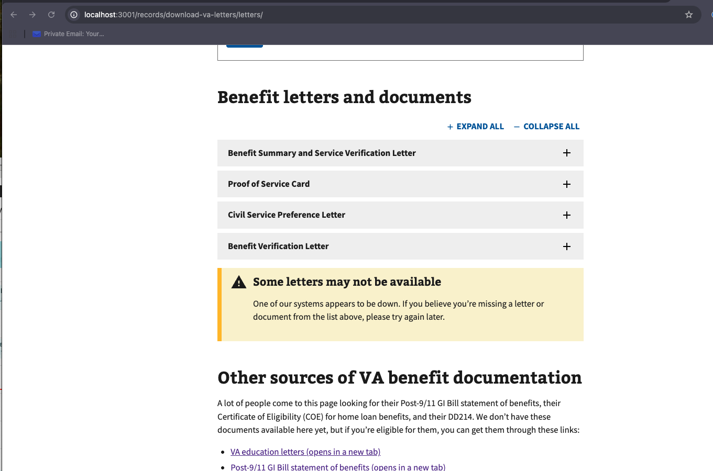
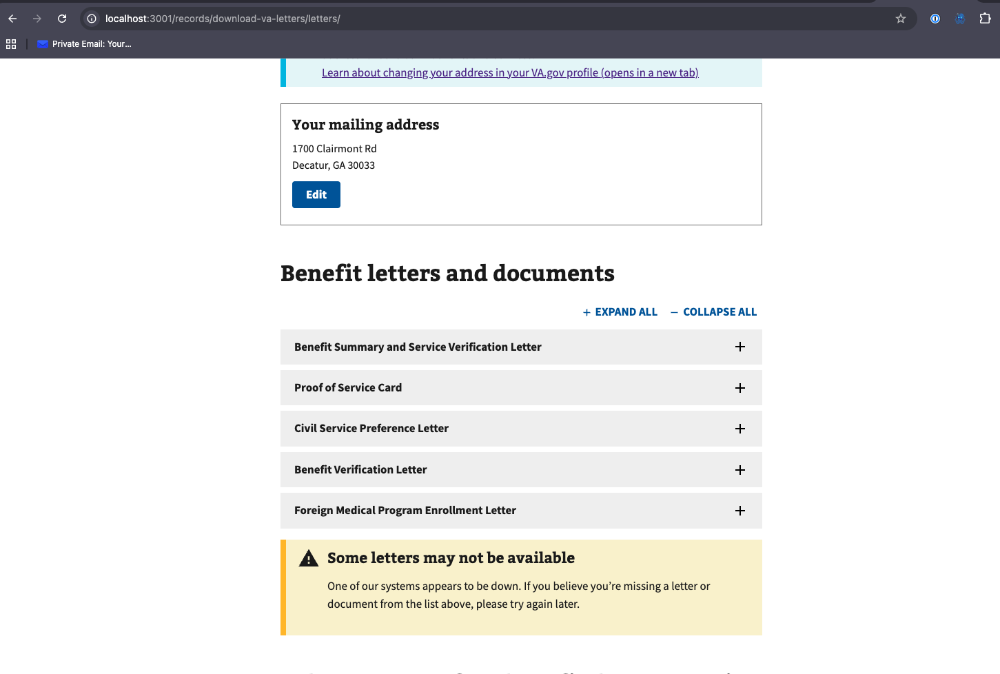
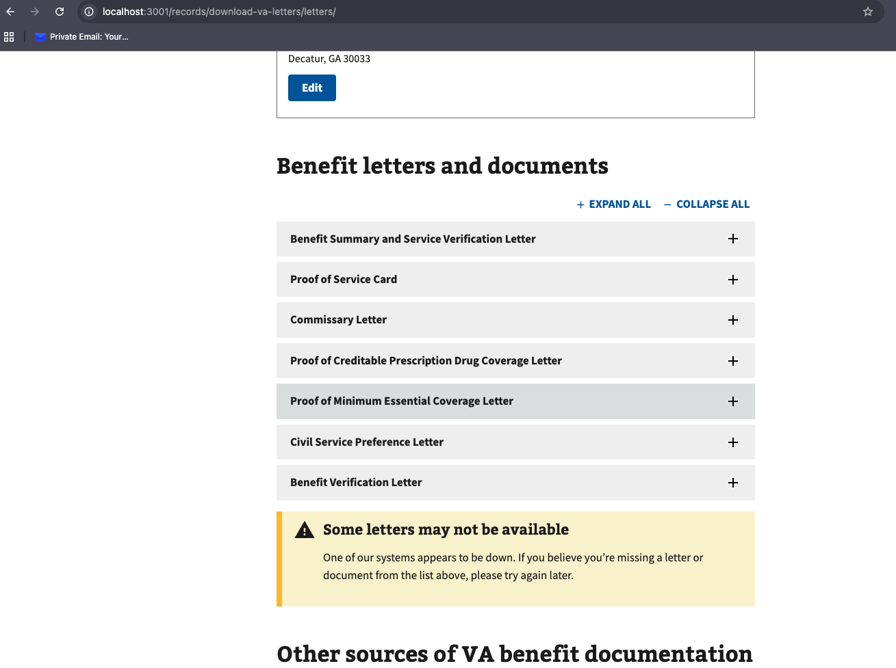
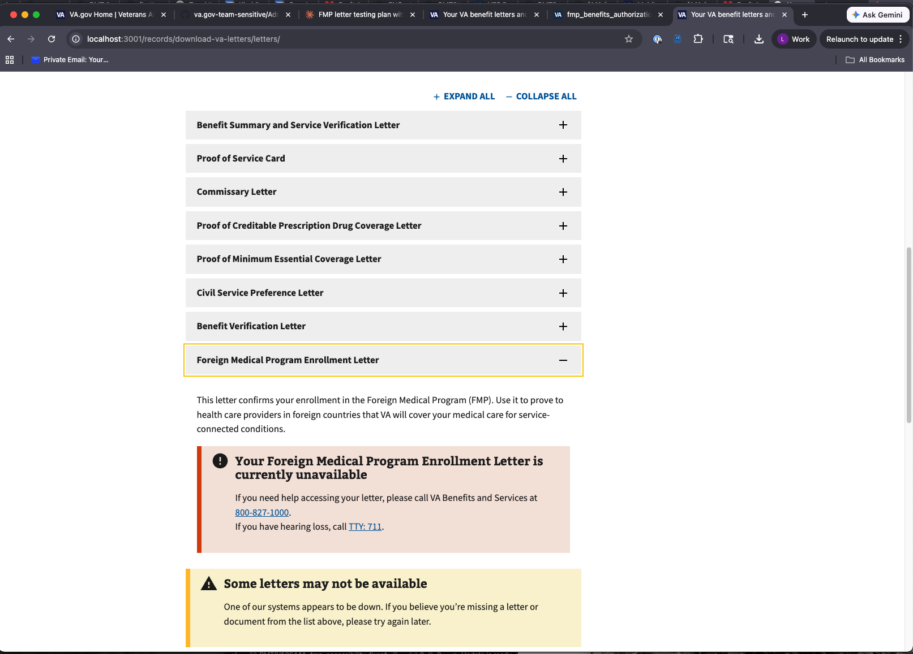
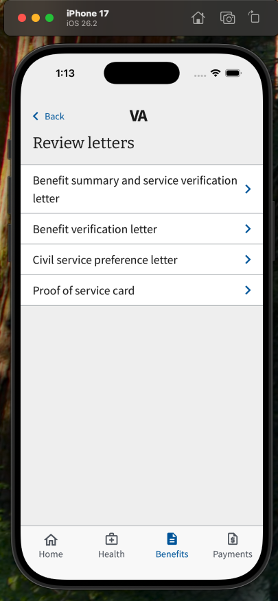
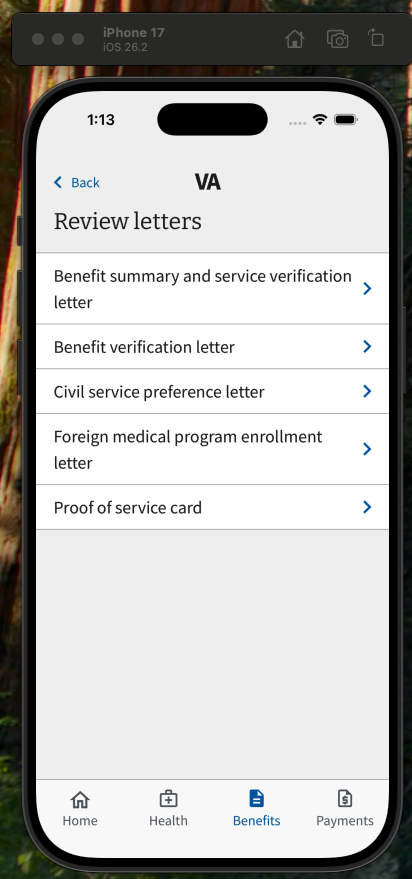
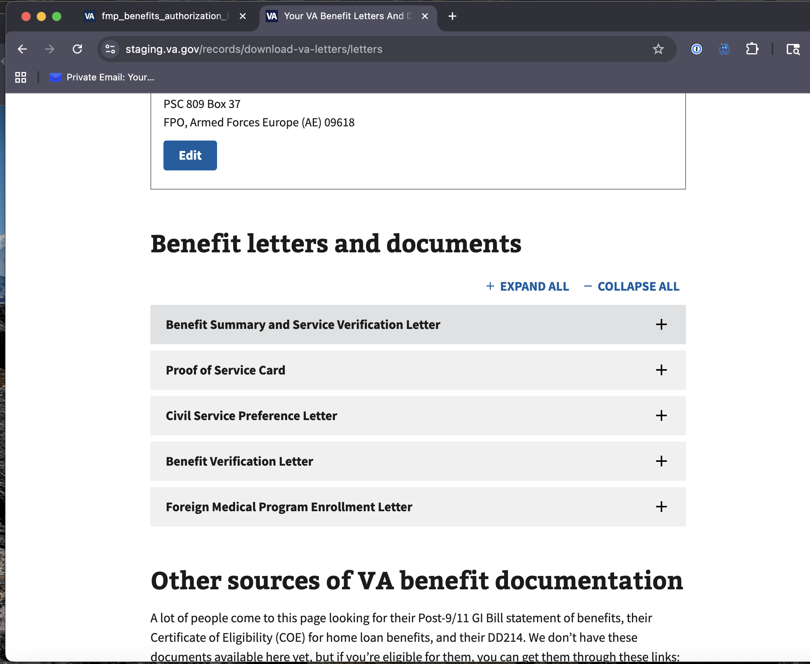
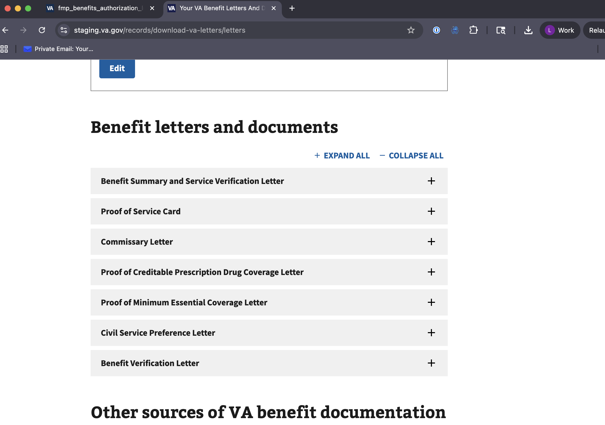
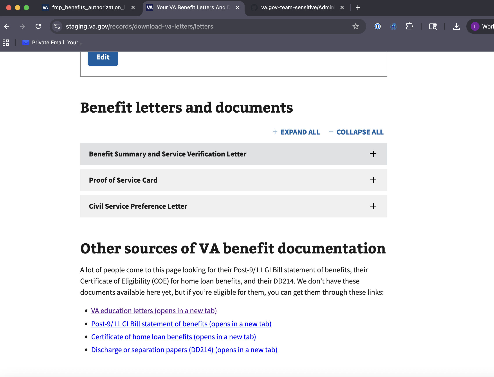
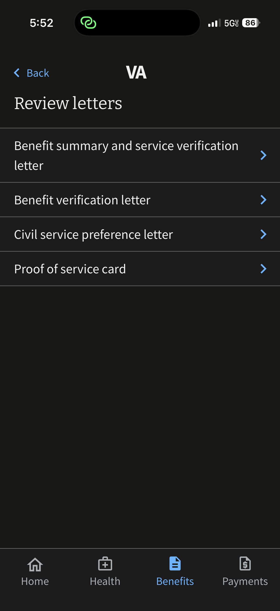

# FMP Benefits Authorization Letter – Test Plan

**Feature:** Foreign Medical Program (FMP) Benefits Authorization Letter  
**Date:** 2026-03-18  
**Environments:** Local, Staging  

---

## Feature Flag Overview

| Flag | Scope | Purpose |
|------|-------|---------|
| `fmp_benefits_authorization_letter` | Web + Mobile (global gate) | Master on/off switch. Supports progressive rollout via individual user targeting or percentage-based enablement. When disabled, neither web nor mobile surfaces the FMP letter. |
| `fmp_benefits_authorization_letter_mobile` | Mobile (all app versions) | Must be enabled for the letter to appear on mobile regardless of app version. Also serves as the sole mobile gate for users who have **not** updated to the version containing `FMPAvailable`. |
| `FMPAvailable` | Mobile only (updated app) | In-app flag required in addition to `fmp_benefits_authorization_letter_mobile`. Only present in updated app builds. Both this **and** `fmp_benefits_authorization_letter_mobile` must be ON for the updated app to show the letter. |

### Flag Dependency Logic

```
fmp_benefits_authorization_letter (master)
    ├── OFF → letter unavailable everywhere (web + mobile)
    └── ON
          ├── Web → letter visible on vets-website
          └── Mobile
                ├── fmp_benefits_authorization_letter_mobile OFF → letter not visible (any app version)
                └── fmp_benefits_authorization_letter_mobile ON
                      ├── App NOT updated (no FMPAvailable) → letter visible ✅
                      └── App IS updated (has FMPAvailable)
                            ├── FMPAvailable OFF → letter not visible ❌
                            └── FMPAvailable ON  → letter visible ✅
```

---

## Screenshot Note

**Image Reuse:** Although some test scenarios reference the same screenshot images to reduce the number of files, all images have been fully tested and confirmed to accurately match their respective scenarios.

## Regression test plan (QA1)

Regression coverage for this feature includes:

- Existing letter list behavior remains unchanged for non-targeted and ineligible users.
- Existing letter download behavior remains unchanged for all previously available letter types.
- Feature-flag gating precedence remains intact across web and mobile (`master -> mobile -> FMPAvailable`).
- Mobile old-build behavior remains compatible when `FMPAvailable` is not present.
- Error handling and user messaging continue to work for failed download and unavailable-letter states.

## Traceability reports (QA3)

The product must have a Coverage for References report that demonstrates user stories are verified by test cases in the test plan. The product must also have a Summary (Defects) report that demonstrates that defects found during QA testing were identified through test case execution.

### Coverage for References report

Use this report to map each approved story to one or more executed test cases.

| Story / Requirement Reference | Test Case ID(s) | Environment | Execution Status | Evidence |
|---|---|---|---|---|
| FMP-AL-001 (Web letter visibility) | W-1, W-2a, W-2b, W-3 | Local / Staging | Local - Pass, Staging - Pass| Screenshots below |
| FMP-AL-002 (Mobile old-build gating) | M-1, M-2, M-3, SM-1, SM-2 | Local / Staging | Local - Pass, Staging - Pass | Screenshots below |
| FMP-AL-003 (Mobile updated-app gating) | M-4, M-5, M-6, M-7, SM-3, SM-4 | Local / Staging | Local - Pass, Staging - blocked until staging merge | Screenshots below |
| FMP-AL-004 (Download + PDF validation) | W-2a, M-6, SW-1a, SM-4 | Local / Staging | Local - Pass, Staging - Pass | Screenshots below |

### Summary (Defects) report

Use this report to show that each defect came from an executed test case and was tracked to resolution.

| Defect ID | Found In Test Case | Environment | Severity | Status | Retest Case / Result |
|---|---|---|---|---|---|
|TBD|---|---|---|---|---|

Note: No defects have been found so far during executed QA test case runs.


## Tests

### E2E Tests (QA4)
Web: [Web E2E](https://github.com/department-of-veterans-affairs/vets-website/blob/main/src/applications/letters/tests/05-fmp-letter.cypress.spec.js) 

Mobile: [Mobile E2E](https://github.com/department-of-veterans-affairs/va-mobile-app/blob/develop/VAMobile/e2e/tests/VALetters.e2e.ts)

Along with manual E2E tests done below

---
### Unit Tests (QA5)
Web: [Web Unit](https://github.com/department-of-veterans-affairs/vets-website/blob/main/src/applications/letters/tests/containers/LetterList.unit.spec.jsx) 

Mobile: [Mobile Unit](https://github.com/department-of-veterans-affairs/va-mobile-app/blob/develop/VAMobile/src/screens/BenefitsScreen/Letters/LettersListScreen.test.tsx)

API: [API Unit](https://github.com/department-of-veterans-affairs/vets-api/blob/master/spec/lib/lighthouse/letters_generator/service_spec.rb)

---
### Endpoint Monitoring (QA6)

- Our rollout plan can be found at [rollout plan](https://github.com/department-of-veterans-affairs/va.gov-team/blob/master/teams/benefits-portfolio/benefits-management-tools/engineering/release-plans/fmp-benefit-letter.md)
- [DataDog Dashboard](https://vagov.ddog-gov.com/dashboard/86n-b39-hhn/benefits---management-tools---letters?fromUser=false&refresh_mode=paused&tile_focus=2694218522713164&from_ts=1764085320000&to_ts=1764096120000&live=false)
- [Google Analytics Report](https://analytics.google.com/analytics/web/#/analysis/a50123418p419143770/edit/SvIXt89hQnCx4HDFQ6iKNw)

### Logging Silent Failures (QA7)

Capture failures that do not surface a user-visible error so they can be detected and triaged quickly.

FMP letter list fetch failures are tracked and surfaced through multiple layers:

- Analytics failure event is recorded when list fetch fails.
- Exception capture is sent to error monitoring for diagnostics.
- UI fallback/status dispatches are triggered for failed list retrieval.
- Reducer maps and stores failure states for rendering logic.
- Main view renders system-down or error states based on mapped failure status.

FMP letter download failures in the enhanced letters path are surfaced to users:

- Blob-fetch failure dispatch updates application failure state.
- Enhanced letter failure state is set in centralized state handling.
- User-facing error alert is displayed in the download flow.

Unit-test coverage verifies failure handling behavior:

- Tests verify letter-list failure dispatches and error-monitoring reporting.
- Tests verify enhanced-letter download failure dispatch behavior.

### No Cross-App Dependencies (QA12)

This has been completed: the application is built in isolation with no cross-app dependencies, excluding static pages and platform components.


---
## Test Plan (QA2)
## 1. Local Testing

### 1.1 Prerequisites

- [x] `vets-api` running locally with Flipper flags accessible at `/flipper/features`
- [x] `vets-website` running locally
- [x] VA mobile app running in simulator/emulator or on device (both old and updated builds if possible)
- [x] Test user accounts available with FMP eligibility (and at least one without)
  - **Eligible (has FMP letter):** staging user 64
  - **Ineligible (no FMP letter):** staging user 100

---

### 1.2 Web – vets-website

#### Scenario W-1: Master flag OFF

**Setup:** `fmp_benefits_authorization_letter` = disabled

| Step | Expected Result | Pass | Screenshot |
|------|----------------|------|------------|
| Navigate to `/records/download-va-letters/letters` | FMP letter does NOT appear in the letter list | - [x] |  |

#### Scenario W-2a: Master flag ON – single user targeting

**Setup:** `fmp_benefits_authorization_letter` = enabled for staging user 64 only
**Test user:** staging user 64

| Step | Expected Result | Pass | Screenshot |
|------|----------------|------|------------|
| Log in as staging user 64, navigate to `/records/download-va-letters/letters` | FMP letter appears in the letter list | - [x] |  |
| Click **Download** on FMP letter | PDF downloads successfully | - [x] | |
| Verify letter content | Letter contains correct veteran info, FMP benefit details, and proper formatting | - [x] | |
| Check download progress UX | Progress indicator displays during generation; dismisses on completion | - [x] | |
| Log in as a user NOT in the targeted list | FMP letter does NOT appear (used user 54) | - [x] |  |

#### Scenario W-2b: Master flag ON – percentage rollout

**Setup:** `fmp_benefits_authorization_letter` = enabled at a partial percentage (e.g. 10%, 25%, 50%)

| Step | Expected Result | Pass | Screenshot |
|------|----------------|------|------------|
| Log in as staging user 64 | Verify letter presence matches expected rollout behavior for this user | - [x] | |

#### Scenario W-3: Non-eligible veteran

**Setup:** Master flag ON, test user without FMP eligibility
**Test user:** No mocked user available, bypassed in code

| Step | Expected Result | Pass | Screenshot |
|------|----------------|------|------------|
| Navigate to letters page | FMP letter does NOT appear (eligibility-gated, not just flag-gated) | - [x] |  |

#### Scenario W-4: Download error handling

| Step | Expected Result | Pass | Screenshot |
|------|----------------|------|------------|
| Simulate backend error (or use an ineligible account mid-session) | User-friendly error message displayed; no crash | - [x] | |
---

### 1.3 Mobile – App NOT Updated (old build)

These scenarios confirm that `fmp_benefits_authorization_letter_mobile` is the sole mobile gate for users on old app builds (which have no awareness of `FMPAvailable`).

#### Scenario M-1: Master flag OFF, mobile flag irrelevant

**Setup:** `fmp_benefits_authorization_letter` = disabled

| Step | Expected Result | Pass | Screenshot |
|------|----------------|------|------------|
| Open Letters section in old app build | FMP letter not present | - [x] | |

#### Scenario M-2: Master ON, mobile flag OFF

**Setup:** `fmp_benefits_authorization_letter` = enabled, `fmp_benefits_authorization_letter_mobile` = disabled

| Step | Expected Result | Pass | Screenshot |
|------|----------------|------|------------|
| Open Letters section in old app build | FMP letter not present | - [x] |  |
| Web letters page | FMP letter IS present (web unaffected by mobile flag) | - [x] | |

---

### 1.4 Mobile – App Updated (new build with `FMPAvailable`)

For updated app users, **both** `fmp_benefits_authorization_letter_mobile` and `FMPAvailable` must be enabled. `fmp_benefits_authorization_letter_mobile` is not optional for updated app users — it is still required.

**Test user:** mocked user 54

#### Scenario M-4: Master ON, mobile flag ON, `FMPAvailable` OFF

**Setup:** `fmp_benefits_authorization_letter` = enabled, `fmp_benefits_authorization_letter_mobile` = enabled, `FMPAvailable` = disabled

| Step | Expected Result | Pass | Screenshot |
|------|----------------|------|------------|
| Open Letters section in updated app | FMP letter not present (`FMPAvailable` gates it off) | - [x] |  |
| Web letters page | FMP letter IS present | - [x] | |

#### Scenario M-5: Master ON, mobile flag OFF, `FMPAvailable` ON

**Setup:** `fmp_benefits_authorization_letter` = enabled, `fmp_benefits_authorization_letter_mobile` = disabled, `FMPAvailable` = enabled

| Step | Expected Result | Pass | Screenshot |
|------|----------------|------|------------|
| Open Letters section in updated app | FMP letter NOT present (`fmp_benefits_authorization_letter_mobile` is required even for updated app) | - [x] |  |
| Web letters page | FMP letter IS present | - [x] | |

#### Scenario M-6: Master ON, mobile flag ON, `FMPAvailable` ON

**Setup:** All three flags enabled

| Step | Expected Result | Pass | Screenshot |
|------|----------------|------|------------|
| Open Letters section in updated app | FMP letter present | - [x] |  |
| Tap to download | Letter downloads successfully | - [x] | |
| Verify letter content | Matches expected FMP letter content | - [x] | |

#### Scenario M-7: Master OFF, mobile flag ON, `FMPAvailable` ON

**Setup:** `fmp_benefits_authorization_letter` = disabled, others enabled

| Step | Expected Result | Pass | Screenshot |
|------|----------------|------|------------|
| Open Letters section in updated app | FMP letter NOT present (master flag takes precedence) | - [x] |  |
| Web letters page | FMP letter NOT present | - [x] | |

---

## 2. Staging Testing

### 2.1 Prerequisites

- [x] Flipper flags configured in staging environment (verify via staging Flipper UI or `vets-api` console)
- [x] Staging test accounts with FMP eligibility confirmed
  - **Eligible (has FMP letter):** staging user 64
  - **Ineligible (no FMP letter):** staging user 100
- [ ] Mobile staging build deployed (both old and new app versions if available in staging) - currently old available
- [ ] Coordinate with VA mobile team on `FMPAvailable` flag state in staging 

---

### 2.2 Staged Rollout Sequence

Staging tests should follow the intended production rollout order. The master flag `fmp_benefits_authorization_letter` uses progressive rollout — start with individual users, then expand by percentage.

**Phase 1 – Web only, single user targeting**
1. Enable `fmp_benefits_authorization_letter` for staging user 64 only
2. Keep `fmp_benefits_authorization_letter_mobile` = disabled
3. Confirm web works for targeted user; confirm all mobile and non-targeted web users do NOT see the letter

**Phase 2 – Web only, percentage rollout**
1. Expand `fmp_benefits_authorization_letter` to a small percentage (e.g. 10%)
2. Keep `fmp_benefits_authorization_letter_mobile` = disabled
3. Monitor Datadog for errors; confirm mobile still unaffected

**Phase 3 – Mobile (updated app)**
1. Increase `fmp_benefits_authorization_letter` percentage as confidence grows
2. Enable `fmp_benefits_authorization_letter_mobile` and `FMPAvailable`
3. Confirm updated app shows letter; confirm old app also shows letter via `fmp_benefits_authorization_letter_mobile`

**Phase 4 – Full rollout**
1. Expand `fmp_benefits_authorization_letter` to 100%
2. Confirm letter available to all eligible veterans across web and mobile

---

### 2.3 Web Staging Scenarios

#### Scenario SW-1a: Letter visible for targeted user

**Setup:** `fmp_benefits_authorization_letter` enabled for staging user 64 only

| Step | Expected Result | Pass | Screenshot |
|------|----------------|------|------------|
| Log in as eligible veteran on staging (staging user 64) | | - [x] | |
| Navigate to `/records/download-va-letters/letters` | FMP letter present in list | - [x] | |
| Download letter | PDF generates and downloads | - [x] | |
| Inspect PDF | Correct veteran data, correct FMP benefit content | - [x] | |
| Check for errors in browser console / network tab | No 4xx/5xx errors | - [x] | |

#### Scenario SW-1b: Letter not visible for non-targeted user during partial rollout

**Setup:** `fmp_benefits_authorization_letter` enabled at partial percentage or single-user targeting (user 64 only)

| Step | Expected Result | Pass | Screenshot |
|------|----------------|------|------------|
| Log in as a user outside the targeted set | FMP letter NOT present in letters list | - [x] | |

#### Scenario SW-2: Letter absent for ineligible veteran

| Step | Expected Result | Pass | Screenshot |
|------|----------------|------|------------|
| Log in as ineligible veteran on staging (staging user 100) | | - [x] |  |
| Navigate to letters page | FMP letter not in list; no JS errors | - [x] |  |

---

### 2.4 Mobile Staging Scenarios - Awaiting staging deploy of mobile

#### Scenario SM-1: Master ON, mobile flag OFF (all app versions)

| Step | Expected Result | Pass | Screenshot |
|------|----------------|------|------------|
| Use old app build on staging | FMP letter absent from Letters section | - [x] | |
| Use updated app build on staging | FMP letter absent from Letters section | - [ ] | Pending |

#### Scenario SM-2: Old app, mobile flag OFF

| Step | Expected Result | Pass | Screenshot |
|------|----------------|------|------------|
| Disable `fmp_benefits_authorization_letter_mobile` on staging | | - [x] |  |
| Use old app build | FMP letter not present | - [x] | |

#### Scenario SM-3: Updated app, mobile flag ON, `FMPAvailable` OFF

| Step | Expected Result | Pass | Screenshot |
|------|----------------|------|------------|
| `fmp_benefits_authorization_letter_mobile` = enabled, `FMPAvailable` = disabled | | - [ ] | |
| Use updated app build | FMP letter absent (`FMPAvailable` still required) | - [ ] | |

#### Scenario SM-4: Updated app, mobile flag ON, `FMPAvailable` ON

| Step | Expected Result | Pass | Screenshot |
|------|----------------|------|------------|
| Both `fmp_benefits_authorization_letter_mobile` and `FMPAvailable` enabled | | - [ ] | |
| Use updated app build | FMP letter present | - [ ] | |
| Download letter | Success | - [ ] | |
| Cross-check with web and old app | Same letter content | - [ ] | |

---

### 2.5 Cross-Platform Consistency Check

After all flags are fully enabled in staging:

| Check | Expected | Pass | Screenshot |
|-------|----------|------|------------|
| Letter content matches between web and mobile downloads | ✅ Identical | - [x] | |
| Letter content matches between old app and updated app | ✅ Identical | - [x] | |
| PDF is accessible (passes basic screen reader / PDF accessibility check) | ✅ Pass | - [x] | |

---

### 2.6 Staging Review Checklist

- [x] Single-user targeting verified before percentage rollout begins
- [x] All three flag combinations tested end-to-end
- [x] No console errors or unexpected API failures
- [x] Download UX (loading state, success, error) confirmed on web
- [x] Download UX confirmed on mobile (both old and updated builds)
- [x] Ineligible veteran correctly excluded
- [x] Letter PDF content verified
- [x] Datadog / logging reviewed for unexpected errors during test session
- [ ] No error rate spikes observed at each percentage rollout increment
- [ ] Mobile team sign-off on `FMPAvailable` flag behavior
- [ ] Product/design sign-off on letter presentation

---

## 3. Flag State Matrix Summary

| `fmp_benefits_authorization_letter` | `fmp_benefits_authorization_letter_mobile` | `FMPAvailable` | Web | Old App | Updated App |
|---|---|---|---|---|---|
| OFF | any | any | ❌ | ❌ | ❌ |
| ON | OFF | any | ✅ | ❌ | ❌ |
| ON | ON | n/a (old app) | ✅ | invalid | — |
| ON | ON | OFF | ✅ | invalid | ❌ |
| ON | ON | ON | ✅ | ✅ | ✅ |

> `fmp_benefits_authorization_letter` uses progressive rollout (single user targeting → percentage → 100%). `fmp_benefits_authorization_letter_mobile` must be ON for any mobile visibility. For updated app users, `FMPAvailable` is an additional required gate on top of it.
