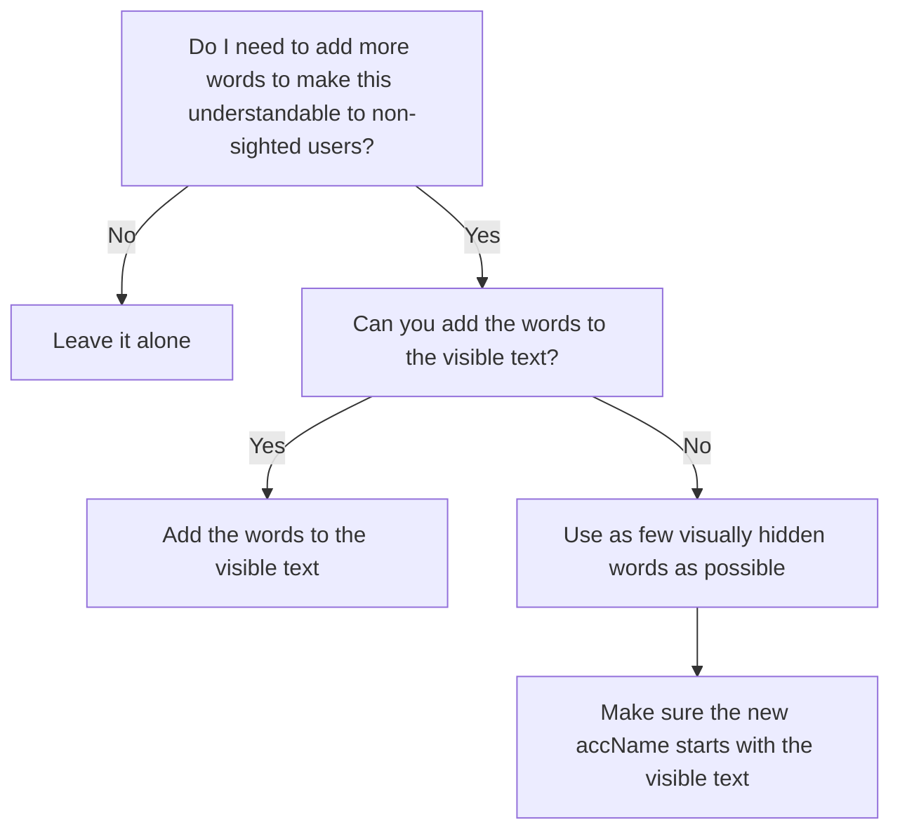

# Cookbook Recipe Ideas

- ~**When to use ARIA**: When to rely on native HTML features and when to lean on ARIA.~
- ~**How to structure headings**: Describe the ideal state for headings on a page, and how they affect different people with disabilities.~
- ~**Buttons vs. links**: When to use one vs. the other.~
- ~**Visually hidden text best practices**: When to use visually hidden text, based on a deep dive into voice command tools.~
- **Accessibility challenges with progressive disclosure**: When can this principle cause problems for screen readers.
- **When people who use screen readers need to know about something happening on a page**: A good place to dive into ARIA live regions.
- **Card best practices**: Cards can get complex quickly. List best practices for one or more cards on a page.
- **Alert best practices**: Where does the focus state start? How to announce alerts to screen readers? What are examples of accessible wording for alerts? When should we use alerts? Where do we place these alerts?
- **Forms mode vs browse mode**: How do these work in screen readers and how does it effect the experience?
- **What is an accessible date picker?**: This can be a tricky component for assistive technology and was brought up by one of our researchers as a good thing to dig into more.
- **Page titles**: How do page titles help with accessibility?
- ~**What does one thing per page mean?**: How much content is one thing?~
- **Tools to do better research**: Help teams do better research with people with disabilities.
- ~**Managing focus**: How to manage focus in an accessible way.~
- ~**Labeling controls**: When should we use sr-only classes vs aria-labels or aria-describedby or aria-label.~
- **Making a prototype accessible**: How to make a Figma/UXPin/DesignToolX prototype accessible? And if this is not possible, then what are the alternatives?
- **Skip links**: Importance of, why we need them, how they work, where to make them go to
- **Error handling and focus management**: Additional documentation on how errors are displayed and which code element receieves focus to read the error and where focus lands so the user can fix the error
- **When to use visually hidden text:** via this flowchart:

