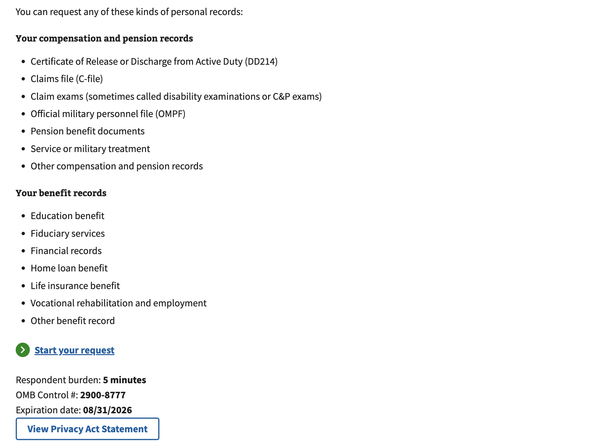
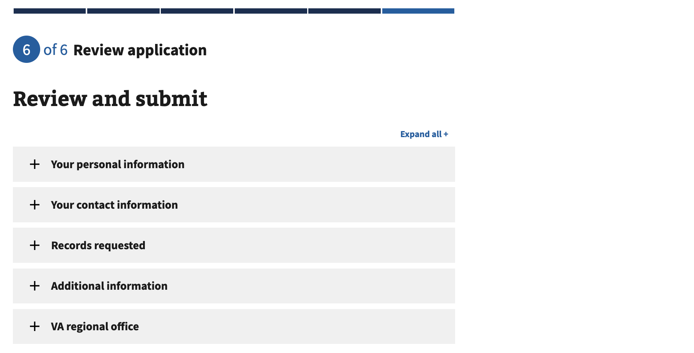
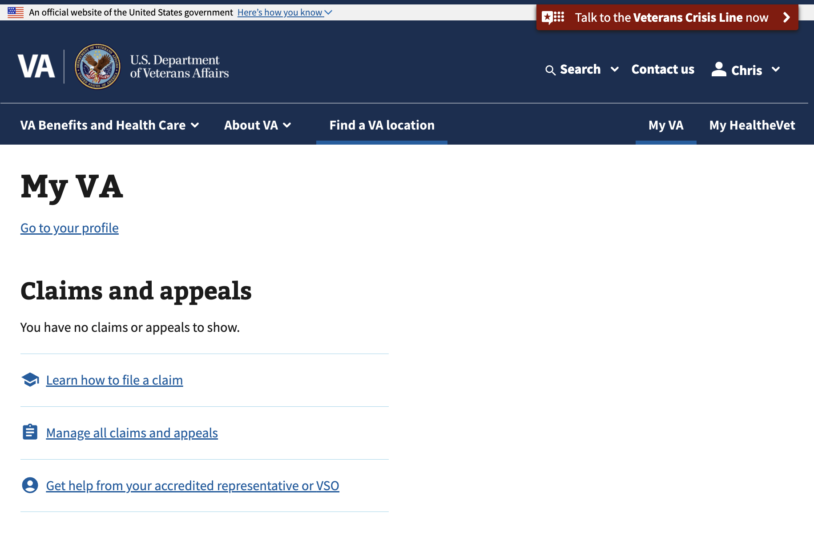
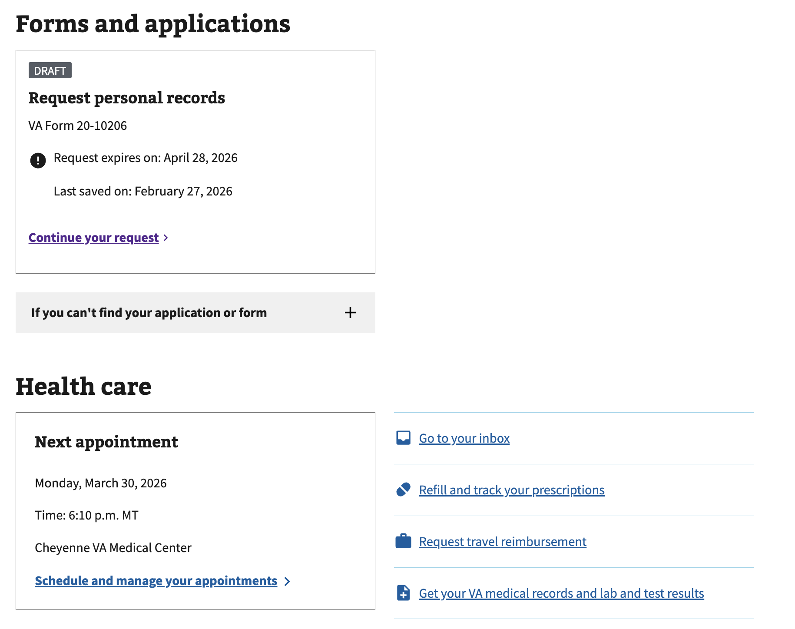
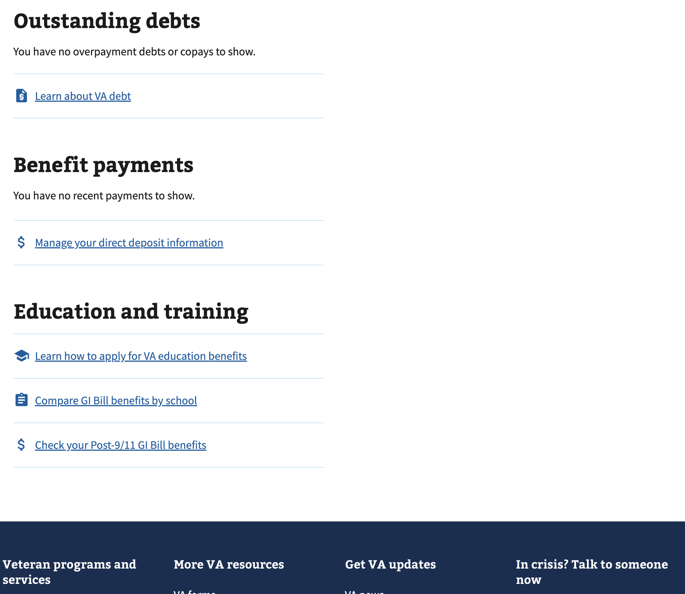

> [!TIP]
> **Complete the frontmatter section above AFTER you've finished and saved your research findings report below.**
> 
> Use the [GitHub Copilot Research Findings Frontmatter Completion Prompt](https://github.com/department-of-veterans-affairs/va.gov-team/blob/master/platform/research/copilot-prompts/research-report/research-findings-frontmatter-completion-prompt.md) to automatically generate structured metadata from this completed research findings report. The prompt uses natural language processing to extract key findings, participant demographics, recommendations, and apply appropriate research repository tags.

---

# 2026-01 Save in Progress (2nd round of usability testing) Research Findings 

**Office of the CTO - Digital Experience (OCTO-DE), Accessibility Digital Experience (ADE)**

**Date:** 02/20/2026

**Contacts:** Cindy Merrill

**[Research Readout (PDF)](link-here)**  
*Add a link to your research readout deck, if available.* **TBD**

**Jump to:**
- [Hypotheses and conclusions](#user-content-hypotheses-and-conclusions)
- [Key findings](#user-content-key-findings)
- [Recommendations](#user-content-recommendations)
- [Product User and Business Outcomes](#user-content-product-user-and-business-outcomes)
- [Key Performance Indicators](#user-content-key-performance-indicators)
- [Next Steps](#user-content-next-steps)
- [Further research needed](#user-content-further-research-needed)
- [Appendix](#user-content-appendix)
- [Research participants](#user-content-research-participants)

## Research Goals
Veterans may fill out web forms on VA.gov throughout their lives, including all stages of the Veteran Journey--Serving and separation, Living civilian life, and Retiring and aging. **Saving in-progress work while filling out an online form** is an interaction for which the current implementation on VA.gov has two known accessibility issues, and a revised design that was [usability tested in May 2025](https://github.com/department-of-veterans-affairs/va.gov-team/blob/master/teams/digital-experience/ADE/research/2025-05-save-in-progress/research-findings.md) didn't work very well. Key findings from that study indicated that most participants didn't know that their information was being saved automatically, and they didn't see or remember either of the informational alerts about saving. 

This research study is intended to get user feedback on a revised design that hopefully communicates more effectively to Veterans that the information they enter into forms will be saved automatically. The new design adds an [interstitial page (in Figure 1 below)](#user-content-figure-1-shows-the-new-interstitial-page) about saving that appears after the user clicks the Continue button on the first page of form fields, which is after they've started filling out the form and during a natural pause in their work (between form pages).

### Figure 1 shows the new interstitial page

The **goals of this research** were to 
1. See if Veterans understand that their form data is being saved as they're filling out a form but haven't submitted it yet.
1. See if Veterans can stop filling out a form, get signed out, and then resume filling out a form.
1. See if moving the accordion controls to the left side affects usability.

Findings and recommendations from this research will **inform guidance and documentation for the "save in progress" feature** for authenticated users filling out forms on VA.gov. Matt Dingee asked ADE to assist with this because some VFS teams are innovating new designs, whereas "save in progress" should be a standard pattern used by all teams for consistency across VA.gov.

## Research Questions

### Research goal 1: See if Veterans understand that their form data is being saved as they're filling out a form but haven't submitted it yet.
1. What reactions/feedback do Veterans have upon encountering the interstitial page after clicking "Continue"?
1. Do Veterans think that their form data is being saved? If so, how confident are they?
1. Do Veterans click on either of the links on the interstitial page (that go to "My VA" or the form intro page)?
1. Do Veterans remember later what the interstitial page said?

#### Research goal 2: See if Veterans can stop filling out a form, get signed out, and then resume filling out a form.  
1. Do Veterans use the "Finish later" button to stop filling out a form?
1. What feedback do Veterans have on the revised "Finish later" page? 
1. Are Veterans able to resume filling out a form that they previously started? If so, how?
1. Do users realize that they have to sign in before resuming the form?

#### Research goal 3: See if moving the accordion controls to the left side affects usability.
1. Are Veterans able to open and close accordions with controls on the left side? (especially people using a screen magnifier)

## Methodology 

We conducted **remote moderated usability testing** to observe research participants filling out an online form. The participants were logged in so that the information they entered was automatically saved before the form was submitted. We used a GitHub Codespace that was accessible to screen readers and screen magnifiers.

Research sessions were conducted over Zoom during January 12-21, 2026. Sessions were 90 minutes long for Veterans using assistive technology (i.e., screen readers or screen magnifiers), and 60 minutes for Veterans not using any assistive technology (AT). 

## Participants--Overview and AT
 Perigean recruited **9 research participants** who were Veterans. 7 participants were able to complete all the user tasks, and the other 2 participants were not because of technical issues.  
 - **5 were assistive technology users**:
   - 4 used a screen reader
   - 1 used a screen magnifier
  - 4 were on a computer, and 5 were on a smart phone
  - 4 had never filled out a VA form online before

The assistive technology used by the 5 participants is summarized in the table below. 

P# | Screen Reader/Magnifier | Software | Device | O/S | Browser 
-- | ----- |------|-------|--------|--------
2 | none | none | phone | iOS | Safari 
3 | Screen reader | JAWS w/mouse echo | computer | Windows | Chrome 
4 | Screen reader | VoiceOver | phone | iOS | Safari then Chrome
6 | Screen reader | Read aloud highlighted text | phone | iOS | Safari 
7 | none | none | computer | Windows | Chrome 
8 | Screen reader | TalkBack | phone | Android | Chrome
9 | none | none | computer | Windows | Opera
11 | Screen magnifier | Windows Magnifier | computer | Windows | Chrome
12 | unknown | unknown | phone | Android | unknown because didn't get that far

For demographic details, see [Research participants](#user-content-research-participants).

## Hypotheses and Conclusions

1. With the new design, Veterans are confident that their form data will be saved.
    - **Definitely False** because most participants said they would lose the information they entered if they didn't click the "Finish later" button or submit the form. They didn't realize that the form was saving their information every time they moved onto the next field.
1. Telling Veterans about auto saving after the first form page is a time when they are receptive and likely to remember.
    - **Definitely False** because most participants skipped past the interstitial page in their zeal to fill out the form. 
1. With the new design, Veterans will be able to stop filling out a form, get signed out, and then resume filling out a form.
    - **Likely True** because all participants used the "Finish later" button to stop filling out the form, and successfully resumed by signing in and then using the "My VA" page. 
1. All Veterans (including screen magnifier and screen reader users) will find the accordion controls on the left side easy to use.
    - **Likely True** because all 6 participants who interacted with the accordions on the Review/Submit page were able to easily open and close them, which included one person using a screen magnifier.

## Key Findings

> **After completing your detailed findings below, you'll add metadata labels using the [Key Findings Metadata Labels Prompt](https://github.com/department-of-veterans-affairs/va.gov-team/blob/master/platform/research/copilot-prompts/research-report/add-metadata-labels-to-findings-prompt.md).**  

1. The interstitial page was NOT effective in communicating about save in progress because most users were so focused on form fields that anything else was ignored.
1. Most participants assumed that saving happened only after selecting "Finish later" or submitting the form.
1. All participants used the "Finish later" button to stop filling out the form, and then successfully resumed the form.
1. All participants who interacted with the accordions on the "Review and submit" page easily opened and closed them using the controls on the left side.
1. Most participants wanted to be notified by email or text after selecting "Finish later" and before their information gets deleted.
1. All participants who encountered an error while filling out the form were able to fix it themselves.

## Details of Findings 

> [!TIP]
> **After drafting your detailed findings, apply OCTO metadata labels to enable automated pattern detection and cross-study aggregation.**
> Use the [GitHub Copilot Key Findings Metadata Labels Prompt](https://github.com/department-of-veterans-affairs/va.gov-team/blob/master/platform/research/copilot-prompts/research-report/add-metadata-labels-to-findings-prompt.md) to generate structured YAML label blocks for each finding below.

- _Supporting data: _  

> **TIP:** For details on how to write descriptive links that are accessible to assistive technology users, see Platform documentation on [How to create accessible GitHub Markdown files](https://depo-platform-documentation.scrollhelp.site/research-design/how-to-create-accessible-github-markdown-files).

### Finding 1: The interstitial page was NOT effective in communicating about save in progress because most users were so focused on form fields that anything else was ignored.
Half of the participants ignored the interstitial page when it came up because it was an **unwelcome interruption to their task of filling out a VA form and didn't seem relevant**.  

  > *"I'm focused on the task, getting a job done. Trying to get to the form, and...I was kind of speed reading through it" (p7).*

  > *"Where's my form? Let me fill it out...I read it and it didn't register, it didn't click" [that these were instructions to read] (p11).*

  > *"I was already beginning to input information on the previous page and then all of a sudden, it shows me what to expect in the form that I'm going to be filling out, which I basically was already doing, so that's probably why I did not focus on that" (p9).*

  > *"Bombarding somebody with the information in the beginning, if it's pertinent or not" (p8).*

Half of the participants did read the interstitial page but **most didn't remember that it said all of their work would be saved automatically**.  

While looking at the interstitial page again at the end of the research session, participants provided some **additional feedback**: 

- Two participants didn't read the heading but only the text below it, and it was the heading that said "We'll save your information automatically after every change you make."
  > *"The big bold up at the top is usually the title of the page or the document, and it's the little stuff down below that has the meat--the meaning" (p9).*

- One participant didn't realize that "after every change you make"  applied to entering information the first time.

  > *"I'm starting this, and I'm making entries. And it's talking about I'm making changes" (p7).*
- Another participant said that if form information is being saved  all the time, why would we ever need to click "Finish later"? It seems like we're conflating two messages in the interstitial page: (1) your information is being automatically saved, and (2) how to get back to your in-progress form after selecting "Finish later".

- Four participants didn't understand the "form introduction" link. Two clicked on it and were confused when it took them to the page they already saw. One participant thought it might open a new introduction, such as a video.

- One participant didn't understand the "My VA" link. She has a VA account but wasn't familiar with the term "My VA".

### Finding 2: Most participants assumed that saving happened only after selecting "Finish later" or submitting the form.
After participants finished filling out the form, we asked when they thought their information was saved. Most participants (6 of 7) said only after selecting the "Finish later" or "Submit" button. **Most skipped or forgot the interstitial page that said their information gets saved automatically.** When we told participants that VA form information is saved automatically, they were pleasantly surprised because they didn't want to lose their work. Maybe it's OK if people don't know that saving is happening automatically, as long as they're glad to not be losing information they entered.

### Finding 3: All participants used the "Finish later" button to stop filling out the form, and then successfully resumed the form. 
**All 7 participants found the "Finish later" button intuitive to save their work**, even if they didn't remember it from the interstitial page. Only one person said they knew that it would save from their past experience with VA forms. One participant said that he was leery of losing his work if he stopped in the middle:

> *"I'd just sit here and finish it until I was done...I hate doing work and then having to come back and redo the exact same thing.  Experience over time [with non-VA forms] has taught me to not trust what it's supposed to do...If it works like it should, everything up to the point where I stop should remain filled out, and when I log back in...it should take me right where I left off" (p9).*

5 of 7 participants knew that they needed to sign in to resume their form. One participant didn't know that, and another participant didn't need to sign in because of a prototype malfunction. **6 of the 7 participants resumed their form from the "My VA" page**, and one did it from the form intro page.  

> *"Right back to where I left off" (p11).*

> *"That's nice that that's right there. I like that. I wouldn't have expected that for something that I was doing previously to pop up in my main page when I first sign in...That's a great feature because I forget easily, so I might not even remember what the form number was" (p9).*

### Finding 4: All participants who interacted with the accordions on the "Review and submit" page easily opened and closed them using the controls on the left side.
6 of 7 people who reached the "Review and submit" page used the accordions, and **none had any issues interacting with the "+" and "-" controls on the left side (instead of on the right in the current VA Design System)**. This included the participant who was using a screen magnifier. In the [previous round of usability testing](https://github.com/department-of-veterans-affairs/va.gov-team/blob/master/teams/digital-experience/ADE/research/2025-05-save-in-progress/research-findings.md#finding-6-va-forms-in-general-had-accessibility-issues-for-screen-readers-and-screen-magnifiers), a participant using a screen magnifier didn't understand how to interact with these accordions when the "+" control was on the right because it wasn't visible to him. 

One participant interpreted the accordions as providing extra information to help the VA find their records, and he was surprised when he saw that it was only the information that he had already entered.

Two participants didn't notice the "Expand all" link, one of whom said that the text was too small. That participant said that he would have clicked on "Expand all" if he had seen it, instead of opening each accordion one at a time. A third participant said that he never uses "Expand all" because he gets too overwhelmed by the length of what might expand, so it's better for him to expand each accordion, one at a time.

One participant said that he liked the "Edit" buttons so you don't have to go back to previous form pages to make changes.

### Finding 5: Most participants wanted to be notified by email or text after selecting "Finish later" and before their information gets deleted. 

Most participants (6 of 7) assumed that after 60 days, their saved form data would be deleted. **Almost everyone wanted to be notified before that via email and/or text**, with one participant suggesting a notification in the VA mobile app. Most people wanted the first notification within 1-7 days of having selected "Finish later", and then once a week after that. 

Eight participants said they wanted to be able to delete a form they started but never finished. Reasons provided included finding out that you no longer needed to submit that form, you already submitted it, or it was the wrong form. 

### Finding 6: All participants who encountered an error while filling out the form were able to fix it themselves.
6 of 7 participants encountered errors, some of which likely resulted because the participants were entering fake data (e.g., name, social security number) as instructed, in order to not share PII. Below are descriptions of some of the issues.

1. Six of 7 participants didn't enter their name correctly in the **name field on the "Review and submit" page**. 4 people corrected the name by using what the error message said, one of whom was glad to see that (see quote below); someone else was annoyed that he couldn't copy/paste the name from the error message and had to retype it (see quote below). 2 people didn't notice the name within the error text and instead expanded the "Your personal information" accordion to see what they entered before. 

    > p3 liked that the error told you what it the name was supposed to be: *"Great! Wish more forms did it that way" (p3).*

    > p8 wanted to copy/paste the name in the error: *"It won't let me even copy that" (p8).*
1. A screen reader user entered the postal code and then a space in order to hear JAWS read it. This triggered an error because there was a space entered into that field and so too many characters. The participant said that they encounter this same issue on many forms, so they realized what the problem was and how to correct it.
1. One participant entered "1-" at beginning of phone number, which resulted in an error because there were more than 10 digits.

## Additional Insights
1. One participant expressed his **appreciation for us taking the time to learn from Veterans**:
    > *"I'm happy you guys are doing this because I go to other kinds of websites, and it's just a nightmare trying to get through--the way they've laid stuff out. So I'm very happy that you guys asked for feedback for the user experience. It's fantastic! Thanks" (p7).*

1. Three participants encountered **accessibility issues while filling out the form while using a screenreader**

     1. P3 was using the JAWS screenreader on desktop with mouse echo (which announces whatever is under the mouse), and **JAWS didn't announce any "Country" select/dropdown options when the dropdown was open and the mouse was over an item**. He had to click to select an option before the screen reader announced it. This is a known issue that affects screen readers and mouse control of dropdown menus, which unfortunately is not fixable.

     1. Another issue P3 encountered (JAWS with mouse echo) is that text that looked like **one sentence was announced in small chunks** instead of as a single sentence, resulting in awkward pauses and missed information. For example, here's how the "Finish later" message sounded (each ellipsis required a mouse movement): "Your personal records request has been saved...Jan 13, 2026 at 5:43 pm...Your saved...request...will expire on...March 14, 2026."

     1. P4 (VoiceOver screenreader on an iPhone in Safari browser) experienced the **form intro page load with focus in the wrong place**--it was in the footer instead of the top of the page where it was supposed to be. This is a known issue with VoiceOver and Safari that has no known fix.

     1. P8 (infrequently uses the TalkBack screenreader on Android) **didn't understand the word "va"**, which was how TalkBack announced "VA". He figured it out after listening to it a few times. The general consensus is to leave this as is because AT users get used to it.

1. Two participants were **frustrated with their AT, perhaps because the tools weren't appropriate for their level of impaired vision**, and they didn't know that another tool might meet their needs better. 
     1. P6 with low vision wasn't using a screenreader on his smartphone but instead a **tool that reads aloud whatever text you highlight with your finger. He kept wanting the tool to read aloud everything on the screen**, but it skipped some text (including accordions) and read some text in small parts with breaks in between (e.g., on the "Records requested" page of the form, as well as the message that appears after you select "Finish later"). At the end of the session, we recommended that the participant try the VoiceOver screenreader.

        > *"I'd like to read it all, but I don't know how to make it do that...It will only let me highlight the first item that appears…'3 of 6 records requested.' Okay, so there's way more information than what you just heard. It looks like it's gonna make me highlight every little bit. I like to do the whole page" (p6).*

        He didn't know that a screenreader would read everything on the page for him.

     1. P8 with low vision was using the TalkBack screenreader on his Android phone to qualify for the AT session, but normally he uses it only as a last resort. He **dislikes TalkBack because it talks too much, is difficult to stop, and scrolling is different**. He didn't know that there were tools that can read text for you without announcing so much about the page and navigation. 

        Usually P8 gets by without reading most of the content and infers what's there or has memorized where to go and what to do from previous experiences. He can read black text on white but it's blurry. He can't read colored text or links, any text on non-white backgrounds, or in dim light. He prefers to use his PC instead of a smartphone since he can increase the brightness/contrast and zoom in. Sometimes he copies colored text into Word, where he can change the text to black. 

        After the session, we recommended a tool that reads only text that he selects, rather than everything on the page: [Select to Speak](https://support.google.com/accessibility/android/answer/7349565?hl=en&ref_topic=9079043&sjid=17578886789114503438-NC).

        > *"As you're trying to navigate, it's constantly yelling at you...Just backspace, please. I know it's a backspace. Just do it." (p8).*

        > *"In order for me to scroll up and down, I can't use one finger. I have to use both fingers. If I use one, she [TalkBack] reads it" (p8).*

        > *"I memorize it, and I make sure that if I go to click on something that's familiar, that I'm expecting this page...And if the word, the text, box shapes are different, or if it's a different set of colors, or if it's a different layout (like it was a year ago that the VA switched not only the login, because I was always using ID.me, but it switched the placement of where that was, and then it gave 3 new windows)...I'm gonna wait till I get home [where I can use the PC and make it bigger]" (p8).*

1. Participants had some **usability issues on the form intro page**:
    
    1. Two non-AT participants were **confused when they saw the form intro page** because they were looking for fields to fill out. One of them always uses Google to find VA forms and never sees the form intro page. The other didn't notice the form number below the big "Request personal records" heading, in part because it was split across two vertical lines: (1) **(VA Form 20-**, and (2) **10206**". 
    
        

Screenshot of the form number split across two lines in Figure 2

        Figure 2 shows the VA form number "20-10206" split across two lines.

        
        

     1. Two screenreader users **expected to be able to click on one of the record types listed on the form intro page**, but they weren't clickable. This also happened to one screenreader user in the previous round of usability research.
        > *"But these are only bullets, not checkmarks, so I know I have to go to the form" (p4).*

    1. One participant **didn't know what "Fiduciary services" means** and how it's different from "Financial records". These were two of the items listed under "Types of information you can request". 

    1. One non-AT participant found it **confusing to appear to stay on the same page (the signed in version) instead of seeing the form**. In the last round of usability testing, 3 participants said the same thing.

       > *"I wanted to fill out a form, I signed in to fill out the form, and all of a sudden, it looks like I'm right back on the same page that I just started at, but actually signed in. I would expect it to take me to the form" (p9).*

     1. The form intro page was so long that two participants **took a while to notice the "Start this request" link**. 
        > *"Trying to find the form was difficult. There was a lot of information on the page" (p7).*

1. Participants encountered a number of **usability issues when filling out the Request Personal Records form**:
      1. **Prefill**: Three participants expected to have their name, address, phone number, and VA regional office prefilled because they were signed in. In the previous round of usability testing, one participant similarly expected prefill.

        > *“Just your name and Social Security number--they should be able to find your records completely" (p3).*
    
     1. When P9 (no AT) opened the "Additional information" accordion, focus moved down to the "Statement of truth", which made it seem like it was a part of the accordion, which it's not. A similar focus problem happened to the third pilot participant (using a screen magnifier), but it was worse because the accordion scrolled completely out of view, which was disorienting. The **extra scrolling is caused by scrollToFocus in the accordions**, which is supposed to ensure that the currently focused element is not off-screen for sighted keyboard users, but it causes other issues. 

     1. **Your full name**: One participant encountered an error when they entered a full name **(first-name middle-name last-name) that didn't match what they previously entered on the form (first-name middle-*initial* last-name)**. This seemed to the participant to be a bug in the form, since it asked for middle initial earlier but then asks for your full name at the end.
        > *"When you're doing government paperwork, when they want your full name, they want the full name---so, all your names written out" (p3).*

     1. **Additional records information**: Three of 7 participants said that they **didn't know what kinds of information would be helpful** to include. One participant thought maybe your parents' names or where you where stationed. Another participant thought maybe a date range for your medical records.
     1. **Country**: One participant was using a scroll wheel to traverse the dropdown list but **couldn't find "United States". When he scrolled to the top of list**, the first option was "Afghanistan" (the second option), and when he scrolled to the bottom of the list where "United States" should be alphabetically, it wasn't there either. He kept on scrolling down then up, and eventually was able to see "United States" at the very top.
     1. Confusion about **required *vs.* optional fields**: One participant didn't know that some fields (e.g., VA file number) were optional and tried to fill them all out. Another participant was confused by this same field because it didn't say "Required" or "Optional". He read the hint text that said you must enter *either* a Social Security number or VA File number. When he started typing in the "VA file number" field, the "Required" label moved to "VA file number", which surprised him. In the previous round of usability testing, 4 participants were similarly confused by the VA file number field and whether you could continue without entering it.
     1. **VA regional office name**: Two participants **weren't sure what to enter**. One said that he only interacts with VA hospitals and didn't know the name of the regional office. The other said that he wanted to select from a list of offices. In the previous round of usability testing, 3 participants were similarly confused by this field.
     1. **Place of birth**: One participant was **unsure how to enter both city and state** into the "Place of birth" field because it's a single text box. In the previous round of usability testing, we also heard this from participants. 
     1. **Back to previous page** link: One non-AT participant said  they didn't notice this link at the top of the page because it was so small. If he had seen that link, he said he would have used it because he avoids the browser back button since that often signs him out. He suggested adding a similar link to the bottom of the page, too, because you might be down there when you need it.

1. Three participants had technical issues with Zoom and their assistive tech:

     1. **Zoom silently kicked p4 out of the session when he clicked the "Sign in" or "Continue" button in the Codespace**. This happened repeatedly with him, and then he would rejoin the Zoom meeting. The participant was using VoiceOver on an iPhone 15 Pro running iOS 26.2, in Safari then Chrome--and tried both with and without sharing his screen. Jeana and Darby tried to reproduce this on their own iPhones with the same iOS version (26.2) but were unable to. It might have been caused by a RAM issue with running Zoom and the Codespace prototype at the same time, as the participant made it farther through the form when he wasn't screen sharing.
     
     1. P11 was using Microsoft Magnifier (a screen magnifier) on an external monitor attached to his Windows computer, extending his display horizontally. **Every time he typed any character into a text field in the Codespace prototype, his viewport shifted way over to the right so he couldn't see what he was typing**. Focus remained in the input field, but p11 couldn't see it. This made filling out the form nearly impossible, so after some troubleshooting, p11 moved the prototype to his Windows laptop screen and then zoomed in.

          > *"When I'm typing something in, it keeps jumping me around, which is not normally what happens when I'm working...don't understand why it's doing that to me" (p11).*
                  
          After the session, Evan reproduced this behavior by connecting his Windows GFE  to an external monitor, extending the desktop horizontally, and setting MS Magnifier to 200%. He showed me in a Slack huddle. We saw that Magnifier always shifts the viewport while you're entering text so that the entry point is the exact center of the screen. As you type each character, the viewport shifts a bit so that the new character remains at the center of the screen. If you're using an external monitor and extending the display horizontally (i.e., not mirroring/duplicating the display or extending the display but arranging the two displays above/below each other), then the laptop + external monitor makes the entire screen much wider. And when MS Magnifier moves the viewport to the center of the screen, it's not the center of the monitor you're looking at but instead the center of both monitors together! When you've magnified the screen that you're looking at, the center of both of the screens may be on the other monitor--thus reproducing the participant's issue.  
          
          When Evan set MS Magnifier back to 100%, the problem went away. There was no big shifting--only the slight shifting with each character. The big shifting issue also didn't happen when Evan tested with VA forms on Staging or with non-VA pages including google.com and yahoo.com--the field stays in view. Our conclusion is that the problem only happens with our Codespace, and so perhaps doesn't merit any further investigation.

          A second issue that happened with p11 was that the **mouse cursor displayed while he was sharing his screen over Zoom didn't reflect the actual position of his mouse**. This didn't affect p11's ability to navigate, but it was strange for the session observers. After the session, Evan did more testing, and I noticed TWO mouse cursors when he extended his screen and shared it over Zoom: 1 larger and 1 smaller. Evan didn't see that, but the observer on the screen share did. The spacing between the cursors and their positions relative to each other varied, depending on Evan's mouse position.

          It's probably not worth researching these two issues further because they only affect Microsoft Magnifier and our Codespace when the user is using an external monitor to extend the desktop horizontally.  
        
     1. There were **so many technical problems with P12's session that we weren't able to get his screen shared or do *any* of the user tasks**. He was using the smartphone TCL K11 (model T432W), which is a low-end phone that runs Android 13 (Go edition), plus a physical jeweler's lens worn around his head that magnifies. Below is a summary of the technical issues:

        1. The Zoom audio stopped whenever any camera was on (this took a bit to figure out)
        1. The participant wanted to have his camera on, and he kept on switching it on (probably accidentally, but we couldn't confirm that because we lost the audio every time it happened)
        1. His phone was stuck in Zoom's Safe Driving Mode, which required him to press a button in order to say anything
        1. He was very non-technical and didn't really know how to use his phone, nor understand phrases like "screen share" and "switch apps"

        Figuring out issue "a" was challenging, and then we were able to talk whenever all cameras stayed off. Unfortunately the combination of issues "a" and "b" happening repeatedly made it impossible for us to resolve issues "c" and "d", get his screen shared, and start the user tasks. It's possible that other Veterans are accessing VA.gov using a similarly low-end phone, but as long as they're not trying to have a Zoom meeting at the same time, these issues shouldn't come up. One takeaway is that **if you encounter a major audio problem while any Zoom cameras are on, you should try turning off all cameras and see if the problem goes away**. 

1. Two participants noticed the stepper and **didn't like that it said they were still on step 1 or 2, even though they had already filled out more than 1 or 2 form pages** by then. This happens because step 1 has 3 different form pages, and step 2 has 2 form pages.

    > *"Still at step 1 of 6" (p6).*

    > *Saw '2 of 6' and said "I thought we got beyond page 2. Wow. Alright...I was just sighing for the pain that we're about to...I was hoping we were on page 3 of 6, or 4 of 6, but no, we still have 4 more pages to go" (p8).*

1. Two participants said that they **prefer to fill out forms on paper instead of online**. One of them said it's easier and he likes to keep a copy. The other participant doesn't have a computer and said the following: 
   > *"I'm thinking I could fill it out quicker if I had it in front of me in paper and pencil...Slow [on phone] because of my vision and I'm not the greatest typist. I have to look at the keys to type, that’s why I prefer to write it out" (p2).*

   At the end of the session, this participant said that **this session had helped her learn how to navigate back to an in-progress form**. She had been planning to print out a paper form from an online form she already started because she needed to upload 15 documents, but at the end of the session, she said that she might try to upload them online, given that she already completed most of the form online and now has learned that it's been saved. 

## Recommendations   

### For the Design System and Forms team
1. **Remove the interstitial page and consider adding something very short just above the Continue button on every page** (e.g., "Your information is being saved automatically"). 
   - _Supporting evidence_: Most participants ignored the interstitial page when it came up or forgot what it said because it appeared as an interruption to their task of filling out a VA form and didn't seem relevant.  

1. **Stop the automatic scrolling down when you open an accordion on the "Review and submit" page**. --> *Remove scrollToFocus from all accordions on the page*
   - _Supporting evidence_: The scrolling is disorienting when focus lands on  content that isn't in the accordion (e.g., "Statement of truth" when you open the "Additional information" accordion) or scrolls so far that the accordion content is no longer in view when using a screen magnifier.  

1. **Consider moving the accordion controls to the left side so as to increase visibility for screen magnifier users who may not see any controls on the right.** --> *Cindy shared this finding with Chandra Carney from the US Web Design System team on 2/17/2026.*
   - _Supporting evidence_: 6 of 7 people who reached the "Review and submit" page used the accordions, and none had any issues interacting with the "+" control being on the left side, including the participant who was using a screen magnifier.

1. **Consider prefilling the Veteran's name, address, and other information** after they've signed in. --> *Is this being worked on?*
     - _Supporting evidence_: Three participants expected to have their name, address, phone number, and VA regional office prefilled because they were signed in. A participant in the previous round of usability testing had the same expectation.

1. **Standardize whether the word "optional" will be always or never be shown**, and be consistent about it.
   - _Supporting evidence_: Some participants were confused about whether they needed to fill out fields that say neither "Required" nor "optional", such as "VA file number".

1. **On the form intro page, consider making the form number under the heading easier to notice**. See if the form number shown under the heading could be forced to display on a single line.
   - _Supporting evidence_: One participant didn't notice the form number below the big "Request personal records" heading, perhaps because it was split across two vertical lines: (1) **(VA Form 20-**, and (2) **10206**. 

1. **Don't put essential information in the heading that isn't repeated below because some people  ignore the text of the heading.**
   - _Supporting evidence_: Two participants didn't read the heading on the interstitial page but only the text below it.

1. **Avoid using the phrases "My VA" and "form introduction" in Veteran-facing web pages because they're not intuitive.**
   - _Supporting evidence:_ 4 of 8 participants didn't know what these phrases meant when seeing them in links on the interstitial page.

1. **Consider keeping the accordions in the "Review and submit" page.**
   - _Supporting evidence:_ One participant said that he never uses "Expand all" because he gets too overwhelmed by the length of what might expand, so he prefers to expand each accordion, one at a time.

1. **Consider making the "Back to previous page" link easier to notice**. Perhaps check its font size and consider increasing it if it's smaller than other text on the page. Perhaps add a duplicate link to the bottom of the page.
   - _Supporting evidence_: One non-AT participant said that they didn't notice this link at the top of the page because it was so small.  

1. **Investigate why the "Finish later" message is read so haltingly in small segments when using JAWS with a mouse**. --> *Jeana will investigate to see if each segment is wrapped in a span, and if so, why.*
   - _Supporting evidence_: P3 had to keep moving his mouse in order to hear each of the 6 small segments of text in the "Finish later" informational alert.  

1. **Investigate why P6 was unable to highlight past "3 of 6 records requested" on the page of record checkboxes**. 
   - _Supporting evidence_: P6 said that they were trying to highlight the entire page to read but could only select "3 of 6 records requested".

1. **Consider researching the issue with Zoom silently kicking out an iPhone VoiceOver user** (iPhone 15 Pro running iOS 26.2 with both Safari and Chrome) to make sure this doesn't happen in Production. Is it only an issue with the Codespace?  
   - _Supporting evidence_: Zoom silently kicked p4 out of the session when he clicked the "Sign in" or "Continue" button in the Codespace. 

### For the Request Personal Records form

1. **Consider revising the "Your full name" prompt on the "Review and submit" page** to include a reference to what you entered before: "Your name as entered previously", **and also consider changing the "Middle initial" prompt to "Middle name"**.
   - _Supporting evidence_: Participants didn't realize that the name that you enter for "Your full name" must exactly match what they entered as their name at the beginning of the form. One participant called out that "Full name" requires your full middle name, not just your middle initial, as asked for earlier.

1. **Consider adding details in the helper text about what types of information would be helpful to enter in the "Additional records information"** field.
   - _Supporting evidence_: Three of 7 participants said that they didn't know what kind of information would be helpful to include.

1. **Consider adding a second "United States" option to the "Country" dropdown where it fits alphabetically** near the bottom of the list.
   - _Supporting evidence_: One participant using a scroll wheel to traverse the dropdown list was unable to see "United States" at the top of the dropdown list, and he then looked near the bottom of the list where it would fit alphabetically, and it wasn't there either. 

1. **Make the capitalization for "VA file number" consistent on the "SSN/VA file number" page**.
   - _Supporting evidence_:  The prompt "VA file number" has only "VA" capitalized, but the hint text also capitalizes the word "File".

1. **Consider providing a dropdown list of VA regional offices from which users can select.**      
     - _Supporting evidence_: Two participants weren't sure what to enter. One said that he only interacts with VA hospitals and didn't know the name of the regional office. The other wanted to select from a list of offices. 

1. **Consider separating the "Place of birth" field into separate "City" and "State" fields** (and "Country"?).
     - _Supporting evidence_: One participant was unsure how to enter both city and state into the "Place of birth" field because it's a single text box. A participant in the previous round of usability testing expressed the same concern.

### For the ADE team
1. **Explore opportunities to help Veterans who are struggling with their assistive tech and may be unaware of other options**. 

     - _Supporting evidence_: Two participants mentioned frustrations with their assistive tech and didn't know that a different tool might meet their needs better. 
     
     Some ideas are as follows:
     1. Meet with Martha's VA Blind Rehab Center contacts to learn how they help Veterans who are blind or low vision, how to assess eligibility, and how to mention their services to research participants who could benefit from their services. --> *Martha will schedule a meeting*
     1. Add an optional blurb to conversation guides that could be shared with participants who might benefit from AT assistance
     1. Consider adding messaging on VA.gov about how to better use the website (i.e., see this page on [gov.uk](https://www.gov.uk/help/accessibility-statement#how-you-should-be-able-to-use-this-website)). Could maybe add to the [508 compliance (Accessibility) page](https://www.va.gov/accessibility-at-va/) --> *Create a ticket to discuss with Danielle.*
     1. Learn more about Veterans' needs by conducting a survey of Veterans who are blind or low vision about their AT tools and experiences with VA.gov. --> *Future work for Cindy*
  
## Product User and Business Outcomes

*Explain how findings and recommendations align with the product's goals.*

> [!NOTE] 
> Refer back to your Product Outline. 

### Desired User Outcome 
This research supports our desired user outcome by....
 
### Desired Business Outcome
This research supports our desired business outcome by....

## Next Steps

*Outline immediate actions based on findings, including owners if applicable.*  

> [!TIP]
> Once your **Recommendations** and **Next Steps** are finalized, you can quickly turn them into GitHub issues using the reusable Copilot prompt in [`create-issues-from-research-findings-prompt.md`](https://github.com/department-of-veterans-affairs/va.gov-team/blob/master/platform/research/copilot-prompts/research-report/create-issues-from-research-findings-prompt.md).  
> **After creating issues, add their hyperlinks back here under their corresponding "Recommendation" or "Next Step."**
> 
> If you need Github Copilot Enterprise Access, please complete this [Issue](https://github.com/department-of-veterans-affairs/copilot-onboarding/issues/new?template=copilot-onboarding.yml).

## Further research needed

*Identify gaps in the current study and areas requiring additional investigation––such as demographics that were not included in this study.* 

## Appendix

### Research documents
- [Research plan](./research-plan.md)
- [Conversation guide](./conversation-guide.md)
- [Interview notes](./notes)

### Tools used for Synthesis

[Synthesis spreadsheet](./analysis/TBD.xlsx) **NEED TO ADD THIS**

[Mural board](https://app.mural.co/t/departmentofveteransaffairs9999/m/departmentofveteransaffairs9999/1767751338801/88ba6eb67d784bd724da7db997a67bfd0d1e14b5?sender=uff8fa85716c1796ccf022668)
  
### Pages and applications used

[Prototype in a GitHub Codespace that needs to be started manually--CONTACT CINDY](https://legendary-yodel-46rpq9g49pj37wv5-3002.app.github.dev)

#### Screenshots of the prototype (Codespace) 
**NEED TO UPDATE EVERYTHING BELOW...**

  
Figure 9: Informational alert about saving

   

  
Figure 10: Intro page--not signed in

  Figure 10 explains about about the form, and prompts the user to sign in to start filling it out.

  
  

  
Figure 11: Intro page--signed in

  Figure 11 The signed-in version of the intro page has an informational alert about saving and a "Start your request" link.
  
   
   

The form we tested has 9 pages of questions, and each page has at the bottom a *Finish later* button on the left side and a *Continue* button on the right side.

  
Figure 12: Form page 1 asks whether you are a U.S. citizen

   

  
Figure 13: Form page 2 asks for your first name, middle initial, last name, birthdate, and place of birth

   

  
Figure 14: Form page 3 asks for your social security number and VA file number

   
 

  
Figure 15: Form page 4 asks whether you live on a U.S. military base, and then for your country, street address, apartment or unit number, city, state/province/region, and postal code

   
   

  
Figure 16: Form page 5 asks for your phone number and email

   
 

  
Figure 17: Form page 6 is a list of checkboxes for which  record(s) to request

   

  
Figure 18: Form page 7 is an Additional records information field

   

  
Figure 19: Form page 8 asks if there is a VA regional office that you're associated with

   

  
Figure 20: Form page 9, which is the last page in the form, has expandable sections of form information at the top. Below is a notice about criminal penalties for withholding information, and a statement of truth that requires typing your full name and checking a box to certify the information

   
   

  
Figure 21: After clicking the "Finish later" button, the user sees a blue informational alert that says your information has been saved".

   

  
Figure 22: My VA page with various sections including Benefit applications and forms at the bottom

   
   
   

> [!IMPORTANT]
> **After completing the demographic information below and saving this file**, use the [GitHub Copilot Research Findings Frontmatter Completion Prompt](https://github.com/department-of-veterans-affairs/va.gov-team/blob/master/platform/research/copilot-prompts/research-report/research-findings-frontmatter-completion-prompt.md) to automatically populate the YAML frontmatter section at the top of this document with: 
> - Participant demographics (counts, age ranges, education levels, etc.)
> - Key findings and recommendations
> - Research goals and methodology
> - Appropriate research repository tags
>
> The prompt will parse the demographic data from this section and structure it correctly for the frontmatter's nested YAML format. 

### Research participants 
_Complete the demographic info below using information from the Perigean recruitment survey. For those items where you didn't have participants, please mark with "0". You can use "unknown" if you aren't sure if your participants had a characteristic._ 

[Example Research participants](https://github.com/department-of-veterans-affairs/va.gov-team/blob/master/teams/digital-experience/ADE/research/2025-05-save-in-progress/research-findings.md#research-participants)

#### Recruitment criteria

_If you had specific criteria that you recruited for, use this space to explain what those were along with other information you feel would be important to understanding your participants._

#### Demographics 

We talked to **x participants.**

Audience segment:
* Veterans: x 
* Caregivers: x 
* Family members of a Veteran: x  

Gender:
* Male: x 
* Female: x 

LGBTQ+:
* Transgender: x 
* Nonbinary, gender fluid, gender queer, Two-Spirit (Indigenous only), or another gender beyond man or woman: x
* Gay, lesbian, or bisexual: x

Devices used during study: 
* Desktop: x 
* Tablet: x 
* Smart phone: x 
* Assistive Technology: x

Age:
* 25-34: x
* 35-44: x
* 45-54: x
* 55-64: x
* 65+: x
* Unknown: x

Education:
* High school degree or equivalent: x
* Some college (no degree): x
* Associate's degree, trade certificate or vocational training: x
* Bachelor's degree: x
* Master's degree: x
* Doctorate degree: x
* Unknown: x

Geographic location:
* Urban: x
* Rural: x
* Unknown: x

Race:
* White: x
* Black: x
* Hispanic: x
* Biracial: x
* Asian: x
* Native: x

Disability and Assistive Technology (AT):
* Cognitive: x
* AT beginner: x
* AT advanced user: x
* Desktop screen reader: x
* Mobile screen reader: x
* Magnification/Zoom: x
* [Speech Input Technology](https://www.w3.org/WAI/perspective-videos/voice/) like Siri/Dragon Naturally Speaking: x
* Hearing aids: x
* Sighted keyboard: x
* Captions: x

#### Underserved groups we haven’t talked to 
> [!NOTE]
_Complete the [VA recruitment checker for marginalized Veteran groups](https://github.com/department-of-veterans-affairs/va.gov-team/blob/master/teams/digital-experience/accessibility/research/RecruitmentCheckerSpreadsheet.xlsx):_
> 1. Duplicate the ***Template*** worksheet
> 1. Enter your participant information **(see the *Template Instructions* worksheet for details)**
> 1. Make a screenshot of the cells that you want to share and paste it into this report below
> 1. Generate an accessible version of those cells using Github Copilot Chat:
>    - Start a new Github Copilot chat
>    - Enter: "I want to convert these spreadsheet cells into a table in markdown:" 
>    - Copy and paste the cells from the recruitment checker spreadsheet that you've filled in
>    - Copy the resulting markdown table by clicking the copy icon in the Copilot chat, and paste it into this report below 
>    - (If Copilot returns an error, try using a different AI model, such as "Claude Sonnet 3.7 Thinking")

This research does not include the perspectives of the following marginalized Veteran groups:
_List all groups in red from the spreadsheet_
* Group 1
* Group 2
* Group 3

➡️ _[insert screenshot of completed recruitment checker in the format below]_

#### A more accessible version of the table in the above image

### Recruitment of underserved groups in [Study name]

➡️ _[paste markdown table of completed recruitment checker from Github Copilot chat]_