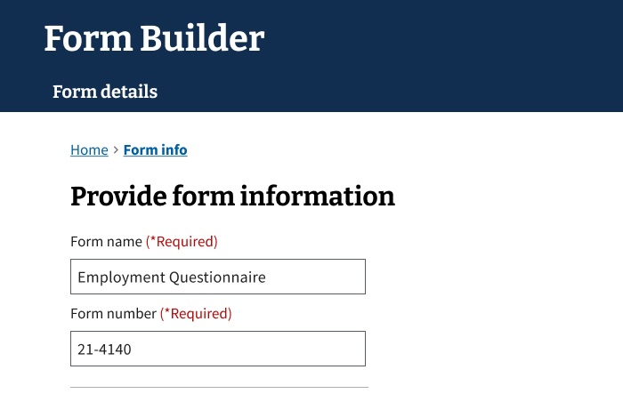
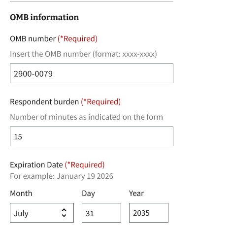
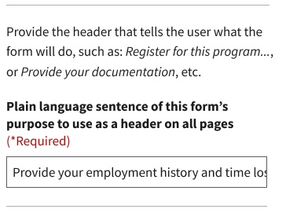
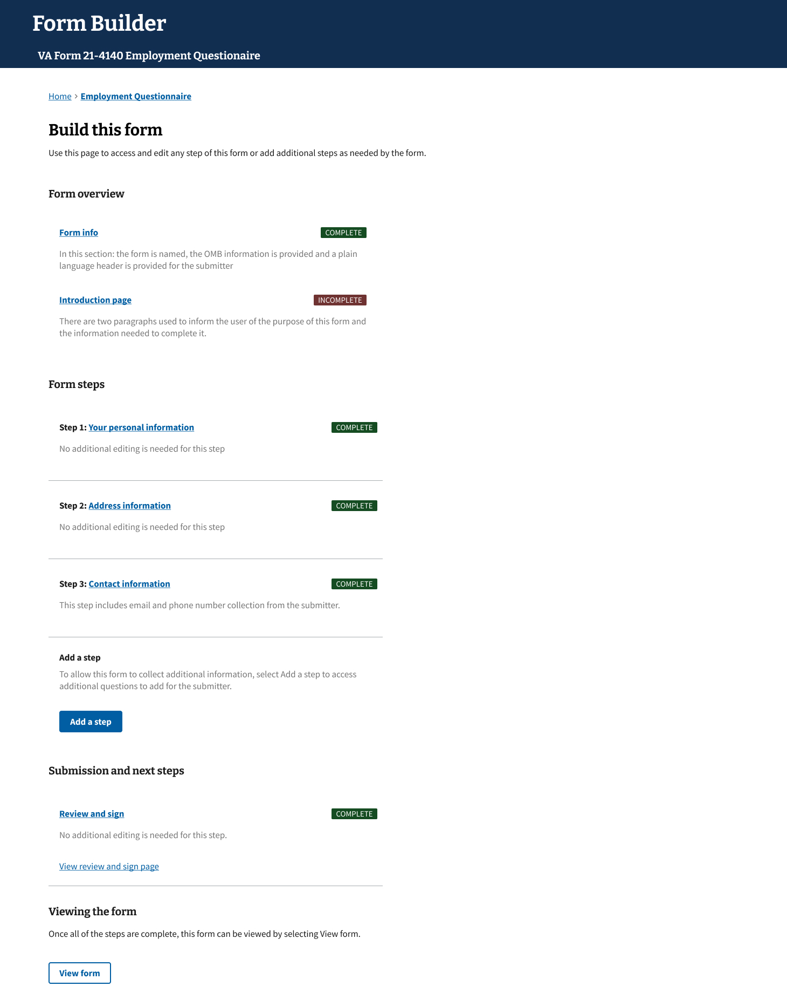

# Collaborator Guide to the Form Builder of Form Engine 

## Welcome to the overview and guide for the Form Builder UI

The process outlined here is specific to the UI that has been created in Drupal to support the quick conversion of existing PDF-based forms into an online, interactive experience for Veterans. There are additional systems and processes in place that support this tool. Explaining all of the related dependencies are beyond the immediate scope of this documentation, but will referenced when needed. 

The UI leverages visual elements of the VA Design System in support of creating a consistent experience for both internal and Veteran-facing tools. We will go into more detail as we talk about how to use Form Builder. 

Keep in mind, this documentation is “living.” and will reflect updates to the tools and processes used by OCTO and the VA Design System.

### In this guide

#### • [The purpose of Form Builder](https://github.com/department-of-veterans-affairs/va.gov-team/blob/master/teams/form-engine/runbook/Collaborator-Guide.md#the-purpose-of-form-builder)

#### • [Before starting with Form Builder](https://github.com/department-of-veterans-affairs/va.gov-team/blob/master/teams/form-engine/runbook/Collaborator-Guide.md#before-starting-with-form-builder)

#### • [Starting a new form](https://github.com/department-of-veterans-affairs/va.gov-team/blob/master/teams/form-engine/runbook/Collaborator-Guide.md#starting-a-new-form)

#### • [Working with steps in Form Builder](https://github.com/department-of-veterans-affairs/va.gov-team/blob/master/teams/form-engine/runbook/Collaborator-Guide.md#working-with-steps-in-form-builder)

#### • [Sharing for review and approval](https://github.com/department-of-veterans-affairs/va.gov-team/blob/master/teams/form-engine/runbook/Collaborator-Guide.md#sharing-for-review-and-approval)

#### • [Editing the content of a form](https://github.com/department-of-veterans-affairs/va.gov-team/blob/master/teams/form-engine/runbook/Collaborator-Guide.md#editing-the-content-of-a-form)

#### • [Handing off the form](https://github.com/department-of-veterans-affairs/va.gov-team/blob/master/teams/form-engine/runbook/Collaborator-Guide.md#handing-off-the-form)

### The purpose of Form Builder

Form Builder was created to simplify the digitization of existing forms available to the Veteran.   
As a starting point, Form Builder can process simple forms that do not require evidence to be uploaded with submission. 

This runbook will serve as your introduction to the process that the Form Builder supports and a quick guide to how to work within the UI of the Form Builder, while following the best practices put in place by the VA Design System (VADS). 

This early version of the Form Builder is an iterative tool which will be improving with your input and collaboration. And as such we look forward to your input on how we might continue to refine, improve, and innovate where it comes to delivering more value for our Veterans and their families. 

### What Form Builder does

Form Builder will provide a “head start” in the digitization of a selected form. 

It automatically generates a draft that contains the expected default steps of most forms on VA.gov.

Form Builder will create the structure needed in order to support adding additional steps as you digitize an existing form. With Form Builder you can add the steps required to collect the necessary information from the user (Today this is the Veteran), in order to help expedite their registration, information update, or task that the previously printed form supported. 

Think of the Form Builder as a shortcut to creating forms on behalf of the VA to more quickly assist the Veteran in providing the necessary information to unlock the benefits that they are entitled to recieve. 

The Form Builder is your assistant in setting up an online experience for the form and it will need your collaboration to help the form get approved for use on the VA.gov platform. 

The output of the Form Builder is what the Collaboration Cycle (insert link) will measure to make sure that the content and flow follows the expected patterns for consistency on the VA.gov platform. 

To make sure that the form you are converting to an online experience is as correct as possible, we have included as many pre-defined and up-to-date components for you to use. 

You will still need to work within the Form Builder to provide the necessary content for labels and areas that the user will need to complete to submit their form. This is handled on an item by item basis for things that are customized by a user of Form Builder.

### What Form Builder will do (but doesn’t yet)

As the Form Builder continues to improve and iterate with enhancements and additional features, it will become an even more valuable tool in the digitization and conversion of existing forms. 

Additionally, the Form Builder will likely exceed this role by becoming a test vehicle for user testing of new flows or more challenging forms to convert. As it will continue to “consume” the components available in the Forms Library, the functionality of Form Builder will expand to be able to tackle more and more forms. 

The Form Builder, in its current state, will not publish directly to the VA.gov platform in a Veteran Facing manner, i.e. it does not circumvent the current governance model. The output of Form Builder (a digital form) is reviewable in a staging environment based on a certain set of dependencies, more on this in the [sharing for review](https://github.com/department-of-veterans-affairs/va.gov-team/blob/master/teams/form-engine/runbook/Collaborator-Guide.md#viewing-the-form-on-staging) section.

Currently, the Form Builder does not support a real-time preview. The adjustments made to the draft of the form will be visible at an interval of the next day or the immediately following day, depending on when the edits to the form were committed to the draft.

## Before Starting with Form Builder

There are a couple of considerations to weigh when thinking about working with Form Builder.  
These include: the suitability of the form you have been assigned to convert, your familiarity with converting existing forms into digital experiences on VA.gov, your comfort with creating additional content, and working with other teams and stakeholders. This section should cover most of these challenges and dependencies.

### Is your form a fit for this process?

Form Builder has been designed to work with simple forms. 

There are many types of forms available on VA.gov and not all of them are great candidates for conversion to an online experience without significant engineering and design effort. 

A form is a good fit if the information needed to complete the form is something that the Veteran has access to, such as dates, locations, and contact information. 

A form is NOT a good fit if it requires additional information to be uploaded such as receipts, images or additional documentation. These forms need more advanced engineering efforts and support from other parts of the form library.

### Working with the Collaboration Cycle

The [Collaboration cycle,](https://depo-platform-documentation.scrollhelp.site/collaboration-cycle/overview) administered by the Governance team, helps to foster consistency in experience across all form digitization. 

Every effort has been made to control the output of this process so that the Collaboration Cycle goes smoothly when the digitized form (the output of this process) is reviewed by that team. 

There are areas that will need to be created and then reviewed as part of this digitization effort, and that is where it makes sense to get Content and IA involved at the start so that a form uses the right amount of and style of content to label sections, interactions, and elements that ask for information from the user. 

For more information about touchpoints and this process you can [follow this link](https://depo-platform-documentation.scrollhelp.site/collaboration-cycle/overview)

### Overview of the Form Builder User Interface

Working within the Form Builder, you will use the user interface. 

The above page is representative of what you can expect when you log into the Form Builder tool. 

If you are starting a new form, the “Build a form” button will start the process of inputting the necessary information and creating a draft for you to work with within the tool. 

View your draft is covered later in this guide. 

When you want to return to this screen, select “Home” from the breadcrumbs at top. 

You will also see a list of the most recent forms that have been worked on in this tool, should you need to edit a previously started form. 

### Working with Stakeholders

It is helpful to discuss the form with the form owner in advance of the conversion.

As part of that conversation, you can learn about which elements are most important to collect via the form, and if there are any challenges that the team has with the way that the paper form has been setup. 

Designing a form, or online experience, often includes trade-offs, and so knowing where using the provided elements would be most helpful can improve the experience for both the user and the stakeholder. 

Keep in mind, several patterns are already established to create consistency, so you may want to ask more broad questions about the general purpose of the form, or which areas the users struggle with on the paper form, or any other insights. 

Currently this tool is focused for use with the simplest of forms, but even in those sometimes there are tricky sections or questions that need to be reworded for clarity or understanding. 

### Setting up an App for reviewing the form

A necessary part of this conversion is to have an application setup in advance in order to see the changes to content and steps for a converted form. 

This is an engineering dependent task and will need support from an engineer familiar with… 

[Engineering Runbook for app setup](https://github.com/department-of-veterans-affairs/va.gov-team/tree/master/teams/form-engine/runbook#creating-the-vagov-application)

This can be done in advance of your form creation, and will allow you to view your content in place, after a build picks up your edits. 
More on viewing a form and sharing for review in this [section](https://github.com/department-of-veterans-affairs/va.gov-team/blob/master/teams/form-engine/runbook/Collaborator-Guide.md#sharing-for-review-and-approval)

## Starting a new form

When you are ready to begin providing the content for a new form conversion, there are a few steps to go through in order to begin with a draft of that form. 

### First inputs for a new form

After selecting the Build a new form option, you will need to provide from the existing form the information contained on it. 
This begins with the form name and number. 

Additionally, you will need to add in the OMB information. 

Importantly, you will also need to add the Header for the form to use on each of the pages that faces the user.  
This is referred to as the Plain Language Header. 
It is easy to think of this as the general purpose of the form for the user.

### The structure of a form in Form Builder

The next screen will show all of the default steps in the new form.   
This is also the screen you will go to when selecting an existing form to edit.  

Breadcrumbs at the top should show your location within this form. 

Note that the name of the form is how you will get back to this location. 

Also note that the parts of this form are separated into three general areas.

**Form overview** has the first page you worked on with information about the form and will also contain the Introduction page.
When a new form is started, this section is created along with the other sections. 

**Form steps** are the sections that the user will go through in completing the form. The default steps are added for personal information, Address information, and Contact information.  These are not editable and included automationally.

After the default steps, the opportunity to add a step is listed. 
This is how you can add functionality (and additional questions) as steps into a form. More on this in “Working with steps”

The final section contains the review and successful submission page of the form. 
This section is also complete and requires no configuration within this tool.

### Next steps with your new form

The “Incomplete” label next to the Introduction page indicates it is not configured completely for use in this form. 

One of the first steps you can complete on this form is to fill in the content to explain how a user will complete this form. 

Access the Introduction page by clicking on the page title. You will then be able to add the content a user will want to know in advance of interacting with the form. This might be specific to the information that will be collected, or things to keep in mind while using the form. 

Note that the Content team will want to review or assist with area, so collaborating with them is very helpful. 

You do not have to complete this section first.

This tool supports “non-linear” editing, so you may proceed with adding steps if you would prefer to continue building the structure of the form before adding in all of the content. 

## Working with steps in Form Builder

Most forms will have at least three “sections”  which contain several numbered questions. Although these are similar from form to form, there are variances and differences that reflect considerations to physical space or other important choices that were made when the physical form was designed for use. 

The Form Builder will automatically add the default steps (and parts) of a form including an Introduction, Personal information, Review and Confirmation areas. The remaining questions outside of these will need to be added as steps to the digital form.

Any added steps can be deleted, re-ordered, edited or added to. 

### Adding a step

*(Screen shots and overview instructions to be added for this area)*

### Pre-defined v. Custom

*(Screen shots and overview instructions to be added for this area)*

### Question and Response choices 

*(Screen shots and overview instructions to be added for this area)*

### Single v. Repeated sets of questions

*(Screen shots and overview instructions to be added for this area)*

### Organizing added steps

*(Screen shots and overview instructions to be added for this area)*

## Sharing for review and approval

*(Section overview)*

### Viewing the form on staging

*(Screen shots and overview instructions to be added for this area)*

### Sharing for feedback and review

*(Screen shots and overview instructions to be added for this area)*

## Editing the content of a form

*(Section overview)*

### Accessing a previously started form

*(Screen shots and overview instructions to be added for this area)*

### Reviewing the updates

*(Screen shots and overview instructions to be added for this area)*

## Handing off the form 

*(Section overview)*

### Items to consider

*(Screen shots and overview instructions to be added for this area)*

### Notifications and Alerts

*(Screen shots and overview instructions to be added for this area)*

### PDF mapping

*(Screen shots and overview instructions to be added for this area)*

### Next steps

*(Screen shots and overview instructions to be added for this area)*  

